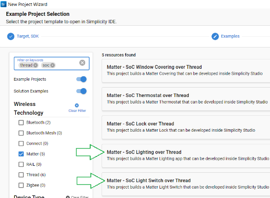

# Example Applications and Demos

The Silicon Labs Matter GSDK Extension (MGE) offers example applications to help you get started with Matter, the first two of these are used in this guide's step-by-step example:

- Matter SoC Light over Thread

- Matter SoC Light Switch over Thread

- Matter SoC Window Cover over Thread

- Matter SoC Lock over Thread

- Matter SoC Thermostat over Thread

