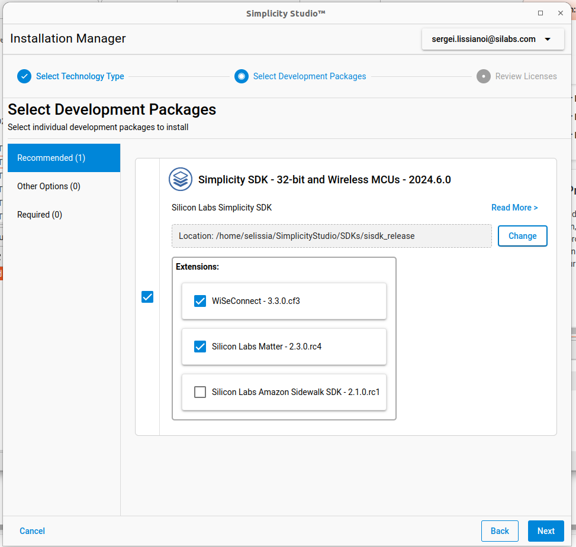

# Quick-Start Guides for Matter over Thread and Matter over Wi-Fi

## Overview

The procedures here describe how to make a simple network of a light, a switch, and a Matter hub, and to use the switch to control the light. First, set up your hardware and software as described below. Then you will follow a step by step procedure to:

- Create a Matter hub on a Raspberry Pi.
- Compile and load a light and a switch example application onto two Silicon Labs development boards to make light and switch Matter Accessory Devices (MADs).
- Create a Matter network with the MADs and the Matter hub.
- Test the light through the Matter hub.
- Bind the switch MAD to the light MAD, so that the switch can control the light.

## Initial Setup

Both the Matter over Wi-Fi and Matter over Thread demos require that you have set up a simple development environment with Simplicity Studio,
two EFR32MG24-based development boards, and a Raspberry Pi used as a Matter hub. The following requirements are common to both demos. The Thread demo also requires a radio co-processor (RCP) as part of the Matter Hub. The requirements for this are provided in the [introduction to the Thread demo](/matter/<docspace-docleaf-version>/matter-thread-getting-started).

### Hardware Requirements

#### Matter Hub

  - 1 Raspberry Pi 4B
  - 1x high speed, 64 GB SD card

#### Matter Devices
##### **Matter over Wi-Fi Accessory Device Requirements for NCP Mode**

The Silicon Labs Matter over Wi-Fi NCP mode demo and development requires two boards: the
Silicon Labs EFR32 Radio board to run the Matter code and either the RS9116, SiWx917, WF200 to run the Wi-Fi protocol stack.

The following boards are supported for the Matter over Wi-Fi demos and development:

  -  **MG24 Boards:**

       -   BRD4186C / SLWSTK6006A / Wireless Starter Kit / 2.4GHz@10dBm
            -   [XG24-RB4186C](https://www.silabs.com/development-tools/wireless/xg24-rb4186c-efr32xg24-wireless-gecko-radio-board)
            -   MG24 with WSTK : [xG24-PK6009A](https://www.silabs.com/development-tools/wireless/efr32xg24-pro-kit-10-dbm?tab=overview)
       -   BRD4187C / SLWSTK6006A / Wireless Starter Kit / 2.4GHz@20dBm
            - [XG24-RB4187C](https://www.silabs.com/development-tools/wireless/xg24-rb4187c-efr32xg24-wireless-gecko-radio-board)
            - MG24 with WSTK : [xG24-PK6010A](https://www.silabs.com/development-tools/wireless/efr32xg24-pro-kit-20-dbm?tab=overview)
  -   **Wi-Fi NCP Dev Kits & boards**

       -   RS9116
            -   SB-EVK1 / Single Band Wi-Fi Development Kit / 2.4GHz
                -   [RS9116X-SB-EVK1](https://www.silabs.com/development-tools/wireless/wi-fi/rs9116x-sb-evk-development-kit)
            -   SB-EVK2 / Single Band Wi-Fi Development Kit / 2.4GHz
                -   [RS9116X-SB-EVK2](https://www.silabs.com/development-tools/wireless/wi-fi/rs9116x-sb-evk2-development-kit)
            -   DB-EVK1 / Dual Band Wi-Fi Development Kit / 2.4GHz & 5GHz
                -   [RS9116X-DB-EVK1](https://www.silabs.com/development-tools/wireless/wi-fi/rs9116x-db-evk-development-kit)
    
                **Note:** Matter only supported over 2.4GHz on this Dev kit.
  -   Interconnect board (included in the Wi-Fi kits)
  -   SPI Cable (included in the RS9116 kit)
  -   Jumper Cables (included in the RS9116 kit)

**Note**:- For More info, refer [Hardware Requirements](/matter/<docspace-docleaf-version>/hardware-requirements)

##### **Matter over Wi-Fi Accessory Device Requirements for SoC Mode**

The Silicon Labs Matter over Wi-Fi demo and development for SoC mode requires the SiWx917 SoC board that supports Matter over Wi-Fi in a single-chip package. he integrated MCU is dedicated for peripheral and application-related processing (Matter), while the ThreadArch® runs the wireless and networking protocol stacks. 

Pre-built images for the SiWx917 connectivity firmware are available as per the instructions on the [Matter Artifacts page](/matter/<docspace-docleaf-version>/matter-prerequisites/matter-artifacts). The following boards are supported for the Matter over Wi-Fi demos and development:

  - **Wi-Fi SoC Boards:**
    - SiWx917 / BRD4002A / Wireless Starter Kit
    - SiWx917 Soc Mode
      -  SiWx917 SoC / Common Flash Radio Board / 2.4GHz
         -  BRD4338A - B0 common flash v2.0

### Software Requirements

**Simplicity Studio 5**: Download and install Simplicity Studio 5 for your operating system from the [silabs.com Simplicity Studio page](https://www.silabs.com/developers/simplicity-studio). While the installation process is easy to follow, instructions are provided in the Simplicity Studio v5 [Getting Started section](https://docs.silabs.com/simplicity-studio-5-users-guide/latest/ss-5-users-guide-getting-started/install-ss-5-and-software).

**Ozone - The J-Link Debugger**:  [Ozone](https://www.segger.com/products/development-tools/ozone-j-link-debugger/) is a full-featured graphical debugger for embedded applications. With Ozone it is possible to debug any embedded application on C/C++ source and assembly level.

**Simplicity Commander**: [Simplicity Commander](https://www.silabs.com/documents/public/software/SimplicityCommander-Windows.zip) is a utility that provides GUI and command line access to the debug features of an EFM32 device. It allows you to flash firmware, update the kit firmware, and lock, or unlock debug access.

**Tera Term**: [Tera Term]((https://osdn.net/projects/ttssh2/releases/)) is the terminal emulator for Microsoft Windows that supports serial port, telnet and SSH connections.

**Silicon Labs Matter GSDK Extension**: Once Simplicity Studio 5 is installed you will be prompted to install the Gecko SDK Suite (GSDK). Here you should also install the Matter Enablement Package by making sure the extension is checked, as shown.

**Matter Hub Raspberry Pi Image**: A copy of the pre-built image from the Silicon Labs web services can be downloaded in this [zipfile](https://www.silabs.com/documents/public/software/SilabsMatterPi_2.2.0-1.2-extension.zip). **Note** this is a large file and will take some time to download.

>**Note:** The Matter hub for Matter over Thread requires an additional device, a radio co-processor. See [the introduction to the Matter over Thread demo](/matter/<docspace-docleaf-version>/matter-thread-getting-started) for more information.

**Matter Bootloader Image**: The EFR32MG24 devices must be programmed with a bootloader. Obtain those here: [Silicon Labs Matter Artifacts](/matter/<docspace-docleaf-version>/matter-prerequisites/matter-artifacts).

**SSH Client**: Managing the Matter hub often requires connecting to it remotely. An SSH client is needed to follow the step-by-step example in this document (PuTTY is used). Install software such as [PuTTY](https://www.putty.org/), Terminal or a similar application for access to the Raspberry Pi-based Matter hub.

**SD Card-Flashing Software**: Many different applications can be used to prepare an SD card for the Raspberry Pi, such as the [Raspberry Pi Imager](https://www.raspberrypi.com/documentation/computers/getting-started.html#install-using-imager), [balenaEtcher](https://www.balena.io/etcher) and [Rufus](https://silabsiot.slack.com/archives/C018366PBH8/p1654113932884999). The step-by-step example in this document uses the Raspberry Pi Imager.

### Visual Studio Development

In addition to creating and building your Matter project within Simplicity Studio, Silicon Labs also provides Visual Studio Code IDE integration. 

**Insert information here**

For more information on development within Visual Studio Code, please visit [Visual Studio Code Enablement](https://docs.silabs.com/simplicity-studio-5-users-guide/latest/ss-5-users-guide-vscode-ide/)

## Next Steps

Now that you have your environment, you can create a [Matter over Wi-Fi network](/matter/<docspace-docleaf-version>/matter-light-switch-example/01-wifi-light-switch-example) or a [Matter over Thread network](/matter/<docspace-docleaf-version>/matter-light-switch-example/02-thread-light-switch-example).