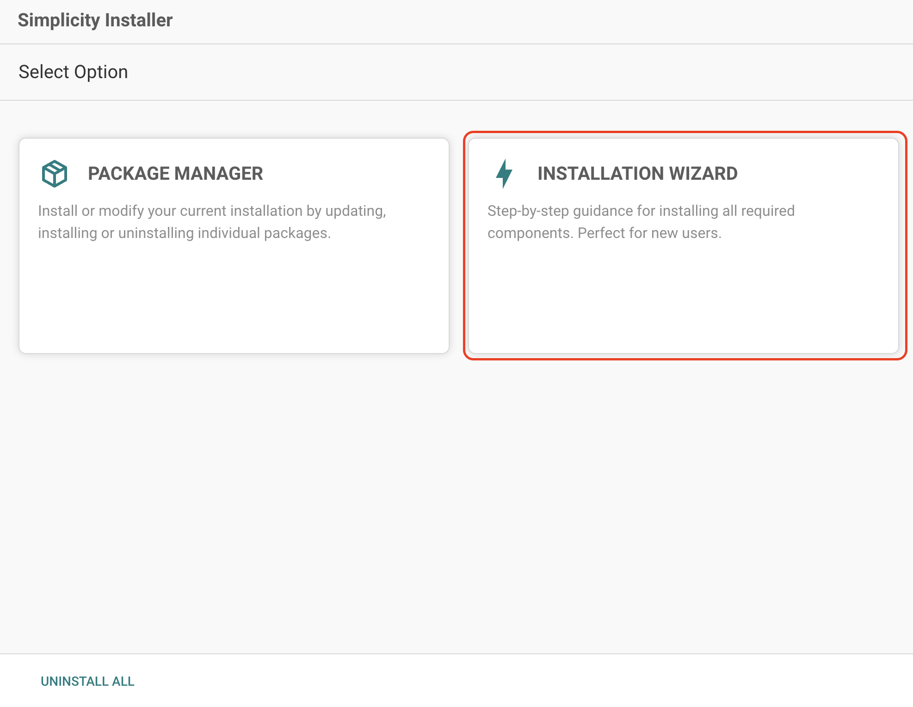
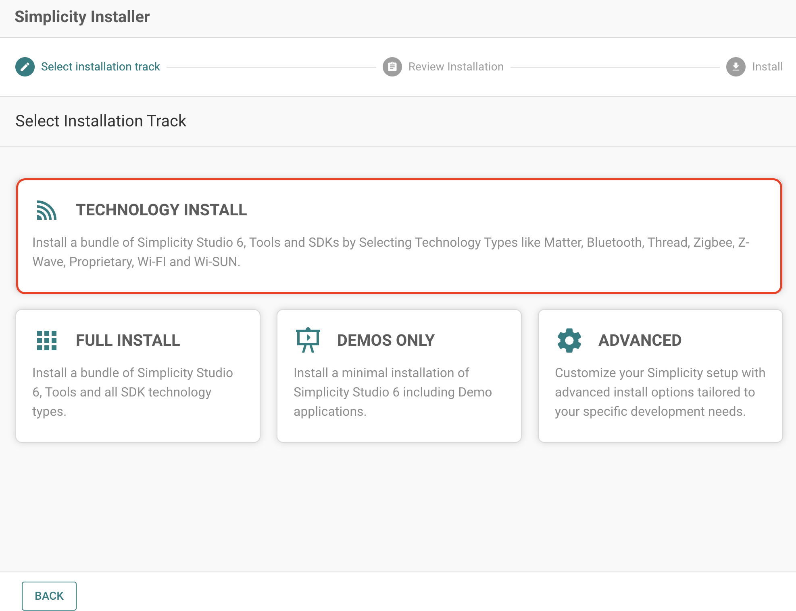
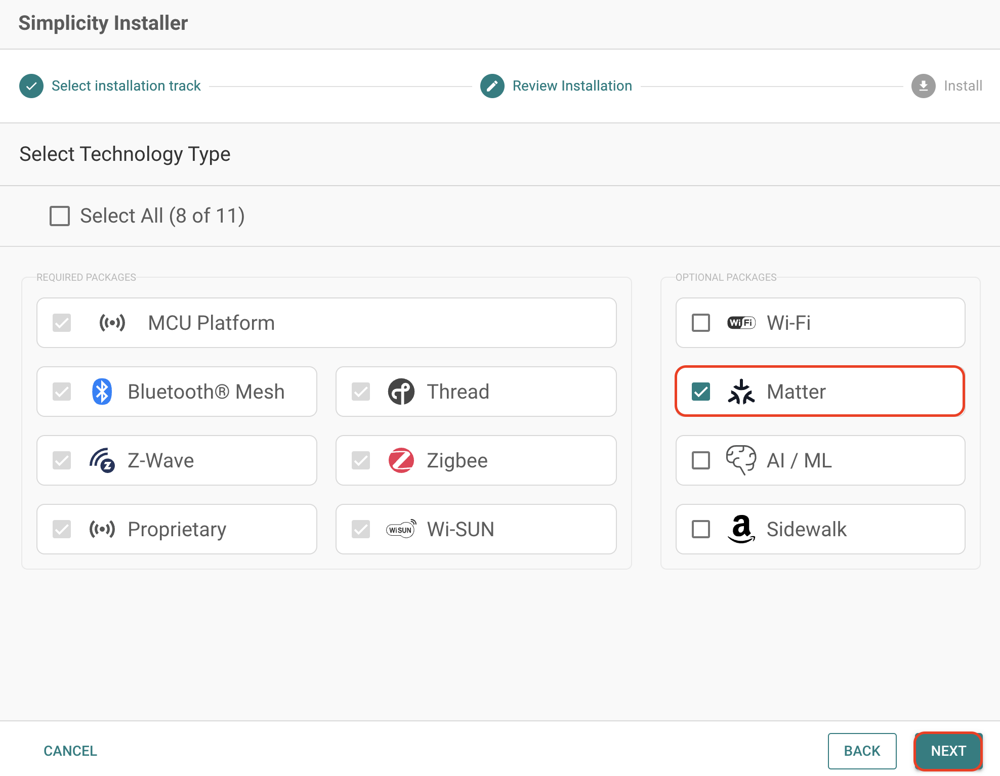

# Quick-Start Guides for Matter over Thread and Matter over Wi-Fi

## Overview

The procedures here describe how to make a simple network of a light, a switch, and a Matter hub, and to use the switch to control the light. First, set up your hardware and software as described below. Then you will follow a step by step procedure to:

- Create a Matter hub on a Raspberry Pi.
- Compile and load a light and a switch example application onto two Silicon Labs development boards to make light and switch Matter Accessory Devices (MADs).
- Create a Matter network with the MADs and the Matter hub.
- Test the light through the Matter hub.
- Bind the switch MAD to the light MAD, so that the switch can control the light.

## Initial Setup

Both the Matter over Wi-Fi and Matter over Thread demos require that you have set up a simple development environment with Simplicity Studio,
two Matter compatible development boards (see the [Silicon Labs Matter Selector Guide](https://www.silabs.com/wireless/matter/selector-guide) for available boards and their capabilities), and a Raspberry Pi used as the Matter Controller. The following requirements are common to both demos. The Thread demo requires a radio co-processor (RCP) connected to the Matter Controller. The requirements for this are provided in the [introduction to the Thread demo](/matter/{build-docspace-version}/matter-light-switch-example/02-thread-light-switch-example).

### Hardware Requirements

#### Matter Hub

- 1 Raspberry Pi 4B or newer
- 1x high speed, 64 GB SD card

**Matter Over Thread Devices**

- SoC: EFR32x MG24, MG26, MG301
- RCP: EFR32x MG21, MG24, MG26, MG301

**Matter Over Wi-Fi Accessory Device Requirements for NCP Mode**

The Silicon Labs Matter over Wi-Fi NCP mode demo and development requires two boards: the Silicon Labs EFR32 Radio board to run the Matter code and either the SiWx917 or WF200 to run the Wi-Fi protocol stack.

The following boards are supported for the Matter over Wi-Fi demos and development:

- **MG24 Boards**
  - BRD4186C / SLWSTK6006A / Wireless Starter Kit / 2.4GHz@10dBm
    - [XG24-RB4186C](https://www.silabs.com/development-tools/wireless/xg24-rb4186c-efr32xg24-wireless-gecko-radio-board)
    - MG24 with WSTK: [xG24-PK6009A](https://www.silabs.com/development-tools/wireless/efr32xg24-pro-kit-10-dbm?tab=overview)
  - BRD4187C / SLWSTK6006A / Wireless Starter Kit / 2.4GHz@20dBm
    - [XG24-RB4187C](https://www.silabs.com/development-tools/wireless/xg24-rb4187c-efr32xg24-wireless-gecko-radio-board)
    - MG24 with WSTK: [xG24-PK6010A](https://www.silabs.com/development-tools/wireless/efr32xg24-pro-kit-20-dbm?tab=overview)
- **Wi-Fi NCP Dev Kits & boards**
  - **SiWx917 NCP**
    - SiWx917 NCP Mode / Wi-Fi Expansion Board / 2.4GHz
      - BRD8045A (B0 Expansion v2.0)
  - **WF200**
    - WF200 / Single Band Wi-Fi Expansion Board / 2.4GHz
      - [SLEXP8022A](https://www.silabs.com/development-tools/wireless/wi-fi/wf200-wifi-expansion-kit)
      - WF200 / Single Band Wi-Fi Expansion Board / 2.4GHz
      - [SLEXP8023A](https://www.silabs.com/development-tools/wireless/wi-fi/wfm200-wifi-expansion-kit)
  - Interconnect board (included in the Wi-Fi kits)

**Matter Over Wi-Fi Accessory Device Requirements for SoC Mode**

The Silicon Labs Matter over Wi-Fi demo and development for SoC mode requires the SiWx917 SoC board that supports Matter over Wi-Fi in a single-chip package. The integrated MCU is dedicated for peripheral and application-related processing (Matter), while the ThreadArch® runs the wireless and networking protocol stacks.

Pre-built images for the SiWx917 connectivity firmware are available per the instructions on the [Matter Artifacts page](/matter/{build-docspace-version}/matter-prerequisites/matter-artifacts). The following boards are supported for the Matter over Wi-Fi demos and development:

- **Wi-Fi SoC Boards**
  - SiWx917 / BRD4002A / Wireless Starter Kit
  - SiWx917 Soc Mode
    - SiWx917 SoC / Common Flash Radio Board / 2.4GHz
      - BRD4338A - B0 common flash v2.0

### Software Requirements

**Simplicity Studio**: Download and install Simplicity Studio for your operating system from the Silicon Labs [Simplicity Studio page](https://www.silabs.com/developers/simplicity-studio). Detailed instructions are provided in the Simplicity Studio [User Guide](https://docs.silabs.com/ssv6ug/latest/ssv6ug-overview/).

**Ozone - The J-Link Debugger**: [Ozone](https://www.segger.com/products/development-tools/ozone-j-link-debugger/) is a full-featured graphical debugger for embedded applications. With Ozone, it is possible to debug any embedded application on C/C++ source and assembly level.

**Simplicity Commander**: [Simplicity Commander](/matter/{build-docspace-version}/matter-references/flash-silabs-device#simplicity-commander) is a utility that provides GUI and command line access to the debug features of an EFM32 device. It allows you to flash firmware, update the kit firmware, and lock or unlock debug access.

**Tera Term**: [Tera Term](https://github.com/TeraTermProject/osdn-download) is the terminal emulator for Microsoft Windows that supports serial port, telnet, and SSH connections.

**Silicon Labs Matter SiSDK Extension**: Once Simplicity Studio is installed, you will be prompted to install the Simplicity SDK. Here you should also install the Matter Enablement Package by making sure the extension is checked, as shown.

**Installation of Wi-Fi SDK and WiSeConnect Packages**: The following packages will be installed during the installation of Simplicity Studio. Refer to [Package Installation](/matter/{build-docspace-version}/matter-wifi-getting-started-example/software-installation).

**Matter Hub Raspberry Pi Image**: A copy of the pre-built image from the Silicon Labs web services can be downloaded in this [zipfile](https://www.silabs.com/documents/public/software/SilabsMatterPi_2.6.0-1.4-extension.zip). **Note** this is a large file and will take some time to download.

>**Note:** The Matter hub for Matter over Thread requires an additional device, a radio co-processor. See [the introduction to the Matter over Thread demo](/matter/{build-docspace-version}/matter-light-switch-example/02-thread-light-switch-example) for more information.

**Matter Bootloader Image**: The EFR32MG24 devices must be programmed with a bootloader. Obtain those here: [Silicon Labs Matter Artifacts](/matter/{build-docspace-version}/matter-prerequisites/matter-artifacts).

**SSH Client**: Managing the Matter hub often requires connecting to it remotely. An SSH client is needed to follow the step-by-step example in this document (PuTTY is used). Install software such as [PuTTY](https://www.putty.org/), Terminal, or a similar application for access to the Raspberry Pi-based Matter hub.

**SD Card-Flashing Software**: Many different applications can be used to prepare an SD card for the Raspberry Pi, such as the [Raspberry Pi Imager](https://www.raspberrypi.com/documentation/computers/getting-started.html#install-using-imager) and [balenaEtcher](https://www.balena.io/etcher). The step-by-step example in this document uses the Raspberry Pi Imager.

### Visual Studio Code Development

Once a Matter project is created and any components or ZCL clusters modified in Simplicity Studio, Silicon Labs provides a Visual Studio Code (VS Code) IDE extension where code changes can be made. Simplicity Studio 6 (SSv6) does not provide an IDE, instead VS Code is used. Projects can be built, flashed and debugged directly from VS Code.

For more information on development with Visual Studio Code, please visit [Visual Studio Code Enablement](https://docs.silabs.com/ss-vscode/latest/ss-vscode-start/).

## Next Steps

Now that your environment is set up, you can proceed to the create a [Matter over Wi-Fi Quick-Start demo](/matter/{build-docspace-version}/matter-quick-start-demo/01-wifi-quick-start-demo) or a [Matter over Thread Quick-Start demo](/matter/{build-docspace-version}/matter-quick-start-demo/02-thread-quick-start-demo).
