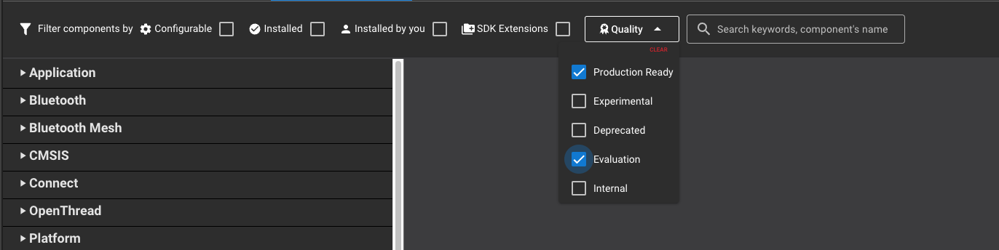
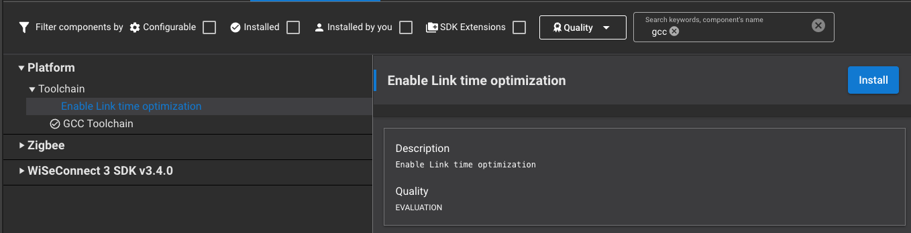

# Code Savings Guide for Building Matter Applications

Silicon Labs' Matter example applications come out of the box with various ease-of-life components allowing for a smoother development process (LCD functionality, debugging capability, Matter shell, etc). These components bring along with them some increase in the size of resulting application's image.

To reduce the total size of your application's image while still maintaining basic core Matter functionality, you can take a few steps:

1. Remove optional components from the Matter Project in Studio that may not be needed for a certain application. For example, removing the components Matter Display and Matter QR Code Display will save flash by disabling the LCD screen.
2. Remove any excess printing from the application. In practice, this can include removing the Matter Shell component and RTT Logging from the Matter device.
3. Install the `matter_no_debug` and/or `matter_no_lcd_shell` components. This will automatically take care of removing these extra features (`matter_no_lcd_shell`) as well as implement the defines and configuration values (`matter_no_debug`) to achieve optimal image size reduction at the click of a button.
4. Remove clusters from the zap configuration. Example applications have clusters enabled to support both Thread and Wi-Fi transport layers such as the Diagnostics clusters. It is important to note that certain device types require different Matter Clusters. Be sure to check the [Matter Specifications](https://csa-iot.org/developer-resource/specifications-download-request/) to confirm which Matter Clusters are required for your device type.
5. Install the `Enable Link time optimization` (LTO) component. This will allow the compiler to optimize the code better by removing unused functions and variables. Currently, this component is not visible by default in the SLCP file as it is tagged as Evaluation. To enable this component, ensure that the **Evaluation** filter is enabled by selecting it in the **Quality** dropdown menu as shown below.

    

    Once this is toggled on, simply enter *gcc* in the keyword search, and you will find **Enable Link time optimization** under **Platform > Toolchain**.

    

    Once the component is installed, LTO will be leveraged by GCC to reduce the code size of the built application.
