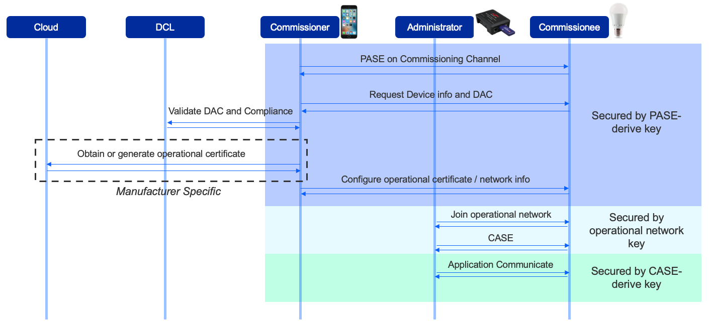
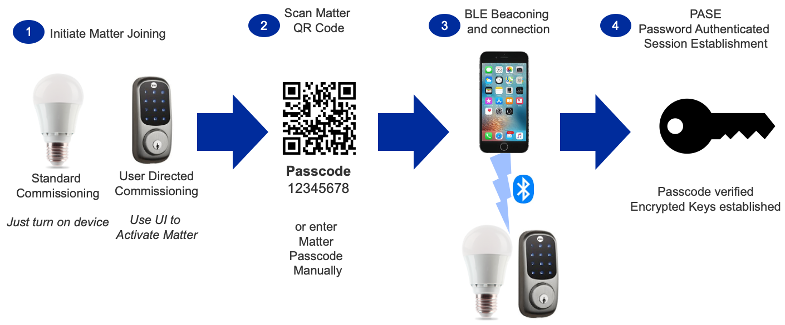

# Commissioning

## Overview

In Matter, Commissioning is the process in which the Matter device joins an existing Matter fabric. There are two main roles in the commissioning process a Commissioner, for example a matterhub, and a Commissionee, for example a Matter light.

## Onboarding Information

For a Matter device to commission onto the network, the Matter device needs to have an onboarding payload. Below is the most critical information stored in the onboarding payload:

- Vendor ID (VID): 16-bit value
- Product ID (PID): 16-bit value
- Discriminator value: 12-bit integer value to distinguish advertising devices
- Passcode: 27-bit unsigned integer used during commissioning
- Discovery Capabilities bitmask: 8-bit bitmask containing information about devices, available technology, and device discovery

The Onboarding payload can come in a variety of different formats:

- QR Code
- QR Code Payload which is the string outputted when scanning the QR Code which will be in the format MT:Y.K9042C00KA0648G00
- Manual Pairing Code which would look something like this: 749701123365521327694

The ConnectedhomeIP's CHIP-TOOL has some added commands that can help you parse the setup payload: ./chip-tool payload parse-setup-payload (https://github.com/project-chip/connectedhomeip/blob/master/docs/guides/chip_tool_guide.md).

## Initiate the Commissioning Process

The commissioning process supports two potential starting points:

1. The device is already on the network
2. The device needs network credentials for Wi-Fi or Thread (requires Bluetooth LE (BLE) support)

The current Matter revision supports Ethernet, Wi-Fi, and Thread devices.

- Ethernet devices get into the operational network when their Ethernet cable is connected. Therefore, the devices are normally already on the network before commissioning.
- Wi-Fi and Thread devices must have credentials configured before the devices can be joined into the operational network. This is normally done over BLE.

This page focuses on Wi-Fi and Thread. The first step for these devices is to enter commissioning mode, following one of two scenarios:  

| Scenario Name | Description |
| ------------------------- | ----------- |
| Standard | Device automatically goes into the commissioning mode on power-up. Beneficial for limited UI devices (such as light bulbs). |
| User-Directed | Device only enters commissioning mode when initiated by the user. Helpful for devices that have user interfaces or for which commissioning should not be initiated without a user present. |

The following figure provides an overview of the commissioning process and the actions each role performs.

## Device Discovery

Depending on the network topology and Matter device implementation, there are a few ways to implement device discovery:

- Bluetooth Low Energy (BLE): This is the method used in the example below. Note that if the Matter device utilizes Thread, it MUST also support BLE for the purpose of discovery and commissioning as you cannot solely use Thread-based commissioning and Device Discovery.
- Wi-Fi (IEEE 802.11-2020): This method utilizes Soft-AP functionality.
- Over IP if device is already on an IP network. This method utilizes discovery service like DNS-SD conveying credentials over IP.

The following figure provides an overview of the commissioning process and the actions each role performs.

## Password Authenticated Session Establishment (PASE)

For Matter devices to ensure the utmost security, the Matter Commissionee and Commissioner establish a secure channel of communication. Here, the Commissioner and the Commissionnee establish a password-authenticated session establishment where they derive encryption keys. Once this session is established, all other messages will be encrypted with the PASE derived keys. This connection is timed and confined between the Commissionee and the Commissioner, and is meant to establish a secure connection between the two devices to communicate with one another.

## Device Attestation

Once the PASE has occurred, the Commissioner needs to check that the Commissionee is a certified Matter device. This process is called Device Attestation. First, the Commissioner will request the Commissionee to provide device information required in the Device Attestation process. The Commissioner will validate that the information it received from the Commissionee is accurate. The Commissioner will do this by retrieving the Commissionee's PAA (Product Attestation Authority) certificate from the [**Distributed Compliance Ledger (DCL)**](/matter/<docspace-docleaf-version>/matter-dcl) and the the Commissioner will validate the Commissionee credentials. For more information on Device Attestation pleas, see [**Device Attestation**](/matter/<docspace-docleaf-version>/matter-device-attestation).

## Node Operational Credentials (NOC)

The Commissioner will either generate or obtain a Node Operational Certificate (NOC) and will install the operational credentials into the Commissionee. The NOC contains a set of credentials that the Matter Nodes can use to identify themselves within a Matter Fabric. The NOC includes the Node Operational Identifier (Operational Node ID). The NOC is encrypted with Node Operational Key Pair generated by the Commissionee. The NOC can be revoked by the administrator, and with that, all bindings and fabric configurations will also be removed from the node.

## Certificate Authenticated Session Establishment (CASE)

To establish a secure connection after commissioning, the CASE is used to derive an encryption key that will be used to establish a secure communication between the Commissioner/Administrator and the Commissionee. Once this key is established, all unicast messages between the Commissioner/Administrator and the Commissionee are encrypted using the CASE keys.

## Example Commissioning Flow

Below is an example Commissioning flow, where the onboarding payload is in the form of a Matter QR Code, and the Device Discovery is done through BLE Beaconing. This will put together all the pieces of Commissioning mentioned above.

In step 1, the Matter device must enter commissioning mode in one of the two scenarios described above. This means that the Matter Node will start its BLE Advertisements, alerting devices around that it is ready to commission.

Usually, a mobile phone serves as the administrator. Step 2 is to use the mobile phone to scan the QR code of the Matter device. The QR code is used as a passcode to set up a secured BLE connection.

Step 3 is to set up the BLE beaconing and connection between the mobile phone and the Matter device, so that the commissioning information can be exchanged through the BLE connection channel.

As the connection should be secure, step 4 is to secure the connection through password-authenticated session establishment (**PASE**). The passcode derived from the QR code is used as an input for this process. The output is the security key used by the connection.

After the secured connection is established, step 5 is to verify the Matter device's manufacturer certificate and compliance status through Device Attestation. Each Matter device must have a device certificate, more specifically the DAC, programmed before it is shipped. The mobile phone, acting as administrator, reads the device certificate through the commissioning channel, then communicates with a remote database to validate the certificate and the compliance status of the device. The remote database is called the Distributed Compliance Ledger (**DCL**).

Step 6 is to install the operational certificate for the device. The administrator either obtains the certificate from the remote server or generates the certificate locally and then transfers the certificate to the device. The administrator also configures the Access Control List (**ACL**) with the list of administrators.

After operational security is configured, step 7 is to configure the operational network for the device. For Wi-Fi devices, the SSID and the password are configured. For Thread devices, the PAN ID, network key, and other parameters are configured.

In step 8, the device starts to join the operational network with the configured parameters.

Once the device is attached to the network (step 9), it can be discovered through Service Registration Protocol (**SRP**). To control that device, you must establish a secured connection through the Certification Authorized Session Establishment (**CASE**) process.

After the CASE session is established, the Matter device is commissioned successfully and can communicate with other devices in the Matter network (step 10).
