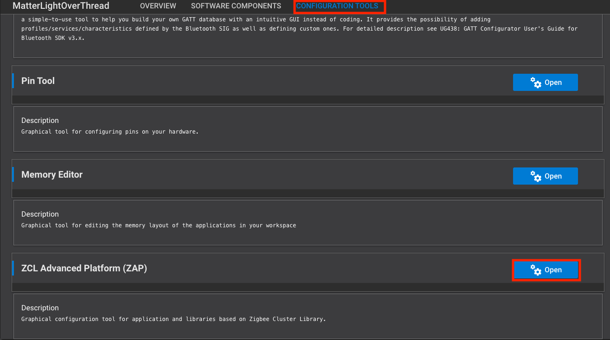

# Matter Intermittently Connected Devices (ICD)

Matter introduces the concept of Intermittently Connected Devices (ICD) in the SDK and in the specification. An Intermittently Connected Device is the Matter representation of a device that is not always reachable. This covers battery-powered devices that disable their underlying hardware when in a low-power mode or devices that can be disconnected from the network, like a phone app.

This page focuses on features designed to improve the performance and reliability of battery-powered devices. Matter ICD functionality can be enabled with the `matter_icd_management` component. The Matter light-switch and lock examples are ICDs by default.

## Creating an ICD Example via Simplicity Studio

### Enabling/Building

To begin creating an OpenThread ICD example, create a generic Matter over Thread solution example via the **New Project Wizard**. Lighting solution example will be used for demonstration purposes.

**Lock and Light-Switch applications come out-of-box with ICD enabled. The low power component can be added by user.**

1. Create project.

    

2. Navigate to the **Configuration Tools** section and open the **ZCL Advanced Platform (ZAP)**.

    

3. Search for the ICD Management cluster and enable for **Server**. You will receive a warning that the corresponding component was unable to be installed. This is due to component conflicts within Simplicity Studio.

    

4. Navigate to the **Software Components** tab and confirm that the ICD Management Server Cluster component is installed (enabling the ICD Management cluster should automatically trigger its installation).

    

5. Replace all subsequent conflicting components via the ensuing pop-up options (See below). This will install the necessary Thread Network Layer (MTD) component and ICD source code. This will also remove the conflicting Thread Network Layer (FTD) component.

    

**Recommended: Install the `matter_platform_low_power` component to achieve further energy savings. See details below.**

ICD functionality should be installed and ready to build. Build the project as you would a normal example and flash the resulting binary to your specified end device. You should be able to commission the device the same way as non-ICD examples using the QR code URL (generated within the RTT logs at startup or **BTN0** press).

## **Power Saving Components**

### **Minimal Power Consumption**

The Lower Power Mode is an optional component, installing it will disable:

- Matter Shell
- OpenThread CLI
- LCD and QR Code

## ICD Configurations

The ICD feature-set offers two types of configurations : cluster configurations and subscription configurations.
The cluster configurations are exposed through the ICD Manager Cluster interface.
The subscription configurations are exposed through various Matter components configurations and public APIs of the Matter SDK.

### ICD Management Cluster

The ICD Management Cluster enables configuration of the ICD’s behavior. It is required for an ICD to have this cluster enabled on endpoint 0.

The ICDM Cluster exposes three configuration attributes that enable to configure an ICD.

| Attribute | Type | Constraints | Description |
|-|-|-|-|
| IdleModeInterval      | uint32 | 1 to 64800 | Maximum interval in seconds or milliseconds the server can stay in idle mode |
| ActiveModeInterval    | uint32 | min 300    | minimum interval in milliseconds the server will stay in active mode |
| ActiveModeThreshold   | uint32 | min 300    | minimum amount of time in milliseconds the server typically will stay active after network activity when in active mode |

### Configuration Attributes

The ICD Management Cluster exposes three configuration attributes.
These configurations are independent from the underlying transport configurations.
These configurations can be changed by modifying the configuration of the `ICD Server Configuration` component or directly by setting values in `sl_matter_icd_config.h`.

```cpp
    #define SL_IDLE_MODE_DURATION_S = 600     // 10min Idle Mode Interval
    #define SL_ACTIVE_MODE_INTERVAL = 1000  // 1s Active Mode Interval
    #define SL_ACTIVE_MODE_THRESHOLD = 500  // 500ms Active Mode Threshold
```

### ICD Check-In Protocol Use-Case

The ICD Check-In Protocol use case is used by ICDs to maintain a known relationship in case subscriptions with clients are lost.
This includes how a client shares a Check-In token (symmetric key) with the ICD, when Check-In messages are sent and how the Check-In Protocol requirements are respected.

The Check-In Protocol is a fail-safe mechanism which allows an ICD to notify a registered client that it is available for communication when all subscriptions between the client and ICD are lost.
A subscription can be lost for several reasons, such as:

* The ICD might not have full RAM retention when it is in an idle state.
* When the ICD is powered off to change the battery.
* Power or network outage causing the connection between the client and the ICD to be interrupted.
* The client is unavailable for any reason (e.g. during a software update or hosted on a mobile device that is sometimes out-of-home).

The Check-In message is sessionless and relies on a shared secret that has been given to the ICD during the registration of the client using the ICD Management cluster.
For more information on the ICD Check-In Protocol use-case, see the associated specification section.

### User Active Mode Trigger

Since ICDs are not immediately responsive, they require a means to render them available for communication within user initiated use cases.
Some of the user initiated use cases are:

* Opening a new commissioning window to add another administrator.
* Reconfiguration of an existing fabric (e.g. IPKs, NOC rotation, ACL changes).
* Reconfiguration of cluster functionality (e.g. ICD Management, Bindings, Groups, Scenes).
* Removal of a device from a fabric.
* Changes to the device's settings.

To enable these user initiated use cases, ICDs need to provide a way for a user to put them in active mode and render them responsive.
The User Active Mode Trigger feature in the ICD Management cluster indicates whether a particular device implements an active mode trigger.

## **Configuration**

To change default values corresponding to Matter ICD examples, modify them in either:

1. `config/sl_matter_icd_config.h`
2. ICD component configurator


### Subscription Configurations

#### Subscription Maximum Interval Negotiation

The subscription mechanism is used by ecosystems and controllers to receive attribute change updates and liveness checks.
The maximum interval of a subscription request is what defines the frequency at which a device will send a liveness check if there are no attribute changes.

Within the subscription request / response model, a device has the opportunity to decide the maximum interval at which it will send its liveness check (Empty Report Update). The device can set a maximum interval within this range if and only if it is an ICD:

```shell
MinIntervalRequested ≤ MaxInterval ≤ MAX(IdleModeInterval, MaxIntervalRequested)
```

The following table shows the subscribe response fields.
| Action Field | Type | Description |
|-|-|-|
| SubscriptionId | uint32 | identifies the subscription |
| MaxInterval | uint16 | the final maximum interval for the subscription in seconds |

The Matter SDK provides a default implementation that allows an ICD to negotiate its MaxInterval.
The goal of the algorithm is to set the MaxInterval to the IdleModeInterval.

```cpp
#if CHIP_CONFIG_ENABLE_ICD_SERVER

    // Default behavior for ICDs where the wanted MaxInterval for a subscription is the IdleModeInterval
    // defined in the ICD Management Cluster.
    // Behavior can be changed with the OnSubscriptionRequested function defined in the application callbacks

    // Default Behavior Steps :
    // If MinInterval > IdleModeInterval, try to set the MaxInterval to the first interval of IdleModeIntervals above the
    // MinInterval.
    // If the next interval is greater than the MaxIntervalCeiling, use the MaxIntervalCeiling.
    // Otherwise, use IdleModeInterval as MaxInterval

    // GetPublisherSelectedIntervalLimit() returns the IdleModeInterval if the device is an ICD
    uint32_t decidedMaxInterval = GetPublisherSelectedIntervalLimit();

    // Check if the PublisherSelectedIntervalLimit is 0. If so, set decidedMaxInterval to MaxIntervalCeiling
    if (decidedMaxInterval == 0)
    {
        decidedMaxInterval = mMaxInterval;
    }

    // If requestedMinInterval is greater than the IdleTimeInterval, select next active up time as max interval
    if (mMinIntervalFloorSeconds > decidedMaxInterval)
    {
        uint16_t ratio = mMinIntervalFloorSeconds / static_cast<uint16_t>(decidedMaxInterval);
        if (mMinIntervalFloorSeconds % decidedMaxInterval)
        {
            ratio++;
        }

        decidedMaxInterval *= ratio;
    }

    // Verify that decidedMaxInterval is an acceptable value (overflow)
    if (decidedMaxInterval > System::Clock::Seconds16::max().count())
    {
        decidedMaxInterval = System::Clock::Seconds16::max().count();
    }

    // Verify that the decidedMaxInterval respects MAX(GetPublisherSelectedIntervalLimit(), MaxIntervalCeiling)
    uint16_t maximumMaxInterval = std::max(GetPublisherSelectedIntervalLimit(), mMaxInterval);
    if (decidedMaxInterval > maximumMaxInterval)
    {
        decidedMaxInterval = maximumMaxInterval;
    }

    // Set max interval of the subscription
    mMaxInterval = static_cast<uint16_t>(decidedMaxInterval);

#endif // CHIP_CONFIG_ENABLE_ICD_SERVER
```

If the default implementation does not fit within the use-case,
an implementation can override the default implementation.
The first step is to implement the `ApplicationCallback` class from the `ReadHandler.h` header.

```cpp
/*
 * A callback used to interact with the application.
 */
class ApplicationCallback
{
public:
    virtual ~ApplicationCallback() = default;
    /*
     * Called right after a SubscribeRequest has been parsed and processed. This notifies an interested application
     * of a subscription that is about to be established. It also provides an avenue for altering the parameters of the
     * subscription (specifically, the min/max negotiated intervals) or even outright rejecting the subscription for
     * application-specific reasons.
     *
     * TODO: Need a new IM status code to convey application-rejected subscribes. Currently, a Failure IM status code is sent
     * back to the subscriber, which isn't sufficient.
     *
     * To reject the subscription, a CHIP_ERROR code that is not equivalent to CHIP_NO_ERROR should be returned.
     *
     * More information about the set of paths associated with this subscription can be retrieved by calling the appropriate
     * Get* methods below.
     *
     * aReadHandler:            Reference to the ReadHandler associated with the subscription.
     * aSecureSession:          A reference to the underlying secure session associated with the subscription.
     *
     */
    virtual CHIP_ERROR OnSubscriptionRequested(ReadHandler & aReadHandler, Transport::SecureSession & aSecureSession)
    {
        return CHIP_NO_ERROR;
    }
    /*
     * Called after a subscription has been fully established.
     */
    virtual void OnSubscriptionEstablished(ReadHandler & aReadHandler){};
    /*
     * Called right before a subscription is about to get terminated. This is only called on subscriptions that were terminated
     * after they had been fully established (and therefore had called OnSubscriptionEstablished).
     * OnSubscriptionEstablishment().
     */
    virtual void OnSubscriptionTerminated(ReadHandler & aReadHandler){};
 };
```

The second step is registering the callback object to the Interaction Model Engine.

```cpp
// Register ICD subscription callback to match subscription max intervals to its idle time interval
chip::app::InteractionModelEngine::GetInstance()->RegisterReadHandlerAppCallback(&mICDSubscriptionHandler);
```

#### Persistent Subscriptions

Persistent subscriptions were added to Matter as a means to ensure that an ICD can re-establish its subscription and by extension its secure session to a subscriber in the event of a power cycle.
When a device accepts a subscription request, it will persist the subscription.
When the device reboots, it will try to re-establish its subscription with the subscriber.
If the subscription is torn down during normal operations or if the re-establishment fails,
the subscription will be deleted.

Persistent subscriptions are enabled by default on all Silicon Labs sample applications.

#### Subscription Timeout Resumption

Matter also provides a retry mechanism for devices to try to re-establish a lost subscription with a client. This feature should not be used on an ICD since it can significantly reduce battery life. This functionality is disabled by default in all Matter sample apps, if necessary it can be enabled by directly editing the project's .slcp file and setting to the `CHIP_CONFIG_SUBSCRIPTION_TIMEOUT_RESUMPTION` configuration value to `1`. 

#### Subscription Synchronization

To avoid forcing an ICD to become active multiple times, the Matter SDK allows an ICD to synchronize its subscription reporting and send all the reports at the same time. The mecansim syncrhonizes the maximum interval of the all subscription to only require the ICD to become active one. This functionality can be enabled by enabling the Synchronous Reports in the Matter Core Components configuration (`CHIP_CONFIG_SYNCHRONOUS_REPORTS_ENABLED` in `sl_matter_config.h`)

## ICD Device Types

Matter introduces two types of ICDs.

- Short Idle Time ICDs
- Long Idle Time ICDs

### Short Idle Time ICDs

Short Idle Time ICDs are battery powered devices that can always be reached by clients.
This means that their polling intervals are small enough to guarantee that a message sent from a client will be able to reach the ICD without any synchronization.
A door lock, for example, is typicaly a short idle time ICD because it needs to be able to receive commands from clients at any given time.
These devices are usually not the initiators in the communication flow.

#### Requirements

This section lists the requirements that Short Idle Time ICDs must respect to be certifiable.

1. The ICD Management Cluster must be present on the Root Endpoint (0) with mandatory attributes.
2. The transport slow poll configuration must be smaller or equal to 15s.
This requirement is not enforced in Matter 1.3 since LIT ICD are not certifiable.
Once LIT ICD officially launch, this will be a mandatory requirement.

Support of the ICD Check-In Protocol use-case and the user active mode trigger is optional for SIT ICDs.

#### Configurations

These are recommended configurations based on the state of the current implementation of SIT ICDs.
The recommended configurations are likely to change with the Matter 1.4 release.

##### ICD Default configurations
- Enable ICD Server: TRUE
- Subscription Timeout Resumption: FALSE
- Subscription Synchronization: TRUE


##### ICD Matter Configuration flags

Configuration parameters of the ICD Server Configuration component (sl_matter_icd_config.h):

```cpp
    #define SL_IDLE_MODE_DURATION_S  = 600    // 10min Idle Mode Interval
    #define SL_ACTIVE_MODE_INTERVAL  = 10000  // 10s Active Mode Interval
    #define SL_ACTIVE_MODE_THRESHOLD = 1000   // 1s Active Mode Threshold
```

##### Openthread Configuration flags

Configuration parameters of the ICD Server Configuration component (sl_matter_icd_config.h): 

```cpp
#define SL_OT_IDLE_INTERVAL   5000 // 5s Idle Intervals
#define SL_OT_ACTIVE_INTERVAL 500  // 500ms Active Intervals
```

> **Note**: Wi-Fi polling configuration are dictated by the Access Point and cannot be changed at the Matter level.

### Long Idle ICDs

Long Idle Time ICDs are battery powered devices that require synchronization between the client and the ICD for communication to succeed.
A sensor device is an example of a device that are typically a long idle time ICD.

Long Idle Time ICDs are ready for integration in the Matter 1.3 release. The core feature-set for ICDs has been implemented through the `ICDManager`.
LIT ICDs should be certifiable with the Matter 1.4 release. 
Splitting the two milestones in different releases is to allow more in depth interoperability testing to validate the proposed feature-set achieves it's power consumption and usability goals.

#### Requirements

This section lists the requirements that Long Idle Time ICDs must respect to be certifiable.

1. The ICD Management Cluster must be present on the Root Endpoint (0) with mandatory attributes.
2. The `LITS` (Long Idle Time Support) feature map must be set to 1.
All required features, attributes and commands required by this feature map must also be present.
2. The `CIP` (Check-In Protocol support) feature map must be set to 1.
All required attributes and commands required by this feature map must also be present.
3. The `UAT` (User Active Mode Trigger support) feature map must be set to 1.
All required attributes and commands required by this feature map must also be present.
4. The `ActiveModeThreshold` cannot be lower than 5 seconds.


#### Configurations

These are recommended configurations based on the state of the current implementation of LIT ICDs.
The recommended configurations are likely to change with the Matter 1.4 release.

##### ICD Default configurations

- Enable ICD Server: TRUE
- Subscription Timeout Resumption: FALSE
- Subscription Synchronization: TRUE
- ICD Slow Polling Limit Enforcement: TRUE 
- Matter Report on Entering Active: TRUE 
- Matter LIT Configuration: TRUE 

The last three parameters are configuration parameters in the Matter Core Components (`ICDServerBuildConfig.h`) 

##### ICD Matter Configuration flags

Configuration parameters of the ICD Server Configuration component (`sl_matter_icd_config.h`):

```cpp
    #define SL_IDLE_MODE_DURATION_S  = 3600   // 60min Idle Mode Interval
    #define SL_ACTIVE_MODE_INTERVAL  = 0      // 0s Active Mode Interval
    #define SL_ACTIVE_MODE_THRESHOLD = 5000   // 5s Active Mode Threshold
```

##### Openthread Configuration flags

Configuration parameters of the ICD Server Configuration component (`sl_matter_icd_config.h`): 

```cpp
#define SL_OT_IDLE_INTERVAL   3600000  // 60mins Idle Polling Interval
#define SL_OT_ACTIVE_INTERVAL 1000     // 1s Active Polling Interval

