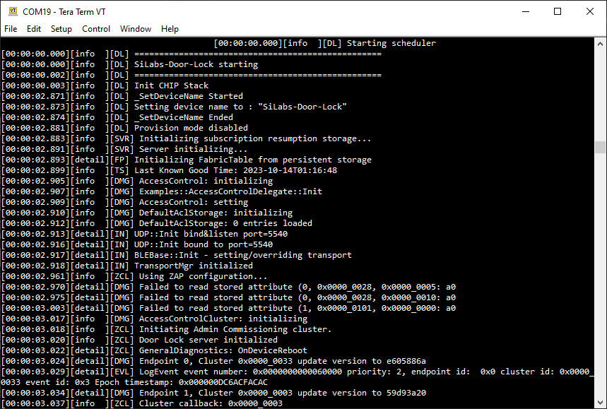
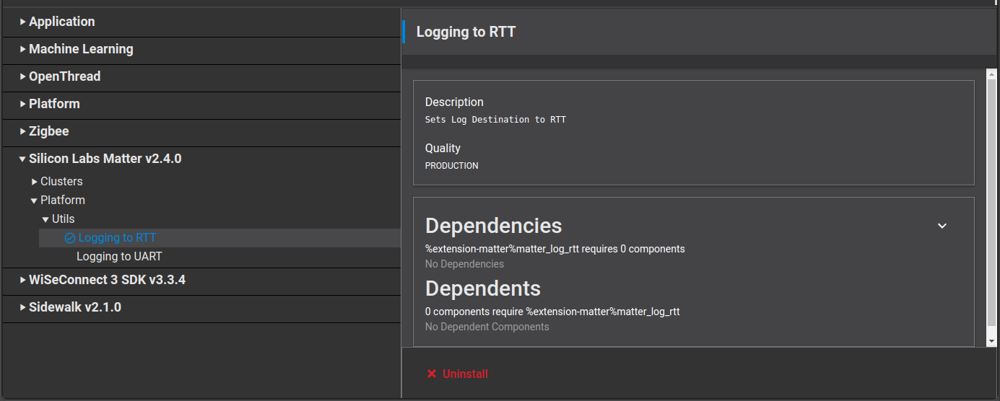

# Matter Logging Configurations

Device logs are enabled by default on UART instead of JLink RTT, and will be fully captured on the Serial Terminal.

To configure the Serial Terminal, follow steps 14 to 18 in the [Serial Port Settings](/matter/{build-docspace-version}/matter-overview-guides/serial-port-communications).

After flashing the device and setting up the Serial Terminal, you will see the device logs displayed on the Serial Terminal.

## Switching To RTT

To redirect device logs from UART to JLink RTT, enable the `matter_log_rtt` component.

To set the JLink RTT on SiWx917 SoC, follow the steps mention in [Setup SiWx917 SoC](/matter/{build-docspace-version}/matter-prerequisites/matter-artifacts)

> **Note:** `matter_log_uart` and `matter_log_rtt` components cannot be selected simultaneously.
