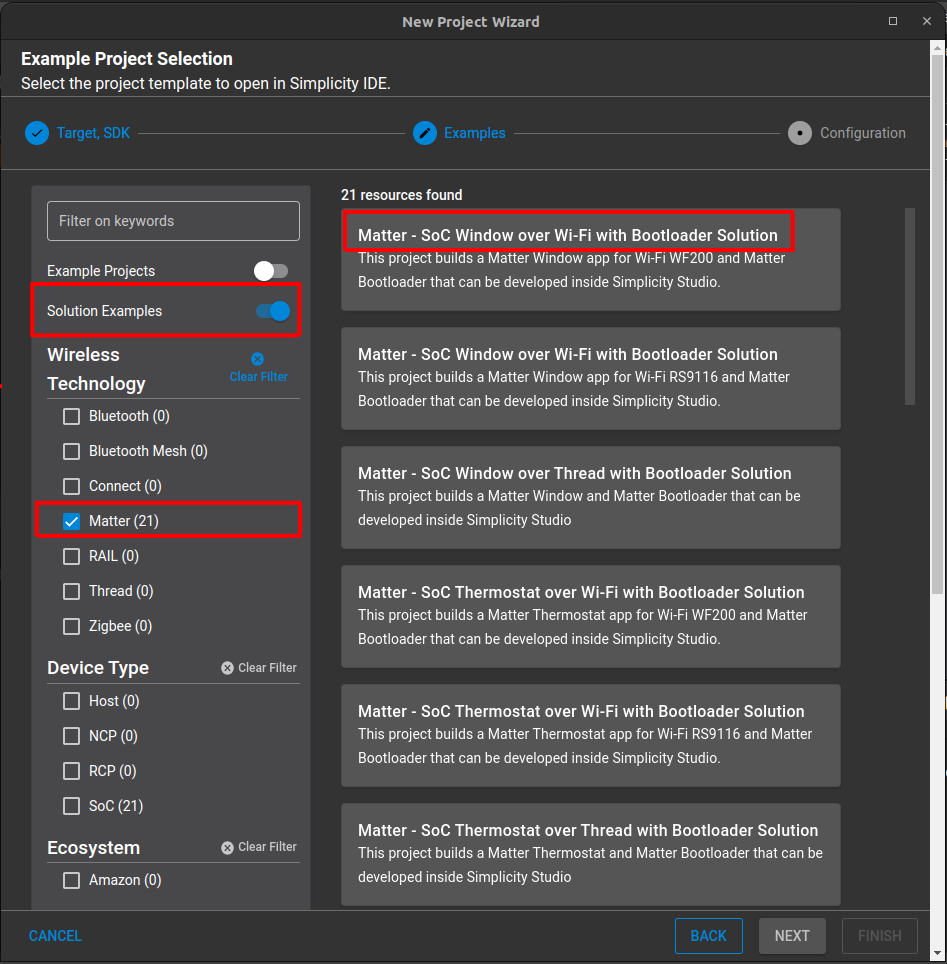
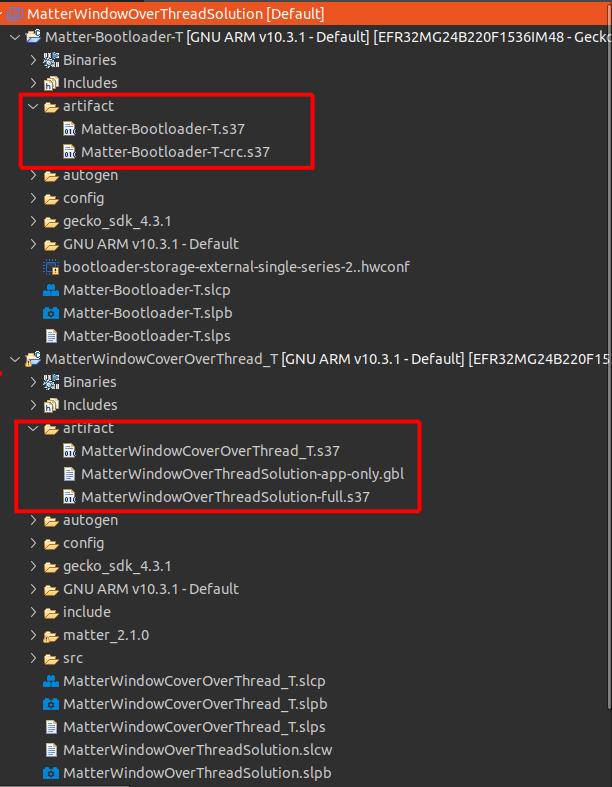

# Matter Solutions

## General

Matter solutions allow the user to generate multiple projects at once, to generate a combined solution/binary and allow multiple post-build operations to provide flexibility and unison when developing a Matter example or application. For example, with the Matter Lighting over Thread with Bootloader Solution a user can generate a Matter Bootloader, a Matter Lighting example, and the combined Bootloader + Example production image. Solutions will also generate a .gbl binary for the users to make use of and create an .ota software image update binary (directions listed below).

## Solution Creation

To create a Matter Solution, proceed to the **Example Project Selection** section of Simplicity Studio's **New Project Wizard**. On the left side, ensure that **Example Projects** is toggled off, **Solution Examples** is toggled on, and **Matter** under the **Technology** section is checked. Then, select the application example you wish to create a project from.



## Solution Building

Building via solutions behaves just like a normal project. Just ensure the top-level solution is selected and build! Artifacts from the resulting projects can be found within the `artifact` directory under each distinct project within the solution. Users selecting to build _just_ the sample application may get an error at the end of their build assuming the bootloader was built with it as well. Disregard this notification.



## OTA Creation

Due to certain limitations with the way our Matter examples are built within Simplicity Studio, OTA file generation must be conducted by the user via the command line.

To create an OTA file, first build a Matter example via solutions. Locate the resulting .gbl file within the `artifact` directory. This will be used as an argument to the GBL creation script. Then, locate the directory that holds the Matter Extension within the SiSDK in Simplicity Studio. The location should be similar to: `/Users/User/SimplicityStudio/SDKs/simplicity_sdk/extension/matter_extension`. Once found, open a terminal at this location and run the command:

```bash
./src/app/ota_image_tool.py create -v 0xFFF1 -p 0x8005 -vn <SoftwareVersion> -vs <SoftwareVersionString> -da sha256 <PathToArtifactDirectory>/<GblFile>  <PathToArtifactDirectory>/<ResultingOtaFileName>
```

Where `SoftwareVersion` and the `SoftwareVersionString` correspond to the CHIP_DEVICE_CONFIG_DEVICE_SOFTWARE_VERSION and CHIP_DEVICE_CONFIG_DEVICE_SOFTWARE_VERSION_STRING parameters the project has been compiled with. And where `ResultingOtaFileName` is the name of the OTA file you wish to generate, `PathToArtifactDirectory` is the location of your artifact directory within your project, and `GblFile` is the name of the GBL file that was produced after building the solution. The OTA file should now have been populated within the `artifact` directory in Simplicity Studio.
