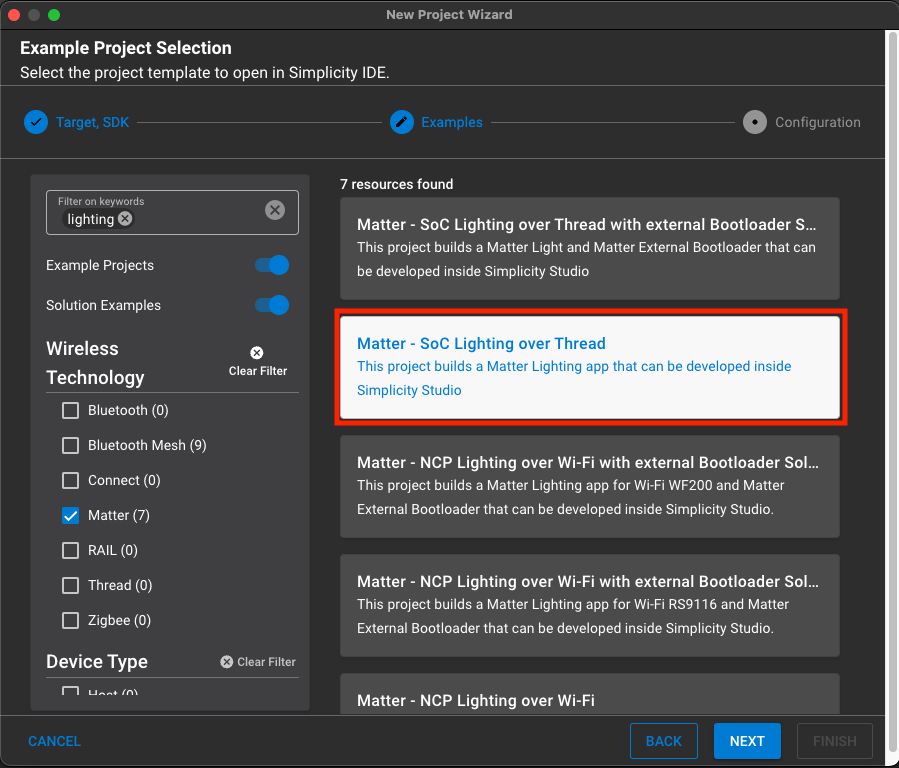
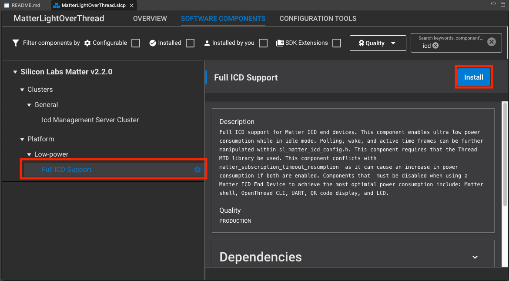
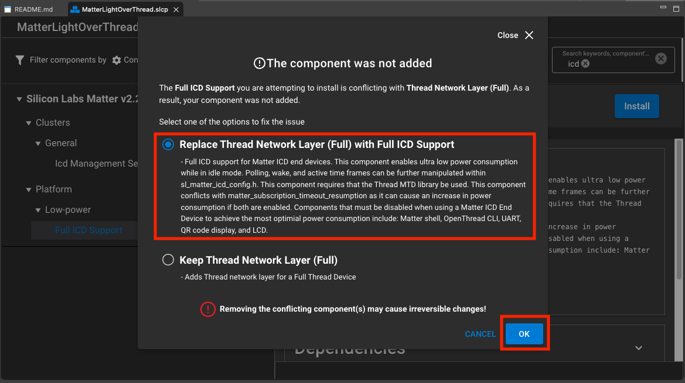

# Matter Intermittently Connected Devices over OpenThread

This page explains how Matter OpenThread Intermittently Connected Devices (ICDs) work and how to configure an ICD example.

## Overview

Matter provides an Intermittently Connected Device (ICD) operating mode to extend the battery life of power-limited devices.
The Matter ICD manager leverages subscription report synchronization and OpenThread functionalities to allow devices to sleep for set periods
without disrupting their Matter sessions.

Currently, in Matter v1.2, only ICD with Short Idle Time (SIT) is supported. ICD SIT are devices that SHOULD be configured with a Slow Polling Interval shorter than or equal to 15 seconds. For example, in a typical scenario for door locks and window coverings, commands need to be sent to the ICD with a use-case imposed latency requirement. Typically, devices that are Short Idle Time ICDs are not initiators in the communication flow.

## Operating Modes

ICDs have two operating modes: Idle and Active. An ICD alternates normally between the Idle mode and Active mode based on the `IdleModeInterval` and `ActiveModeInterval` respectively.

When the device is in *Active Mode*, the ICD is set into a fast-polling interval for maximum responsiveness.
The `CHIP_DEVICE_CONFIG_ICD_FAST_POLL_INTERVAL` parameter communicates the maximum sleep interval of a node in active mode.

Any of the following device states will start or keep the ICD in *Active Mode*:

- A commissioning window is open
- An exchange context is awaiting a response or ack
- The fail-safe is armed
  
Any of the following events can trigger the start of the *Active Mode* interval or extend it by one `ActiveModeThreshold`:

- A message needs to be sent
- A message was received
- An implemented user action occurred

Once the active mode is triggered, the ICD stays in this mode for a minimum duration of `ActiveModeInterval`
When the active interval has elapsed and none of the aforementioned states are active, the device will switch its operating mode to the Idle Mode.

In _Idle mode_, the ICD will poll its associated router at its slow-polling interval to see if another device has tried to communicate with it while it was sleeping.
If no event occurs, the ICD stays in its idle mode for the entirety of the `IdleModeInterval`.
The `CHIP_DEVICE_CONFIG_ICD_SLOW_POLL_INTERVAL` parameter communicates the slow-polling interval and therefore the maximum sleep interval of the node in idle mode. This parameter affects both the minimum power consumption and maximum latency.

## Thread Communication

In order to receive messages that were sent while the ICD was sleeping, the ICD relies on its associated Thread router which buffers any incoming messages.
The Thread router will send all buffered messages to the ICD when it polls the router at the end of its slow-polling interval.

## Configuration

Matter exposes some defines to configure the polling intervals of the OpenThread stack in both Idle and Active modes.

| Parameter Name | Define | Description | Default Value | Maximum Allowed Value |
| - | - | - | - | - |
| SlowPollInterval | CHIP_DEVICE_CONFIG_ICD_SLOW_POLL_INTERVAL (`SL_OT_IDLE_INTERVAL`) | Interval, in milliseconds, at which the thread radio will poll its network in idle mode. | 15000 ms | <= IdleModeInterval |
| FastPollInterval | CHIP_DEVICE_CONFIG_ICD_FAST_POLL_INTERVAL (`SL_OT_ACTIVE_INTERVAL`) | Interval, in milliseconds, at which the thread radio will poll its network in active mode. | 200 ms | < ActiveModeInterval |

For Matter configuration, see the [**Matter ICD**](/matter/<docspace-docleaf-version>/matter-overview-guides/matter-icd#Configuration) documentation.

## Building

### Enabling/Building

1. To begin creating an OpenThread ICD example, create a generic Matter over Thread example via the **New Project Wizard**. Lighting example will be used for demonstration purposes. Lock and Light-Switch applications come out-of-box with ICD enabled.

1. Once the project is generated, navigate to the software components section and install the Matter ICD component. Replace all subsequent conflicting components via the ensuing pop-up options (See below). This will install the necessary Thread Network Layer (MTD) component and ICD source code. This will also remove the conflicting Thread Network Layer (FTD) component.

3. ICD functionality should be installed and ready to build. Build the project as you would a normal example and flash the resulting binary to your specified end device. You should be able to commission the device the same way as non-ICD examples using the QR code URL (generated within the RTT logs at startup/BTN0 press).

## Minimal Power Consumption

The Lower Power Mode component is optional for low-power builds with the component `matter_platform_low_power`.

The Lower Power Mode component will disable:

- Matter Shell
- OpenThread CLI
- LCD and QR Code
