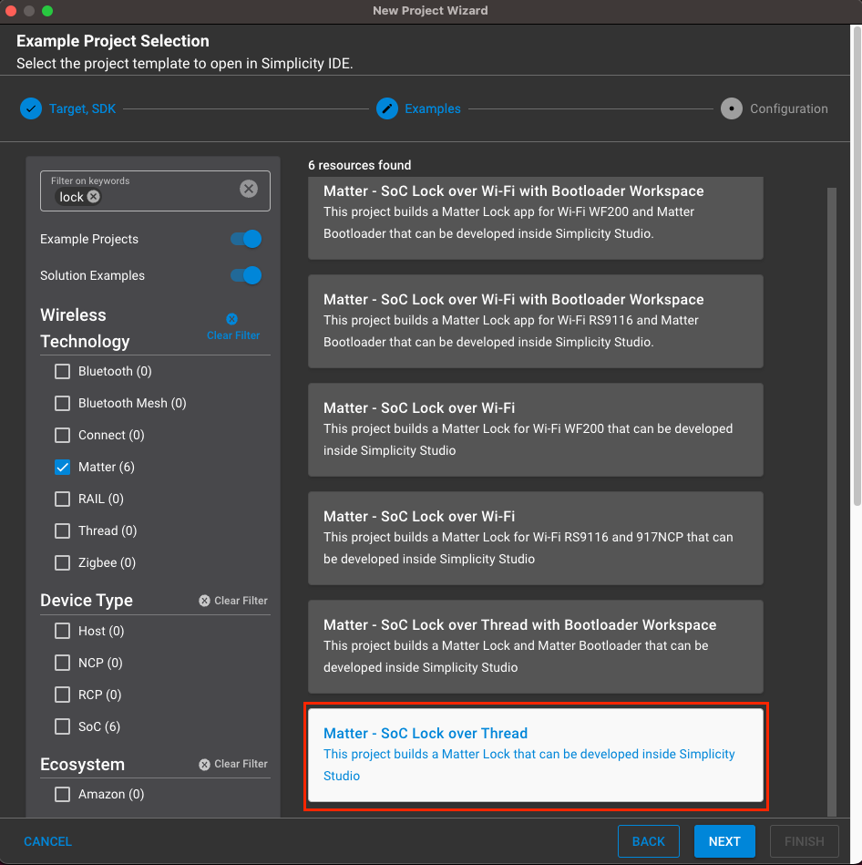
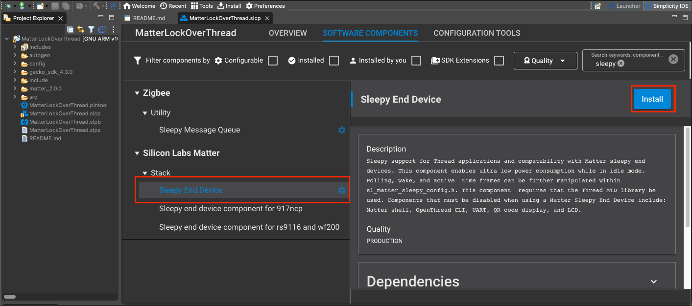
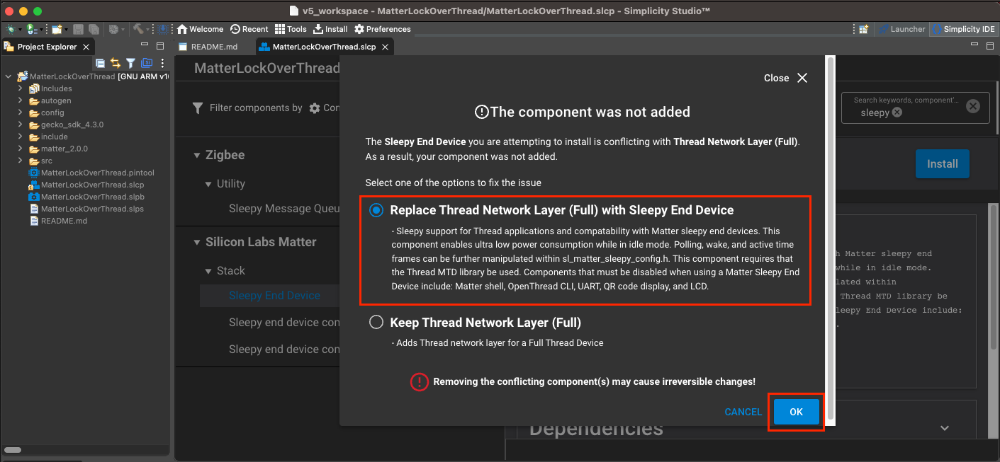
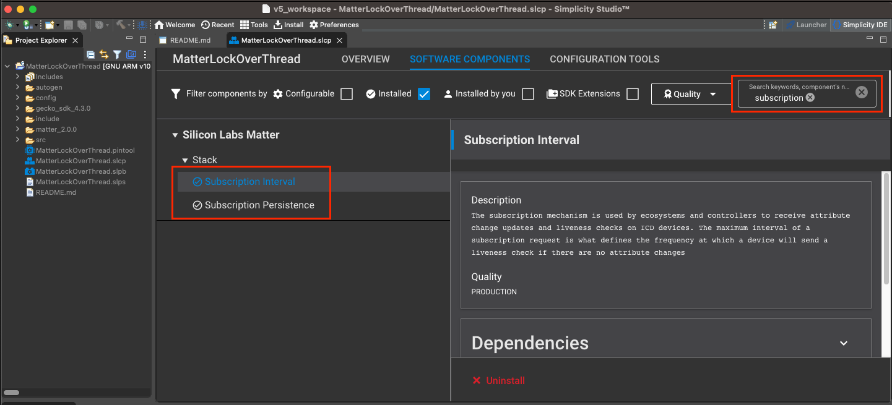
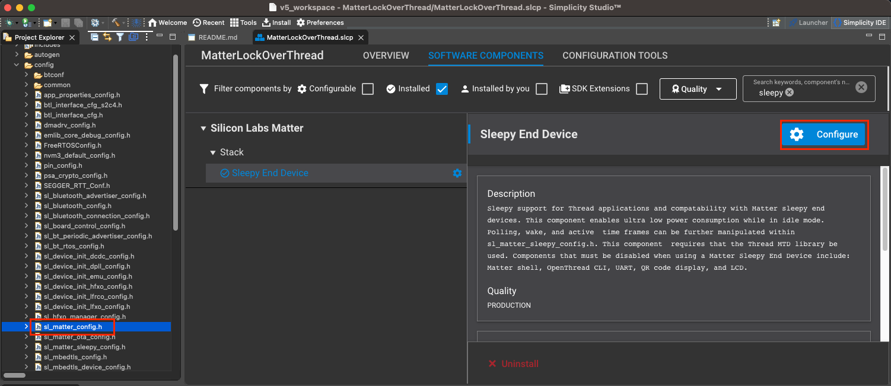

# Matter Sleepy End Devices over OpenThread 

This page explains how Matter OpenThread Sleepy End devices (SEDs) work and how to configure an SED example.

## Overview

Matter provides a Sleepy End Device operating mode to extend the battery life of a power limited devices. This operating mode leverages OpenThread functionalities to enhance the provided Matter features. Matter Sleepy functionalities currently focus on allowing an application to define the interval of time where a device is asleep.

## Operating Modes

SEDs have two operating modes, Idle and Active.

- _Active Mode_ sets the SED into a fast-polling interval for maximum responsiveness when the Node is engaged in ongoing communication, such as an active exchange. The SLEEPY_ACTIVE_INTERVAL parameter communicates the maximum sleep interval of a node in active mode.

- _Idle mode_, or slow-polling, sets the maximum time an SED will sleep before polling. This parameter affects both the minimum power consumption and maximum latency. The SLEEPY_IDLE_INTERVAL parameter communicates the maximum sleep interval of a node in idle mode.

A device determines if it is in Active or Idle mode based on whether it has at least one open exchange in the message layer. As long as the device has one open exchanges, it will remain in Active mode and poll its associated OpenThread router at the fast-polling interval. Once all exchanges are closed, the device will switch operating modes to Idle Mode.

When a device is in _Idle mode_, it will poll its associated router at its slow-polling interval to see if another device has tried to communicate with it while it was sleeping. If the OpenThread router has an outstanding message for the SED, the SED will enter its Active polling mode to process the message.

## Thread Communication

To receive message that were sent while the SED was sleeping, SED relies on its associated Thread router to buffer any incoming message. The Thread router will send all buffered message to the SED when the SED polls the router at the end of its slow-polling interval.

## Building 

### Enabling/Building

1) To begin creating an OpenThread SED example, create a generic Thread example via the "New Project Wizard". We will be using the Lock example for demonstration purposes.
   

2) Once the project is generated, navigate to the software components section and install the Sleepy End Device component. Replace all subsequent conflicting components via the ensuing pop-up options (See below). This will install the necessary Thread Network Layer (MTD) component and sleepy source code. This will also remove the conflicting Thread Network Layer (FTD), Matter Shell, and LCD components.
   

3) Install the Subscription Interval and Subscription Persistence components. These components are not required but highly reccomended.

4) Sleepy functionality should be installed and ready to build. Build the project as you would a normal example and flash the resulting binary to your specified end device. You should be able to commission the device the same way as non-sleepy examples using the QR code URL (generated within the RTT logs at startup/BTN0 press).

### Minimal Power Consumption

The Lower Power Mode component is optional for low-power builds. Installing the sleepy end device component will add the low power functionality as well.

The Lower Power Mode component will disable:

- Matter Shell
- OpenThread CLI
- LCD and Qr Code

## Configuration

Matter exposes three defines that can be set to configure the `SLEEPY_ACTIVE_INTERVAL`, `SLEEPY_IDLE_INTERVAL`, and `SL_ACTIVE_MODE_THRESHOLD` parameters. 

| Parameter Name | Define | Description | Default Value | Maximum allowed Value |
| - | - | - | - | - |
| SLEEPY_IDLE_INTERVAL | SL_OT_IDLE_INTERVAL | Maximum node sleep interval when in idle mode. | 30000 ms | <= 1 hour|
| SLEEPY_ACTIVE_INTERVAL | SL_OT_ACTIVE_INTERVAL | Maximum node sleep interval of when in active mode. | 200 ms | <= 1 hour|
| SLEEPY_ACTIVE_MODE | SL_ACTIVE_MODE_THRESHOLD | Maximum node active interval of when in active mode. | 1000 ms | <= 1 hour|

To change these default values, modify them in either: 
1) `config/sl_matter_sleepy_config.h`
2) Sleepy End Device component configurator
   

