# Serial Port Communication on the Silicon Labs Platform (Matter Shell)

The matter-shell exposes the configuration and the management APIs via the matter command line interface (matter CLI). This interface can be used to change the state of the device.

## Hardware Requirements

To run matter shell on the Silicon Labs Platform, refer to the [Hardware Requirements](/matter/{build-docspace-version}/matter-prerequisites/hardware-requirements).

## Software Requirements

To run matter shell on the Silicon Labs Platform, refer to the [Software Requirements](/matter/{build-docspace-version}/matter-prerequisites/software-requirements).

## Execute Matter Shell on Silicon Labs Platform

1. [Download](https://www.silabs.com/developers/simplicity-studio) and install Simplicity Studio.

2. To install the software packages for Simplicity Studio, refer to [Software Package Installation](/matter/{build-docspace-version}/matter-wifi-getting-started-example/software-installation#installation-of-software-packages).

3. Connect the EFR32MG2x or SiWx917 SOC board to the computer.

4. Go to the **Devices** section on the left panel.

5. Select the radio board that is connected. The Launcher page will display the selected radio board's details.

   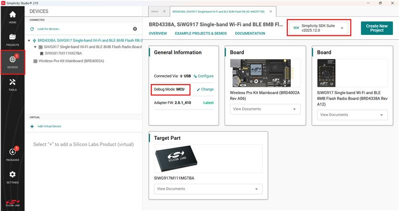

6. Verify the following in the **General Information** section:
   - The Debug Mode is **Onboard Device (MCU)**.
   - The Preferred SDK is the version you selected earlier.

7. Click on the **Create New Project** option and create a project for the Matter Lock Application.

   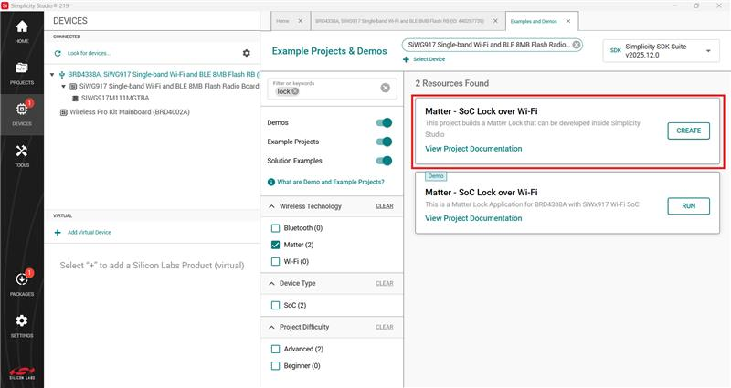

8. In the Project Configuration window, click **Finish**.

   

9.  After creation of project, open the **Software Components** tab and, in the search bar, type _Matter Shell_ and install it.

    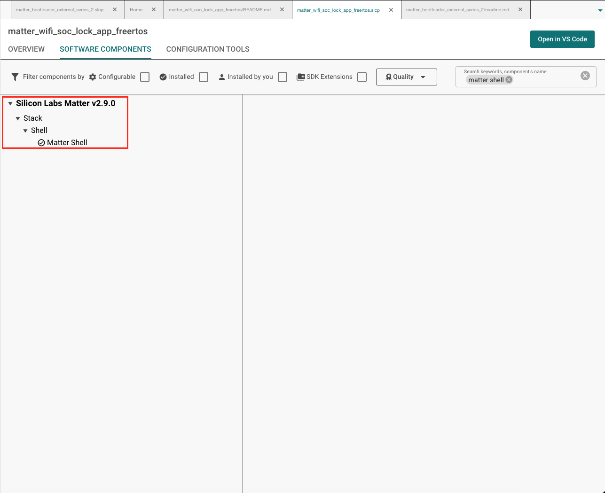

10. Build the project after enabling the **Matter Shell** component.

11. After a successful build, commission the device as described in [Commission Matter Platform](/matter/{build-docspace-version}/matter-wifi-run-demo/use-case-execution#creating-the-matter-network).

12. Open Tera Term and under **New connection**, select **Serial**, and in the dropdown, select the **JLink** port, and click **OK**.

    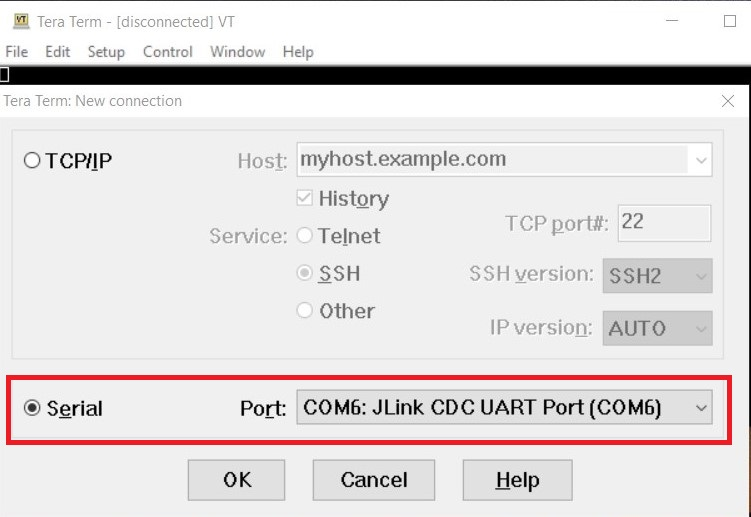

13. In the menu bar, click **Setup > Terminal**.

    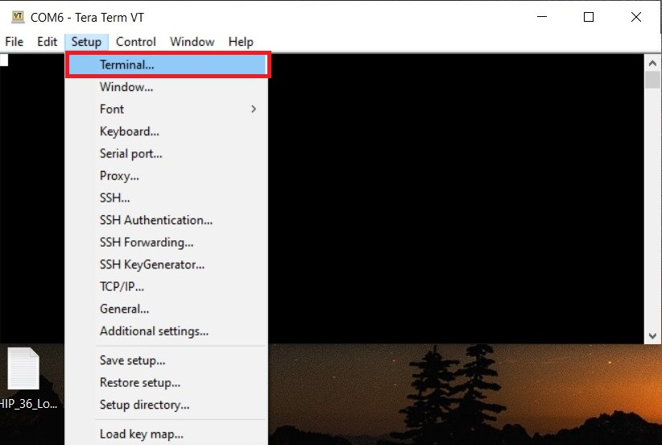

14. Inside **Terminal**, set the values below and click **OK**.

    - Terminal Size : 80 * 24
    - New-Line
      - Receive : CR+LF
      - Transmit : CR+LF

    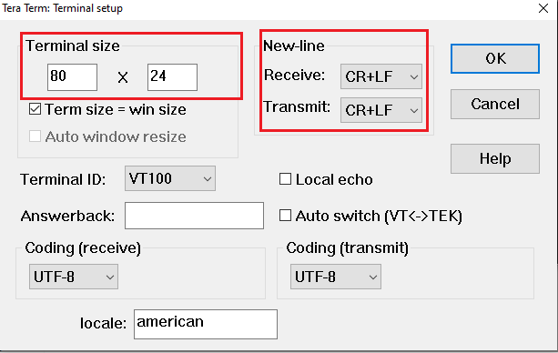

15. In the menu bar, click **Setup > Serial port**.

    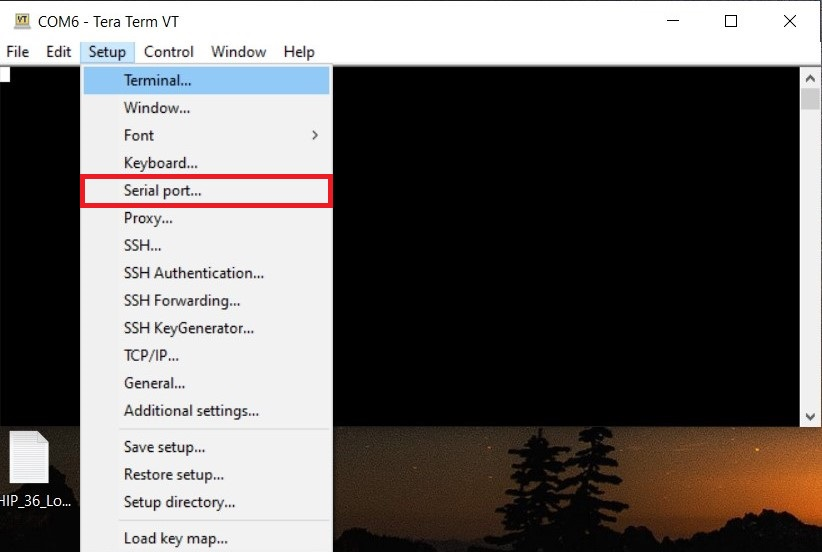

16. Increase the speed to **115200** and click **New setting**.

    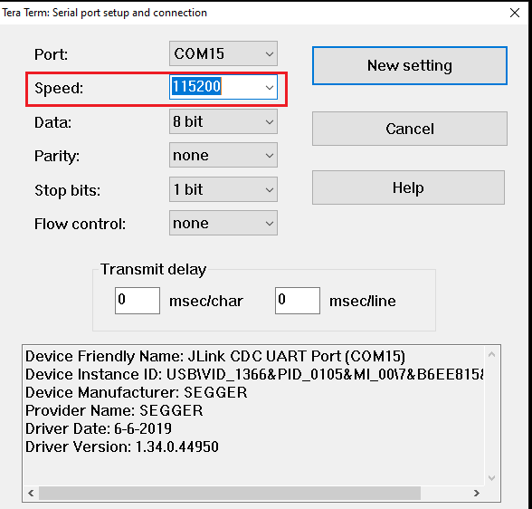

17. In the menu bar, click **File > TTY Record**. Create any empty file with extension ".tty" and click **Save**.

    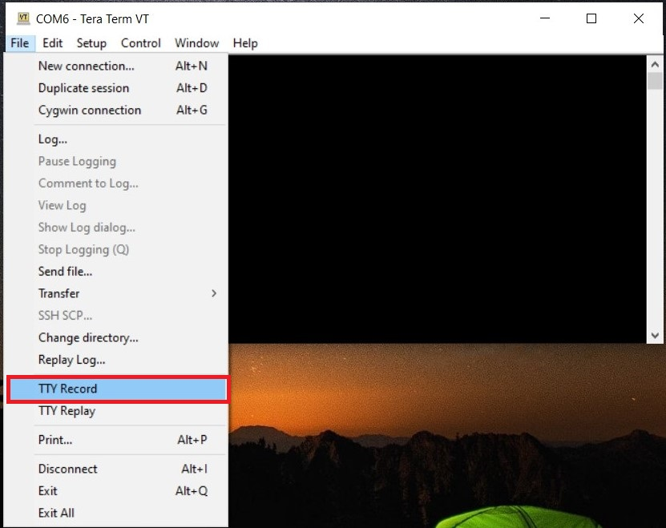

18. After creating the tty file, press **Enter** to open the **matterCli** terminal.

    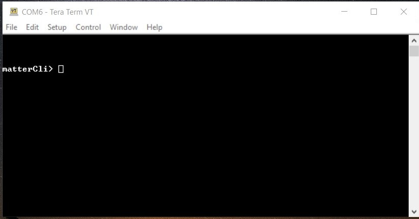

19. Send any command through the **matterCli** terminal, from the below list of commands:

    - doorlock event door-state-change "DoorState"
        - Door State List
        - DoorOpen = 0
        - DoorClosed = 1
        - DoorJammed = 2
        - DoorForcedOpen = 3
        - DoorUnspecifiedError = 4
        - DoorAjar = 5
    - doorlock event lock-alarm "AlarmCode"
        - Alarm Code List
        - LockJammed = 0
        - LockFactoryReset = 1
        - LockRadioPowerCycle = 3
        - WrongCodeEntryLimit = 4
        - FrontEsceutcheonRemoved = 5
        - DoorForcedOpen = 6
        - DoorAjar = 7
        - ForcedUser = 8
    - onboardingcodes ble, command will show QR Code.

      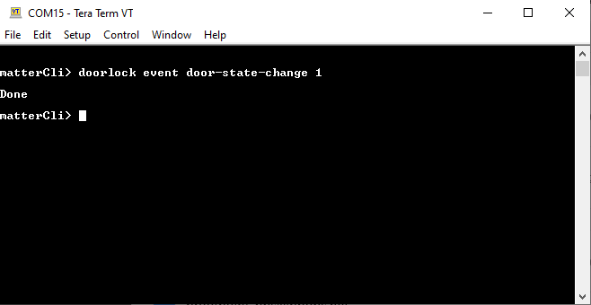

20. After changing DoorState and AlarmCode in **matterCli**, run the commands below using chip-tool on Raspberry PI to verify the event.
  
    - To Read Door State
  
      ./chip-tool doorlock read-event door-state-change "node_id" "endpoint"
  
    - To Read Alarm Code
  
      ./chip-tool doorlock read-event door-lock-alarm "node_id" "endpoint"

  **Note**: Type **help** in matterCli terminal for more information about supported features.

  **Note**: For 917SoC ICD-enabled devices, only five UULP pins are supported. As a result, the Matter shell is not functional with sleepy applications because they are not mapped to UULP pins. To enable the Matter shell for sleepy 917SoC devices, the P37 pin must be pulled up. Additionally, boards BRD2708A, BRD2911A, and BRD4343A have only three UULP GPIO pins, which prevents the shell from functioning. To enable the shell on these boards, users must repurpose existing UULP GPIO pins.