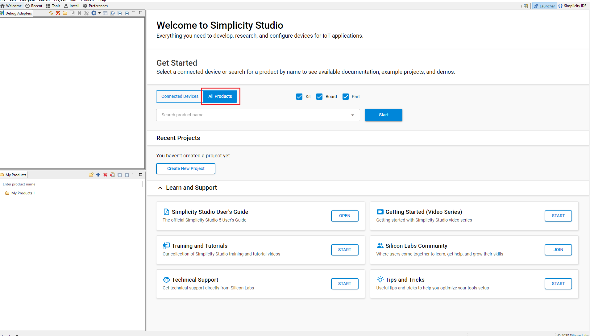
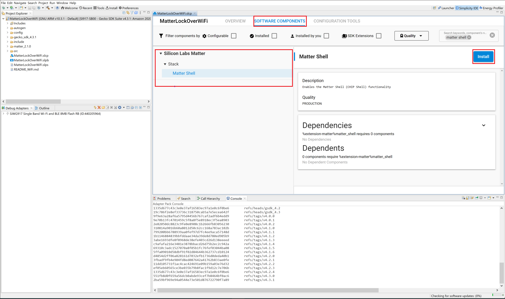
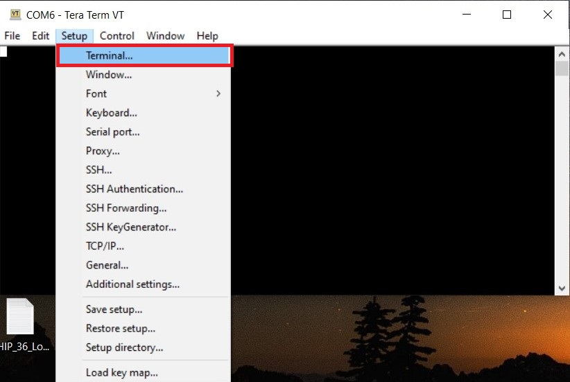
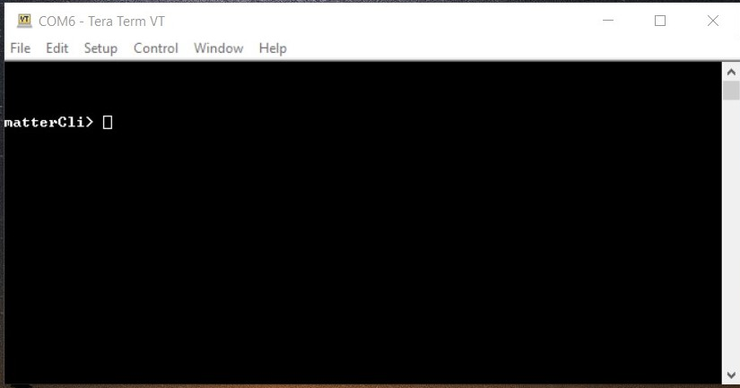

# Serial Port Communication on the Silicon Labs Platform

The matter-shell exposes the configuration and the management APIs via the matter command line interface (matter CLI). This interface can be used to change the state of the device.

## Hardware Requirements

To run matter shell on the Silicon Labs Platform, refer to the [Hardware Requirements](/matter/<docspace-docleaf-version>/matter-prerequisites/hardware-requirements).

## Software Requirements

To run matter shell on the Silicon Labs Platform, refer to the [Software Requirements](/matter/<docspace-docleaf-version>/matter-prerequisites/software-requirements).

## Execute Matter Shell on Silicon Labs Platform

1. [Download](https://www.silabs.com/developers/simplicity-studio) and install Simplicity Studio.

2. To install the software packages for Simplicity Studio, refer to [Software Package Installation](/matter/<docspace-docleaf-version>/matter-wifi-getting-started-example/software-installation#installation-of-software-packages).

3. Log in to Simplicity Studio and connect the EFR32MG2x or SiWx917 SOC board to the computer.

4. Go to the **All Products** section.

   

5. Type and select the radio board from the displayed list and click **Start**.

   

6. The Launcher page will display the selected radio board's details.

   

7. Verify the following in the **General Information** section:
   - The Debug Mode is **Onboard Device (MCU)**.
   - The Preferred SDK is the version you selected earlier.

   

8. Open the **Example Projects and Demos** tab and create a project for the Matter Lock Application.

   

9. In the New Project Wizard window, click **Finish**.

   

10. After creation of project, open the **Software Components** tab and, in the search bar, type **Matter Shell** and install it.

    

11. Build the project after enabling the **Matter Shell** component.

12. After a successful build, commission the device as described in [Commission Matter Platform](/matter/<docspace-docleaf-version>/matter-wifi-run-demo/use-case-execution#creating-the-matter-network).

13. For SiWx917 SoC, connect the TTL cables with the Radio Board to execute **Matter Shell**.

    

    **Note**: For EFR32MG2x devices, TTL Cable support is not required.

14. Open Tera Term and under **New connection**, select **Serial**, and in the dropdown, select the **JLink** port, and click **OK**.

    

15. In the menu bar, click **Setup > Terminal**.

    

16. Inside **Terminal**, set the values below and click **OK**.

    - Terminal Size : 80 * 24
    - New-Line
      - Receive : CR+LF
      - Transmit : CR+LF

    

17. In the menu bar, click **Setup > Serial port**.

    

18. Increase the speed to **115200** and click **New setting**.

    

19. In the menu bar, click **File > TTY Record**. Create any empty file with extension ".tty" and click **Save**.

    

20. After creating the tty file, press **Enter** to open the **matterCli** terminal.

    

21. Send any command through the **matterCli** terminal, from the below list of commands:

    - doorlock event door-state-change "DoorState"
        - Door State List
        - DoorOpen = 0
        - DoorClosed = 1
        - DoorJammed = 2
        - DoorForcedOpen = 3
        - DoorUnspecifiedError = 4
        - DoorAjar = 5
    - doorlock event lock-alarm "AlarmCode"
        - Alarm Code List
        - LockJammed = 0
        - LockFactoryReset = 1
        - LockRadioPowerCycle = 3
        - WrongCodeEntryLimit = 4
        - FrontEsceutcheonRemoved = 5
        - DoorForcedOpen = 6
        - DoorAjar = 7
        - ForcedUser = 8
    - onboardingcodes ble, command will show QR Code.

      

22. After changing DoorState and AlarmCode in **matterCli**, run the commands below using chip-tool on Raspberry PI to verify the event.
  
    - To Read Door State
  
      ./chip-tool doorlock read-event door-state-change "node_id" "endpoint"
  
    - To Read Alarm Code
  
      ./chip-tool doorlock read-event door-lock-alarm "node_id" "endpoint"

  **Note**: Type **help** in matterCli terminal for more information about supported features.
