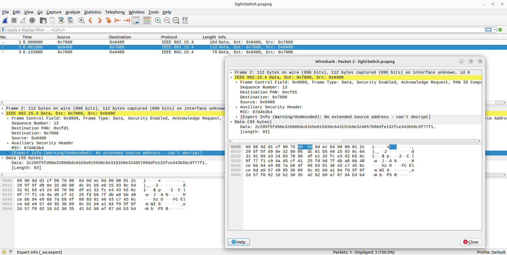
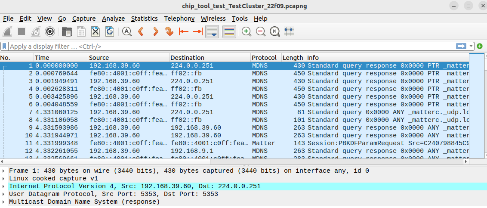
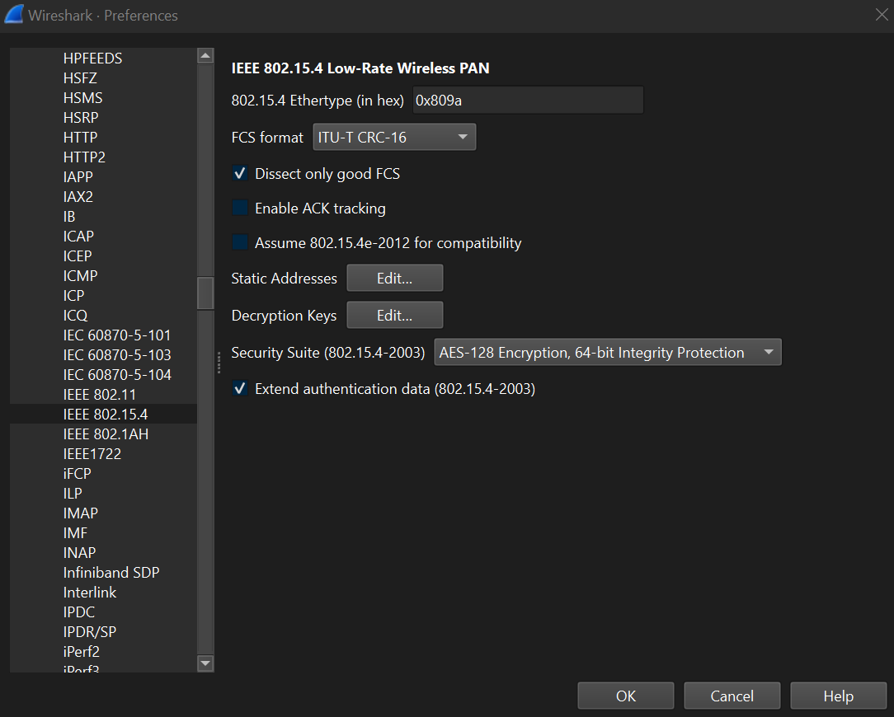
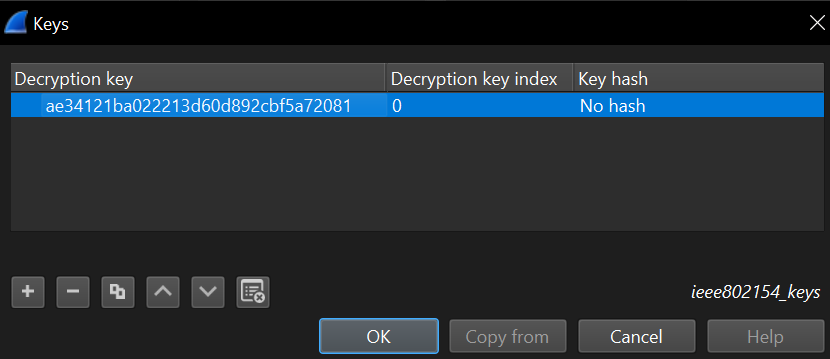

When developing a wireless application, it is often useful to visualize the network traffic. This is either to study the communication between devices or to debug networking issues. Below are the most common ways to debug networking issues:

- Use Wireshark with the Matter Wireshark dissector
- Use logging to dump out the unencrypted network traffic from the device itself
- Use Silicon Labs' Network Analyzer to analyze the underlying Thread (+BLE for commissioning) traffic

# Use Wireshark Together with the Matter Wireshark Dissector

[Wireshark](https://www.wireshark.org/) is a great tool for analyzing network packets, but the default Wireshark offering does not include decoding of Matter Network Packets. To enable Matter decoding, you must capture the network traffic using a wireless network interface. You also need to provide Wireshark with something called a Matter dissector for Wireshark to understand the Matter protocol and dissect Matter network packages.

Below are the steps to capture and visualize network traffic with Wireshark and the Matter Wireshark dissector:

## 1. Rebuild the Matter Application and CHIP-tool Using CHIP_CONFIG_SECURITY_TEST_MODE

The Matter protocol implements strict and mandatory security requirements. These include end-to-end message encryption, which prevents network packets from being analyzed even if captured. To analyze Matter network traffic for development purposes, we must disable this feature from all devices involved in the network traffic to analyze. These devices include CHIP-tool running on a Matter controller or Matter End Devices.

To do this, you must rebuild the firmware for the involved devices with __CHIP_CONFIG_SECURITY_TEST_MODE__ enabled.

For example, with a Silabs sample Matter application developed using the Matter Extension, you can enable this option within the header file _CHIPProjectConfig.h_:

~~~
// For convenience, Chip Security Test Mode can be enabled and the
// requirement for authentication in various protocols can be disabled.
//
//    WARNING: These options make it possible to circumvent basic Chip security functionality,
//    including message encryption. Because of this they MUST NEVER BE ENABLED IN PRODUCTION BUILDS.
//
#define CHIP_CONFIG_SECURITY_TEST_MODE 1
~~~

__IMPORTANT NOTICE: disable security ONLY for development purposes only. This option MUST always be DISABLED for production (default).__

## 2. Capture Matter Network Traffic Using a Sniffer

After disabling network security, you need to capture the specific network traffic you need to analyze. This will depend on the networking protocol you use to transport Matter messages.

For example, if you use Matter over Thread, you need a Thread sniffer, and if you use Matter over Wi-Fi, you need to capture Wi-Fi traffic.

With Matter over Thread, you can sniff Thread traffic using a Silabs WSTK and the Network Analyzer from Simplicity Studio v5. For this, you can refer to section 5.4 of [QSG170: Silicon Labs OpenThread QuickStart Guide](https://www.silabs.com/documents/public/quick-start-guides/qsg170-openthread-sdk-quick-start-guide.pdf). 

After capturing Thread network traffic, export it as a PCAPNG file, which is a file format that can be read by Wireshark. At this point, we can only see Thread traffic since Wireshark currently cannot decode the Matter layer of the network packet yet:



## 3. Follow instructions on the CSA Matter Dissector Repository to Build/Install Wireshark and the Dissector

For Wireshark to decode Matter network packets, we need to add a protocol dissector designed for Matter specifically.

The CSA has a Matter Dissector project that can be used by Wireshark to decode Matter packets. To use it, follow the CSA guide: [Matter-Dissector: Wireshark plugin for parsing Matter protocol messages](https://github.com/project-chip/matter-dissector/tree/main). Note that at the time of this writing, this dissector only works on Linux and the quality is still experimental.

Here are the steps to properly setup and run Wireshark with Matter dissector:

1. Setup your workspace.
```shell
mkdir ~/my_folder
cd ~/my_folder
```
On you Linux machine, you should create new folder. This folder will contain both Wireshark and Matter Dissector repositories. Doing this will help the setup scripts to run by default and avoid PATH issues.

2. Install dependencies and build Wireshark
```
cd ~/my_folder
sudo apt-get build-dep wireshark
git clone https://gitlab.com/wireshark/wireshark.git
cd wireshark
git checkout release-3.6
mkdir build
cd build
cmake ..
make
sudo make install
sudo ldconfig
```

3. Clone, build and install the Matter dissector
```shell
cd ~/my_folder
git clone git@github.com:project-chip/matter-dissector.git
cd matter-dissector
make
make install
```

## 4. Do a Test Run with the Matter Dissector to Verify Everything Runs Correctly
After building and installing both Wireshark and Matter dissector, it's a good idea to do a test run with an example capture file.

To do this, run:
```shell
cd ~/my_folder/
cd matter-dissector
make test
```
You should see Wireshark opening and decoding a sample Matter network capture file:



## 5. Add Security Keys (When Applicable) for Wireshark to Decrypt Messages

The Matter dissector should be able to decode Matter traffic once the security has been disabled. However, Wireshark still needs to decode the underlying network transport if there's any encryption involved.

In the case of Matter over Thread Wireshark will need the Thread network key. You can get the Thread network key from the OpenThread CLI of a device on the network.

Here is an example:
```shell
matterCli> otcli networkkey
otcli networkkey
 
ae34121ba022213d60d892cbf5a72081
Done
```
After obtaining the Thread network key, you need to add this key to Wireshark for it to decode Thread network traffic. To do this, choose Edit → Preferences → Protocols → IEEE 802.15.4:


Add the network key you just acquired as "Decryption key" and select "OK":


## 6. Analyze Matter Traffic Captured in Step 2

At this point, Wireshark is ready to decrypt and analyze the Matter traffic (with security disabled) you captured earlier.

You can now use Wireshark to open the PCAPNG file you exported at __step 2__ and proceed to do Matter network analysis.

## Use logging to dump out the network traffic

Since Matter is open-source software, you have access to the end device source code and can see incoming and outgoing messages when they're not encrypted. This allows you to dump out this unencrypted network traffic (for development purposes only) using any other communication channel. This includes but is not limited to RTT log or UART log.

You can view unencrypted Matter messages within the function _SessionManager::PrepareMessage_. At this point, you can either implement a method for network traffic dump or use Matter's existing infrastructure for messages trace (highly recommended).

If you choose the latter option, here are the steps:

## 1. Enable Matter Transport Trace
You need to enable this option within _CHIPBuildConfig.h_:
~~~
CHIP_CONFIG_TRANSPORT_TRACE_ENABLED
~~~
With this enabled, Matter will begin tracing unencrypted messages. Here is one of the places where unencrypted message trace takes place within Matter SDK:

~~~
// Trace before any encryption
MATTER_LOG_MESSAGE_SEND(chip::Tracing::OutgoingMessageType::kGroupMessage, &payloadHeader, &packetHeader,
                        chip::ByteSpan(message->Start(), message->TotalLength()));
 
CHIP_TRACE_MESSAGE_SENT(payloadHeader, packetHeader, destination_address, message->Start(), message->TotalLength());
~~~
## 2. Implement Method to Dump Out Network Traffic
To do this you'll need to implement a method to dump out network traffic. 

For this, you need to implement the function _HandleTransportTrace()_, which is already called to perform message tracing by the Matter SDK when you enable CHIP_CONFIG_TRANSPORT_TRACE_ENABLED.

Here is its prototype:
~~~
void HandleTransportTrace(const char * type, const void * data, size_t size);
~~~
After _HandleTransportTrace()_ is properly implemented for message tracing, you should see unencrypted messages on the communication channel you chose earlier (UART, RTT, etc.).

## Use Silicon Labs' Network Analyzer to Analyze the Underlying Thread and BLE Network Traffic

To analyze BLE network traffic, you can refer to [AN1317: Using Network Analyzer with Bluetooth® Low Energy and Mesh](https://www.silabs.com/documents/public/application-notes/an1317-network-analyzer-with-bluetooth-mesh-le.pdf)
For Thread network analysis, you can refer to section 5.4 of [QSG170: Silicon Labs OpenThread QuickStart Guide](https://www.silabs.com/documents/public/quick-start-guides/qsg170-openthread-sdk-quick-start-guide.pdf)


