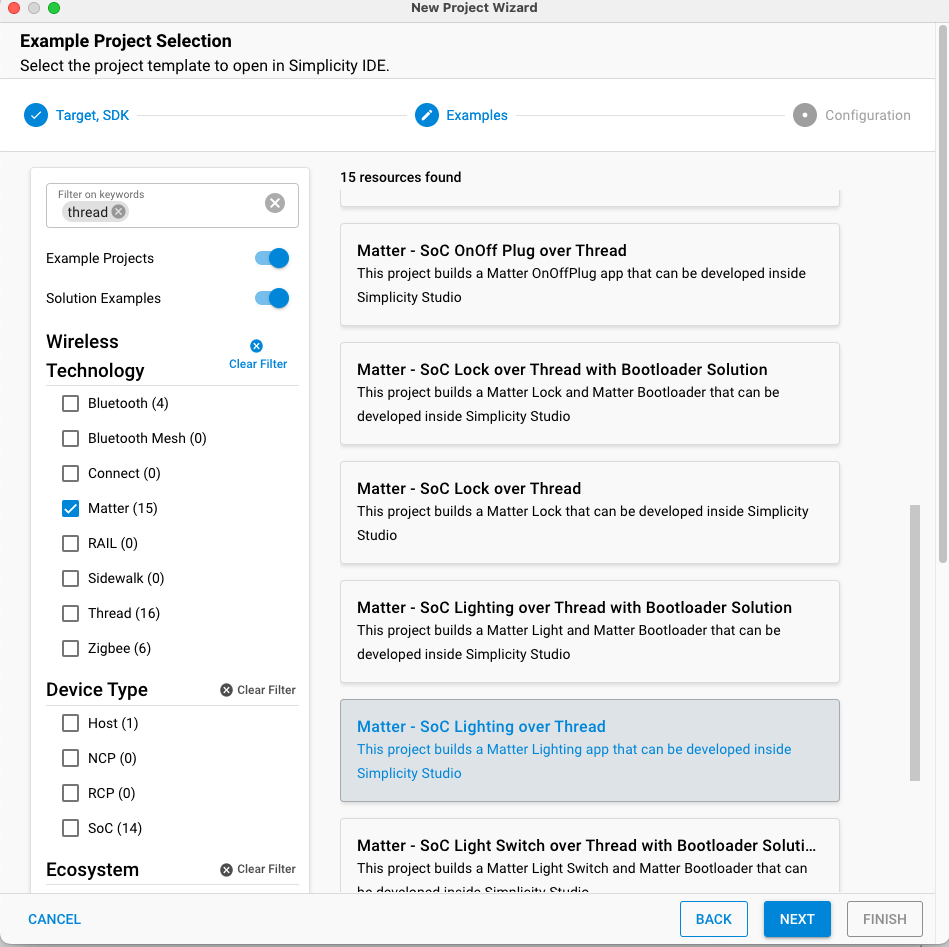

# Test Matter Certificates for Development

## Hardware and Software Requirements

- **Commissioner**

  - Raspberry Pi flashed with the Matter Hub Image

    - Setting Up you Matter Hub: [Developing with Silicon Labs Matter](/matter/<docspace-docleaf-version>/matter-start)

  - WSTK with supported boards for RCP

    - How to set up your RCP: [Developing with Silicon Labs Matter](/matter/<docspace-docleaf-version>/matter-start)

- **Commissionee**

  - WSTK with MG24A or MG24B (Initial boards supported for Matter CPMS Alpha program). The provisioning script also supports MG12. In this tutorial, you will build an application with a BRD4187C.

## Introduction to Provisioning

Matter devices require a minimum amount of data that should be installed. Besides the Vendor ID, Product ID, Discriminator, and other device information, session establishment requires a CD (Certification Declaration), PAI (Product Attestation Intermediate certificate), and DAC (Device Attestation Certificate). There is no requirement about how or where this data is stored, but the Matter stack uses three distinct interfaces to retrieve it:

- [DeviceInstanceInfoProvider](https://github.com/project-chip/connectedhomeip/blob/master/src/include/platform/DeviceInstanceInfoProvider.h)

- [CommissionableDataProvider](https://github.com/project-chip/connectedhomeip/blob/master/src/include/platform/CommissionableDataProvider.h)

- [DeviceAttestationCredsProvider](https://github.com/project-chip/connectedhomeip/blob/master/src/credentials/DeviceAttestationCredsProvider.h)

There is a long list of parameters that may be loaded on the device in-factory, and there are also complex dependencies between different arguments and files. For instance, Vendor ID must be returned by the DeviceInstanceInfoProvider interface, but Vendor ID must also be present in the CD and DAC and must match in all instances. Furthermore, each DAC must be loaded alongside its private key, which is used to sign outgoing messages. The secrecy of the private key is critical for the security of the inter-device communication; therefore, measures must be taken to limit access to this key, and this key should be stored in the most secure part of your device.

In a production environment, different devices should have unique identifiers, passcodes, discriminators, private-keys and DACs, which implies customization during the manufacturing process. To ease the development and manufacturing of customized devices, Silicon Labs provides the [Custom Part Manufacturing Service (CPMS)](https://www.silabs.com/services/custom-part-manufacturing-service).

In a development environment, Silicon Labs provides a Provisioning Tool that is used to generate a Matter Certificate Chain based on Test or Development Certificates provided by the CSA. These certificates can have data modified such as VID, PID, Discriminator, Passcode, etc. For more information and arguments to this tool, refer to [Using CPMS](/matter/<docspace-docleaf-version>/matter-using-cpms).

To provide flexibility, Silicon Labs provides two ways to write Commissionable Data and Device Attestation Credentials to Matter Devices. The following figure depicts these two flows:


These two provisioning flows use the same Python Provisioning Tool script to initiate writing the Commissionable Data and the Device Attestation Data. The Generator Firmware and the Matter Sample application have the ability to store all the required data for a successful commissioning.

The use of a Generator Firmware is intended for Provisioning at Manufacturing and to reduce time writing Matter Credentials as there is no need for a bootloader or Matter Application.

When using a Matter Sample Application for provisioning, the user must ensure that the Matter Device has the flag *use\_provision\_channel = true* upon booting the device. The provision flag may be set to 1 at runtime. This may be accomplished in three ways:

- On example application with two buttons, factory reset by pressing BTN0 and BNT1 at the same time. Besides the regular factory reset, the provision flag is set to 1, and the device will wait for provisioning upon restart.

- The application may set the provision flag to 1 given certain condition, for instance, upon receiving a wireless command.

- When connected through USB or TCP/IP, the provision flag may be overwritten using Simplicity Commander:

```bash
commander nvm3 read -o ./temp/nvm3.s37
commander nvm3 set ./temp/nvm3.s37 --object 0x87228:01 --outfile ./temp/nvm3+.s37
commander flash ./temp/nvm3+.s37
```

A hands-on example of these provisioning flows will be provided in the following Sections.

## Initial Setup

Using your PC for development, including:

- Studio with Matter Extension or SMG - *preferably the latest GSDK version.*
- Clone the matter repo

```bash
git clone https://github.com/SiliconLabs/matter.git
cd matter
git submodule update --init
```

In the matter repo directory:

```bash
source ./scripts/bootstrap.sh
source ./scripts/activate.sh
gn gen out/tools
ninja -C out/tools
cd provision/
```

## Generating Matter Certificates (CD, PAA,PAI,DAC) - Provisioning Script

Reference and detailed explanation of the different processes that take place in the provisioning script are detailed in [https://github.com/SiliconLabs/matter/tree/release_2.1.0-1.1/cpms](https://github.com/SiliconLabs/matter/tree/release_2.1.0-1.1/cpms). The following is an example on how to generate certificates using the chip-cert tool. We will start with generating the Certification Declaration as follows:

```bash
./out/tools/chip-cert gen-cd -K credentials/test/certification-declaration/Chip-Test-CD-Signing-Key.pem -C credentials/test/certification-declaration/Chip-Test-CD-Signing-Cert.pem -O credentials/test/certification-declaration/Chip-Test-CD-1049-8005.der -f 1 -V 0x1049 -p 0x8005 -c ZIG20142ZB330001-24 -l 0 -i 0 -n 257 -t 0 -o 0x1049 -r 0x8005
```

This chip-cert command uses the Chip-Test-CD-Signing-Key.pem and Chip-Test-CD-Signing-Cert.pem to sign the output CD which is Chip-Test-CD-1049-8005.der with **Vendor ID:**  0x1049 and **Product ID:** 0x8005.

The next step is to generate the Product Attestation Intermediate (PAI) and Device Attestation Certificate (DAC) using a test Product Attestation Authority (PAA) provided by the CSA and can be found in ~/matter/credentials/test/attestation/Chip-Test-PAA-NoVID-Cert.pem. This PAA will be the root certificate to sign the PAI which will then sign the DAC and we will obtain our Public Key Infrastructure Matter Certificate Chain:

```bash
./out/tools/chip-cert gen-att-cert -t i -l 3660 -c "Matter PAI" -V 0x1049 -P 0x8005 -C ./credentials/test/attestation/Chip-Test-PAA-NoVID-Cert.pem -K ./credentials/test/attestation/Chip-Test-PAA-NoVID-Key.pem -o ./credentials/test/attestation/pai_cert.pem -O ./credentials/test/attestation/pai_key.pem
```

If you plan on using different PID for different Matter devices you can remove the -P 0x8005 from the PAI and this will provide more flexibility to generate DACs with different PIDs under the same PAI. You can use the following command to generate a DAC using the PAI Cert and the PAI key:

```bash
./out/tools/chip-cert gen-att-cert -t d -l 3660 -c "Matter DAC" -V 0x1049 -P 0x8005 -C ./credentials/test/attestation/pai_cert.pem -K ./credentials/test/attestation/pai_key.pem -o ./credentials/test/attestation/dac_cert.pem -O ./credentials/test/attestation/dac_key.pem
```

To verify the Certificate Chain you can also use chip-cert:

```bash
./out/tools/chip-cert validate-att-cert --dac credentials/test/attestation/dac_cert.pem --pai credentials/test/attestation/pai_cert.pem --paa credentials/test/attestation/Chip-Test-PAA-NoVID-Cert.pem
```

If the chain is correctly verified, no errors should be output from this command.

Once you have finished generating you Certificates, you can proceed with installing the Provisioning Tool in order to flash the Matter Commissionable Data and the Device Attestation Data onto your device.

## Provisioning Tool

>Important: Please review the required installations in the [Provisioner Script](https://github.com/SiliconLabs/matter/tree/release_2.1.0-1.1/cpms#provisioner-script) Section.

### Required Installation

- Simplicity Commander:

  - Please install Simplicity Commander and add it to you environment variables.

  - example for Mac:

    ```bash
    export PATH=$PATH:"/Applications/SimplicityStudio.app/Contents/Eclipse/developer/adapter_packs/commander/Commander.app/Contents/MacOS/"
    ```

- SEGGER:

  - You can use the dlibjlinkarm.dylib in Simplicity Studio Eclipse/developer/adapter_packs/jlink/ or,

  - You can download SEGGER depending on your OS [here](https://www.segger.com/downloads/jlink/).

  - Once you have the dlibjlinkarm.dylib please try one of these options so the provisioning script can use jlink:

```bash
# Option A: Copy the library to your libraries directory.
$ cp libjlinkarm.dylib /usr/local/lib/

# Option B: Add SEGGER's J-Link directory to your dynamic libraries path.
$ export DYLD_LIBRARY_PATH=/Applications/SEGGER/JLink:$DYLD_LIBRARY_PATH
```

- SPAKE2 + generator: This tool is already part of the files in the cloned repo.

- Pylink

  - Please follow the [PyLink Installation Instructions](https://pylink.readthedocs.io/en/latest/installation.html).

### Running the Provisioning Tool

Once you have generated the PAA, PAI and DAC and have installed the provisioning tool you can use it to write the Commissionable Data and the Device Attestation Data. As previously mentioned, there are two provisioning flows possible, following are the necessary steps to correctly provision your device.

Go to the ~/matter/provision/directory:

### Generator Firmware

To choose different provisioning flows, the provisioning script has the argument option -gf to direct the script:

```bash
python3.7 ./provision.py -c config/silabs.json -ic ../credentials/test/attestation/pai_cert.pem -dc ../credentials/test/attestation/dac_cert.pem -dk ../credentials/test/attestation/dac_key.pem -cd ../credentials/test/certification-declaration/Chip-Test-CD-1049-8005.der -d 0xab2 -gf images/efr32mg24.s37 -j 10.4.215.22
```

Provisioning Tool Output

```bash
  ‣ commander device info --ip 10.4.215.22
  ‣ mkdir -p ./temp

◆ Device Info:
  ∙ part: 'efr32mg24b220f1536im48'
  ∙ family: 'efr32mg24'
  ∙ version: '4'
  ∙ revision: 'A1'
  ∙ flash_addr: 0x08000000
  ∙ flash_size: 0x00180000

◆ Writing firmware
  ‣ commander flash images/efr32mg24.s37 --ip 10.4.215.22
  ‣ commander device reset --ip 10.4.215.22

◆ Preparing credentials

◆ SPAKE2+ Verifier
  ∙ pass: 62034001
  ∙ salt: U1BBS0UyUCBLZXkgU2FsdA==
  ∙ iter: 1500
  ▪︎ EBoBESpGG+XUOhcw8DXk4+4C7jQ8KQI5ZtrA7BEIZz4EDK2I6QnVVInxr1VfGIa2ht3VIIj1gs/ZPUZ57GZuVcf2x0KN0gjM0GBj0mzvzoYAV0Dxo8RcL3Dxuo93icG6Qw==
  ‣ cp ../credentials/test/certification-declaration/Chip-Test-CD-1049-8005.der ./temp/cd.der
  ‣ cp ../credentials/test/attestation/pai_cert.pem ./temp/pai_cert.pem
  ‣ openssl x509 -outform der -in ./temp/pai_cert.pem -out ./temp/pai_cert.der
  ‣ cp ../credentials/test/attestation/dac_cert.pem ./temp/dac_cert.pem
  ‣ openssl x509 -outform der -in ./temp/dac_cert.pem -out ./temp/dac_cert.der
  ‣ cp ../credentials/test/attestation/dac_key.pem ./temp/dac_key.pem
  ‣ openssl ec -inform pem -in ./temp/dac_key.pem -outform der -out ./temp/dac_key.der

◆ Connecting to device

▪︎ Open TCP connection 10.4.215.22:19020 to efr32mg24b220f1536im48
▵ Init send(12)
▴ Init response(17)
Init:
  ∙ addr:0817e000, page:8192

◆ Credentials: Import

▵ KEY send(135)
▴ KEY response(22)
Import(KEY):
  ∙ key:0, off:0x0, size:121

◆ Credentials: Write

▵ DAC send(491)
▴ DAC response(22)
Import(DAC):
  ∙ key:0, off:0x0, size:477
▵ PAI send(456)
▴ PAI response(22)
Import(PAI):
  ∙ key:0, off:0x0, size:442
▵ CD send(257)
▴ CD response(22)
Import(CD):
  ∙ key:0, off:0x0, size:243

◆ Credentials: silabs_creds.h (legacy)

◆ Write Factory Data

▵ Setup send(256)
▴ Setup response(48)
Setup:
  ∙ passcode:  0x3b29051
  ∙ discriminator: 0xab2
  ∙ uid: 4974be050220f9d10f899828fba42562
  ∙ payload: 48822800444056a3206507
  ```

>Note: If you have issues when executing the provisioning tool, refer to [Matter CPMS/Provisioning script issue list](file:///C:\pages\viewpage.action%3fpageId=359130994)

>Note: If you have connected more than one device, provide the -j \<j-link no\>.

>Note: Invalid chip-cert path (--cert_tool): '../out/tools/chip-cert' (The provisioning script uses the cert-tool. If the activate.sh script has not been successfully run, this error will occur.)

### Building a Sample Application - SMG

To build a lighting app using SMG, you can run these commands for an MG24 or an MG12. This example is using a BRD4162A. Go to the matter directory and execute the following command (in the matter directory):

```bash
cd ..
./scripts/examples/gn_silabs_example.sh ./examples/lighting-app/silabs/ ./out/lighting-app/ BRD4187C chip_build_platform_attestation_credentials_provider = true
```

**chip\_build\_platform\_attestation\_credentials\_provider = true** instructs the software to use the credentials that have been provided by the provisioning tool in the last page of flash.

Your application will be in /out/lighting-app/BRD4187C.

### Building a Sample Application - Studio - Matter Extension

#### Create a New Lighting Over Thread Project



#### Install Matter Device Attestation Credentials Component


This component is meant for the firmware to refer to the credentials injected by the provisioning tool.

Once this is completed you can build your image and flash the \<image\>.s37 using Simplicity Studio.

### Store Commissionable Data (NVM3), Attestation Data CD,PAI, DAC (Main Flash)

```bash
python3.7 ./provision.py -c config/silabs.json -r -cn "Silabs Device" -ic ./temp/pai_cert.pem -cd ./temp/cd.der -pf \<prod-fw-path\> -j \<jlink-no or ip-address\>
```

Flashing Certificates Provisioning Tool Output

```bash
  ‣ commander device info --serialno 440292679
  ‣ mkdir -p ./temp

◆ Device Info:
  ∙ part: 'efr32mg12p332f1024gl125'
  ∙ family: 'efr32mg12'
  ∙ version: '25'
  ∙ revision: 'A2'
  ∙ flash_addr: 0x00000000
  ∙ flash_size: 0x00100000

◆ Prepare
  ‣ openssl x509 -outform der -in ./temp/pai_cert.pem -out ./temp/pai_cert.der

◆ Loading Generator Firmware
  ‣ commander flash ./images/efr32mg12.s37 --serialno 440292679

▪︎ Open SERIAL connection 440292679 to efr32mg12p332f1024gl125
Init:
  ∙ addr:000ff800, page:2048

◆ Credentials: CSR

CSR, key:1, len:391
-----BEGIN CERTIFICATE REQUEST-----
MIHqMIGOAgEAMCwxKjAoBgNVBAMMIVNpbGFicyBEZXZpY2UgTXZpZDoxMDQ5IE1w
aWQ6ODAwNTBZMBMGByqGSM49AgEGCCqGSM49AwEHA0IABBiaLc2VN15CDtv1EVGQ
iv5jSchjW2f8cx56rc4tq6/LY9COnZoAmj2fNrHonD60GO78bXJ+ka42/Uaxyecq
/wWgADAMBggqhkjOPQQDAgUAA0kAMEYCIQCrfnIrRWirEy0dP9ybK78Ty0G3mCFf
UmYFbvFb4LpcTgIhALd+70nQO/zKdipBmHscHZ9PN7UyjcflMZa5L7WzzC4l
-----END CERTIFICATE REQUEST-----

◆ Credentials: DAC

◆ Sign
∙ serial number:  41449
  ‣ openssl x509 -sha256 -req -days 18250 -extensions v3_ica -extfile ./csa_openssl.cnf -set_serial 41449 -CA ./temp/pai_cert.der -CAkey ./temp/pai_key.der -CAform DER -CAkeyform DER -in ./temp/csr.pem -outform der -out ./temp/dac_cert.der

◆ Credentials: Write
Import(DAC):
  ∙ key:1, off:0x0, size:453
Import(PAI):
  ∙ key:1, off:0x200, size:460
Import(CD):
  ∙ key:1, off:0x400, size:243

◆ Credentials: silabs_creds.h (legacy)

◆ Write Factory Data

Setup:
  ∙ passcode:  0x5abcdef
  ∙ discriminator: 0xe9a
  ∙ uid: b3d79923b02237dd75903fdf553c887d
  ∙ payload: 488228004440d3df9b570b

◆ Write app

  ‣ commander flash ../out/lighting-app/BRD4162A/matter-silabs-lighting-example.hex --serialno 440292679
  ```

You can see in the provisioning tool output the Payload Setup

```bash
Setup:
∙ passcode: 0x5abcdef
∙ discriminator: 0xe9a
∙ uid: b3d79923b02237dd75903fdf553c887d
∙ payload: 488228004440d3df9b570b
```

### Matter Commissioning - Using MatterHub (RaspberryPi)

#### Start a Thread Network

```bash
mattertool startThread
```

This will provide you with the Thread Network Dataset.

```bash
mattertool pairing ble-thread 1111 hex:0e080000000000000000000300000b35060004001fffe00208dead00beef00cafe0708fddead00beef000005106dab1ff61b8a77e5795876fdac64ac69030a4f70656e5468726561640102cfd20410208a97470bc964ef4a6655c6c63c89d90c0402a0f7f8 0x5ABCDEF 0xd02 --paa-trust-store-path /home/ubuntu/temp
```

Where:

**1111** is the Node Id that will be assigned to the MAD being commissioned

**hex:0e080000000000000000000300000b35060004001fffe00208dead00beef00cafe0708fddead00beef000005106dab1ff61b8a77e5795876fdac64ac69030a4f70656e5468726561640102cfd20410208a97470bc964ef4a6655c6c63c89d90c0402a0f7f8** is the dataset of the thread network created

**0x5ABCDEF** is the passcode

**0xd02** is the discriminator

**/home/ubuntu/temp/** is the folder where the corresponding PAA is located in the Commissioner.
