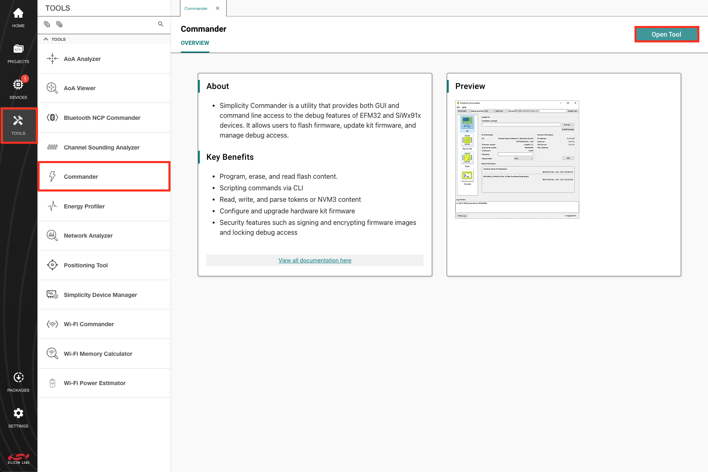
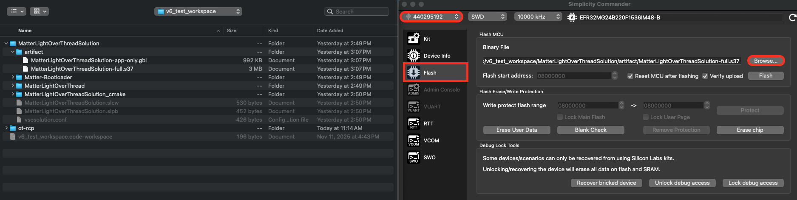

# How to Build and Flash the Matter Accessory Device (MAD)

The Matter Accessory Device, such as the lighting-app, is the actual Matter device that you will commission onto the Matter network and control using the chip-tool.

## Step 1: Get the Image File to Flash the MAD

Use one of the following options to get the required image to flash the MAD:

1. Use the pre-built image file from either Simplicity Studio (Demos) or [Matter Artifacts page](/matter/{build-docspace-version}/matter-prerequisites/matter-artifacts).
2. Build the image file from Simplicity Studio or out of the CSA Matter GitHub repository.

### Using the Pre-Built Image File

Prebuilt image files are available both on GitHub and inside Simplicity Studio.

#### Simplicity Studio

To find the demos within Simplicity Studio, even if you do not have a device connected:

1. In Simplicity Studio, click the **Home** tab in the upper left corner.
2. Next to **Start a New Project**, click **all projects & demos**.
3. In the upper right, click **Select Device** to choose a connected board or search for a virtual board such as **BRD4187C**. This filters the window for that part.
4. In the left navigation, check **Matter** to show all Matter demos.
   The demos are marked as **Demo** and allow you to **Run** them. Projects can be *created*.
5. Choose a demo, and click **Run** to flash it onto your board.
3. Choose a board to by clicking on **Select Device**, you can choose from a connected board or search for one such as **BRD4187C** and on the board. This will filter the window for that part.
4. In the left hand navigation, choose **Matter** to show all the Matter demos.
5. The demos are marked as "demo" and allow you to "run" them. Projects can be "created".
6. Choose the demo you wish to use, and click **Run** to flash it onto your board.

#### Silicon Labs GitHub

If you are interested in using prebuilt image files from GitHub, all of the Matter Accessory Device image files are accessible through the [Matter Artifacts page](/matter/{build-docspace-version}/matter-prerequisites/matter-artifacts). If you are using a pre-built image file, you can skip forward to Step 2 below.

If you are coming from Simplicity Studio, you may have already installed the demo image in Simplicity Studio, in which case you can skip forward to the next step.

### Building the Matter Image File

 The entire build process for Simplicity Studio is covered in the [Matter over Thread QuickStart Demo](/matter/{build-docspace-version}/matter-quick-start-demo/02-thread-quick-start-demo.md#step-1-create-a-matter-sample-project).

## Step 2: Flash the Matter Accessory Device

There are a few ways to flash a device using Simplicity Studio.

1. [Flash from VS Code](/matter/{build-docspace-version}/matter-quick-start-demo/02-thread-quick-start-demo.md#step-3-flash-the-device)
2. Flash from Commander GUI: 
   1. In Simplicity Studio, click **Tools**, click **Commander**, and then click **Open Tool**.
      The stand-alone Commander GUI opens.
   2. Select the board, click **Flash**, and then click **Browse** to find the image file and flash it.

   
   2. This will open the stand alone Commander GUI. From here select the board and then click on the flash tab. Browse to the image file and flash it.

   

3. [Flash from Commander CLI](https://docs.silabs.com/simplicity-commander/latest/simplicity-commander-commands/device-flashing-commands)
4. [Flash using Simplicity Device Manager](https://docs.silabs.com/device-manager/latest/device-manager-work-in/devices)

Once your Matter Accessory Device has been flashed, it should show a QR code on the LCD. If no QR Code is present, it may be that you need to add a bootloader to
your device. Bootloader images are provided on the [Matter Artifacts page](/matter/{build-docspace-version}/matter-prerequisites/matter-artifacts).
