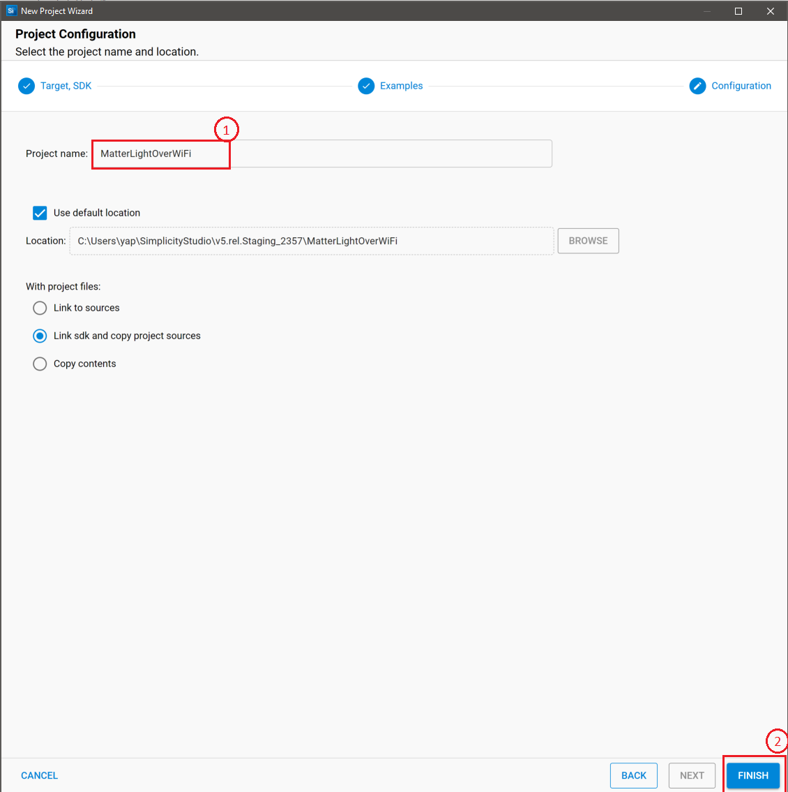
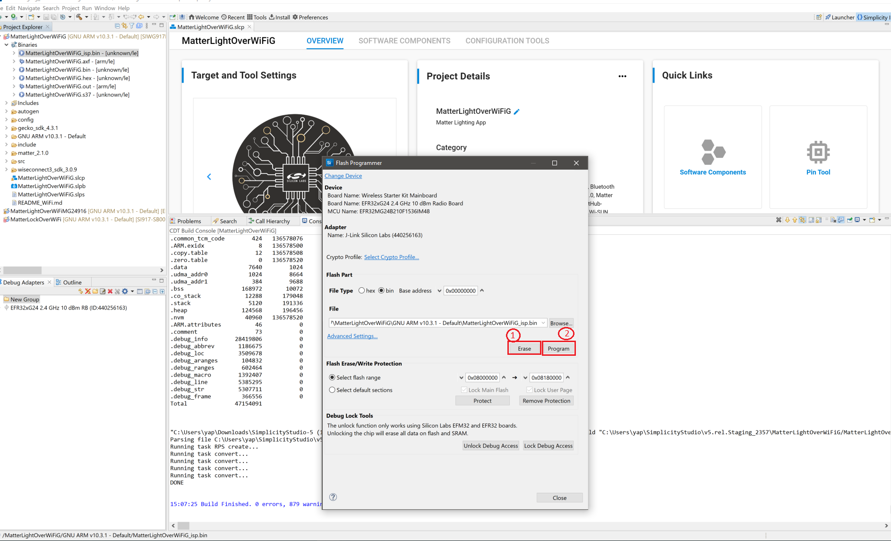

# Building the 917 SoC Matter Accessory Devices (MADs) using Simplicity Studio

In Simplicity Studio 5, create the Light MAD:

1.   [Download](https://www.silabs.com/developers/simplicity-studio) and Install Simplicity Studio 5.
2.   To install the prerequisites for Simplicity Studio, click on `Install -> SDKs` in launcher tab and install the following packages in the given order:
```shell
   Gecko SDK
   Silicon Labs Matter
   Wiseconnect
```
**Note**: Version numbers mentioned in the screenshot might be outdated. Install the latest packages available with the studio.


3.   If you have more than one Gecko SDK then select the preferred version of Gecko SDK. So for that in launcher tab go to `preferences -> Simplicity Studio -> SDKs`.


4.   Switch to the Launcher view (if not already in it).


5.   Go to `All Products` in launcher tab and select one compatible board from the below supported list of SiWx917 SOC dev boards. 
```shell
  BRD4325B (Dual Flash)
  BRD4325C (Common Flash)
  BRD4325G (Common Flash)
```


6.   Once it shows up in the Debug Adapters view, select it.


7.   Open the Example Projects and Demos tab, select the **Matter** filter and enter "*Wi-Fi*" in **Filter on keywords**.


8.   Select the *Matter - SoC Lighting over Wi-Fi* example for SiWx917 SOC, click **Create**, rename the project if you wish, and click **Finish**.


9.   Once the project is created, right-click on the project and select *Build Project* in the Project Explorer tab.
 

10.  To flash the application, connect the compatible dev board to the machine or PC if not yet done. 
11.  Once the project is compiled successfully, Go to the Project Explorer view and select the binary to be flashed.


12.  Right-click on the selected *_isp.bin* binary and click on *flash to device*.


13.  Flash programmer window will be opened, Click on *Program* button to start the flashing.


**Note:**
   Output of the SiWX917 SoC application will be displayed on the J-Link RTT Viewer.

14.   In order to debug Matter Application, Right-click on the selected *_isp.bin* binary and click on *Debug As*.

