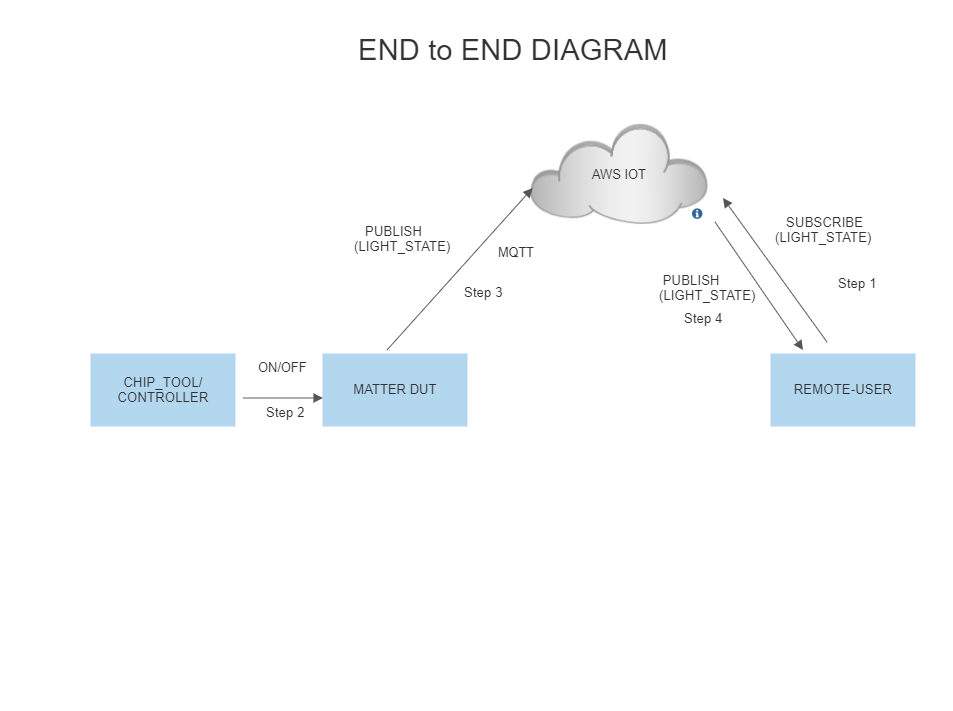
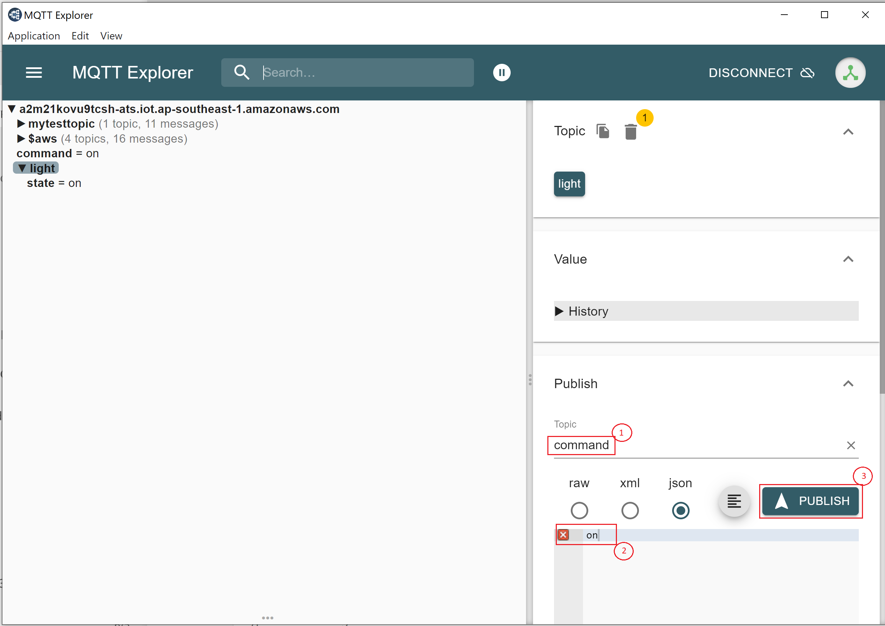
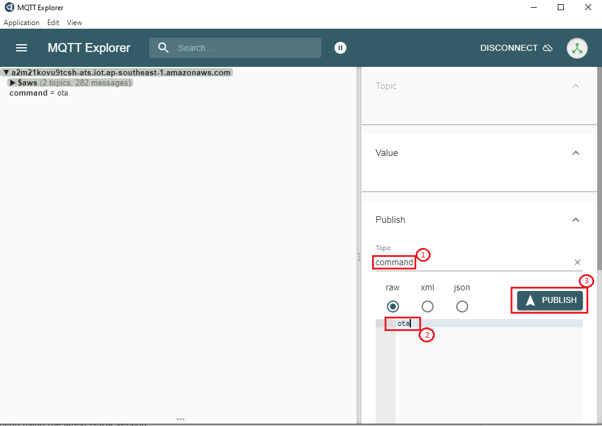

# Matter Wi-Fi Direct Internet Connectivity

- Direct Internet Connectivity (DIC) is a Silicon Labs-only feature to connect Matter devices to proprietary cloud solutions (AWS,GCP,APPLE ...) directly. As such, a Matter Wi-Fi device must support connecting locally on the Matter Fabric, via IPv6, and connecting to the Internet via IPv4.
- Matter devices can be controlled by chip-tool or controller and the respective status of the attribute modified will be published to the cloud.
-  Remote user can install the cloud specific application to get the notifications on the attribute status and to control the device.

## Feature Design

## End-to-End Set-Up Bring Up

### Message Queuing Telemetry Transport (MQTT)

MQTT is an OASIS standard messaging protocol for the Internet of Things (IoT). It is designed as an extremely lightweight publish/subscribe messaging transport that is ideal for connecting remote devices with a small code footprint and minimal network bandwidth. Refer https://mqtt.org/ for more details

### Configuring the MQTT server

To set up and configure AWS or Mosquitto for DIC support see the following documentation: 

- [AWS installation](./aws-configuration-registration.md)
- [Mosquitto installation](./mosquitto-setup.md)

### Remote User Setup (MQTT Explorer)

A remote user is used to check the state of device. In this context MQTT explorer is used as a remote user.

[MQTT explorer setup and configuration](./mqtt-explorer-setup.md)

### DUT Setup

Software and Hardware prerequisites for working with Silicon Labs Matter:

1. [Matter Hardware Requirements](/matter/<docspace-docleaf-version>/matter-prerequisites/hardware-requirements)
2. [Matter Software Requirements](/matter/<docspace-docleaf-version>/matter-prerequisites/software-requirements)
3. Use the build command for DIC instead of the normal build command in the Software Setup documentation.

   - [Don't use normal build commands](./../sld120-matter-wifi-getting-started/04-light-switch-step-by-step-example.md)
   - [Build for DIC](./build-dic.md)

## End-to-End Test of DIC Application

User Setup (MQTT Explorer):

  - Sharing status of device to cloud
    - End-to-end command to be executed from chip-tool, refer [Running the Matter Demo on EFR32 hosts](run-demo.md)
    - Below is the application specific attribute/s information or state shared to the cloud through Direct Internet Connectivity Solution
       - For Lighting App, On/Off Attributes
       - For Lock App, lock/unlock Attributes
       - For Windows App, lift/tilt Attributes
       - For Thermostat App, SystemMode/CurrentTemp/LocalTemperature/OccupiedCoolingSetpoint/OccupiedHeatingSetpoint Attributes
       - For On/off Plug App, On/Off Attributes
    - Application status would be updated on the mqtt_explorer UI, as shown in below image.

 - Control of the device through cloud interface
     - Make sure matter device is up and commissioned successfully, refer [Running the Matter Demo on EFR32 hosts](run-demo.md)
     - For Controlling the device, set topic name and the commands to be executed in the mqtt_explorer for below applications.
       - Lighting App
         - Topic: command
         - Commands:
           - toggle
           - on
           - off
       - Onoff-plug App
         - Topic: command
         - Commands:
           - toggle
           - on
           - off
       - Lock App
         - Topic: command
         - Commands:
           - lock
           - unlock
       - Thermostat App
         - Topic: command
         - Commands:
           - SetMode/value(value need to provide 1,2,3,4 ex:SetMode/1)
           - Heating/value(value need to provide 2500,2600 ex:HeatingSetPoint/2500)
           - Cooling/value(value need to provide 2500,2600 ex:CoolingSetPoint/2500)
    - Then click `publish` button to execute the command.
   

 - Download AWS OTA Image through cloud interface
     - Make sure matter device is up and commissioned successfully, refer [Running the Matter Demo on EFR32 hosts](run-demo.md)
     - Make sure device is connected to MQTT Server successfully.
     - Then Create a AWS OTA Job in the AWS Website, refer [How to create AWS OTA JOB](aws-configuration-registration.md)
     - Trigger OTA Command through MQTT Explorer like below.
     - Then click `publish` button to execute the AWS OTA command.
   