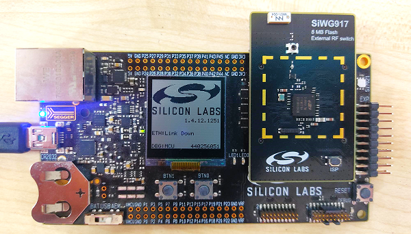

# Getting Started with SoC Mode

This guide describes how to get started with developing an application for SiWx91x System-on-chip (SoC) mode, where both the application and the networking stack run on the SiWx917 chipset.

## Check Prerequisites
In order to run Matter over Wi-Fi, a developer must check for below prerequisites:

### Hardware Requirements
Below hardware devices required for executing Matter over Wi-Fi:

- Silicon Labs Wireless starter/development kit (WSTK)
- SiWx917 SoC development kit
- Wi-Fi Dev Kit
   - SiWx917
      - SoC mode:
           - BRD4325B (A0 dual flash radio boards v1.2) 
             SiWx917
           - BRD4325C (B0 common flash radio board v1.2)
             SiWx917
           - BRD4325G (B0 Stacked Flash + External PSRAM radio board v1.2) 
             SiWx917
           - BRD4388A (B0 2.0 common flash) 
             SiWx917
- Windows/Linux/MacOS computer with a USB port
- USB cable for connecting WSTK Board to Computer
- Raspberry Pi with a >32 GB SD Card
- Access Point with Internet Access

### Software Requirements 
Below software tools, packages and images required for executing Matter over Wi-Fi:

### Software Tools Requirements
- Simplicity Commander for flashing firmware/binary
- Tera Term
- Simplicity Studio
- Putty for controling EFR32 hardware using chip-tool controller
- Ozone Debugger for logging and debugging (Optional) 
- JLink RTT for logging only (Optional)

### Software Packages
- Gecko SDK v4.x
- WiseConnect SDK v3.x

### Firmware Images
Refer [Matter Artifacts Page](/matter/<docspace-docleaf-version>/matter-prerequisites/matter-artifacts#siwx917-firmware-for-siwx917-soc)

## Installation of the Wi-Fi Software Tools and Packages
Refer [Wi-Fi Software Installation Page](./software-installation)

## Connect SiWx917 SOC to Computer
1. Mount the SiWx917 radio board on the SiWx917 WSTK board.

2. Connect your SiWx917 Wireless Starter Kit (WSTK) board to your computer using a USB cable.

3. Simplicity Studio will detect and display your radio board.

## Troubleshoot Board Detection Failure
If Simplicity Studio does not detect SiWx917 SoC board, try the following:
- In the Debug Adapters panel, Click the Refresh button (having an icon of two looping arrows).

- Press the RESET button on the SiWx917 SoC radio board.

- Power-cycle the SiWx917 SoC radio board by disconnecting and reconnecting the USB cable.

## Building, Flashing and debugging an Application
Refer [Demo execution](./run-matter-demo) for building, flashing and debugging an application.