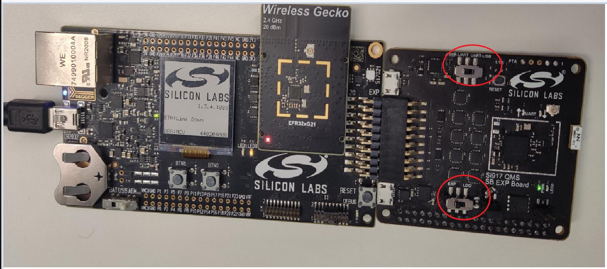

# Upgradation of Connectivity Firmware
- We recommend to upgrade the NCP combos connectivity firmware to the latest available version when
  - first received a EFR32 evaluation kit (EVK)
  - first received a radio board, or
  - upgrading to a new version of the WiSeConnect SDK v2.x or v3.x extension

## Upgradation of Connectivity Firmware for NCP devices

- SiWx917 NCP or RS9116 EVK connectivity firmware can be upgraded using Teraterm or kermit.

### Connectivity firmware upgrade using Teraterm
1. Make sure that the switches on the expansion board are towards UART side.


2. Refer [Updating the Firmware](https://docs.silabs.com/rs9116/wiseconnect/2.0/update-evk-firmware) 
  ```shell
  Instructions are the same for both SiWx917 NCP and RS9116 EVK.
  ```
3. Once firmware flashing is done make sure to make switches back to Expansion mode, while using it with the host platform.



### Troubleshoot NCP Firmware Update Failure
If the firmware update fails, try the following:
  - Toggle the power switch towards AEM (Advanced Energy Monitoring) on the WSTK board.
  - Perform the following steps and try the firmware update again
     - Toggle the ISP switch towards ISP on the radio board.
     - Press the RESET button on the WSTK board.
     - Toggle the ISP switch away from ISP on the radio board.
     - In the Flash section in step 5 above, click Erase chip.
     - The flash will be erased.
     - Retry the firmware upgrade.

## Upgradation of Connectivity Firmware for SoC devices
- SiWx917 SOC connectivity firmware can be upgraded using studio.

### Connectivity firmware upgrade using Studio
  
1. In the Simplicity Studio home page, click Tools.
   
2. In the Tools dialog, select Simplicity Commander and click OK.


3. In the Simplicity Commander window, click Select Kit and choose your radio board.


4. In the navigation pane, go to the Flash section.
   
5. Click Browse next to the Binary File field.


6. Refer [Firmware for SiWx917 SoC](/matter/<docspace-docleaf-version>/matter-prerequisites/matter-artifacts#siwx917-firmware-for-siwx917-soc) to identify the which firmware to be flashed into the specific hardware. Locate and select the firmware file to flash. 
   
7. Click Flash


8. The firmware will be flashed and the Log Window will display a "Resetting" message.


### Troubleshoot SiWx917 SOC Firmware Update Failure
If the firmware update fails, try the following:
  - Toggle the power switch towards AEM (Advanced Energy Monitoring) on the WSTK board.
  - Perform the following steps and try the firmware update again
     - Toggle the ISP switch towards ISP on the radio board.
     - Press the RESET button on the WSTK board.
     - Toggle the ISP switch away from ISP on the radio board.
     - In the Flash section in step 5 above, click Erase chip.
     - The flash will be erased.
     - Retry the firmware upgrade.