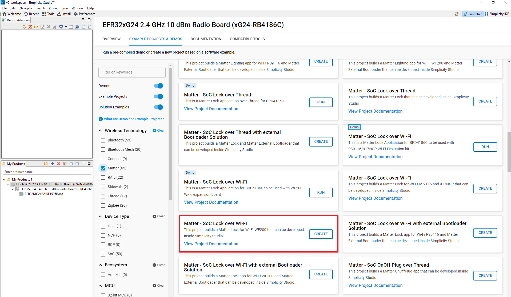

# Serial Port Communication on Silicon Labs Platform
  The matter-shell exposes the configuration and the management APIs via matter command line interface (matter CLI). This interface can be used to change the state of the device.

## Hardware Requirement
- To run matter shell on Silicon Labs Platform, refer [Hardware Requirments](/matter/<docspace-docleaf-version>/matter-prerequisites/hardware-requirements)

## Software Requirement
- To run matter shell on Silicon Labs Platform, refer [Software Requirments](/matter/<docspace-docleaf-version>/matter-prerequisites/software-requirements)

## Execution of Matter Shell on Silicon Labs Platform

1. [Download](https://www.silabs.com/developers/simplicity-studio) and Install Simplicity Studio.
   
2. To install the software packages for Simplicity Studio, refer [Software Package Installation](/matter/<docspace-docleaf-version>/matter-wifi-getting-started-example/software-installation#installation-of-software-packages)

3. Log in to Simplicity Studio and connect the EFR32 board to the computer.

4. Go to the All Products section.
   

5. Type and Select the radio board from the displayed list and select Start.
   

6. The Launcher page will display the selected radio board's details.
   

7. Verify the following in the General Information section:
   - The Debug Mode is Onboard Device (MCU).
   - The Preferred SDK is the version you selected earlier.
   

8. Click on Example Projects and Demos Option and Create Project for **Matter Lock Application**.
   

9. In the New Project Wizard window, click Finish.
   

10. After creation of project , click on **Software Components** tab and in search bar type **Matter Shell** and install it.
    

11. Build the Project after Enabling **Matter Shell** Component.

12. After successful build commission the device , refer [Commission Matter Platform](./run-matter-demo#creating-the-matter-network)

13. Open Tera Term and under New Connection, under Serial Port, select JLink port and click **OK**.
    

14. Click on Setup from Menu bar and change the value to 115200 under Speed category, then click on New setting.
    

15. Inside **Terminal** Set the below values and click **OK**.
  - Terminal Size : 80 * 24
  - New-Line
    - Receive : CR+LF
    - Transmit : CR+LF
    

16. Click on File from Menu bar again, select **Serial Port** option.
    

17. Increase the speed to **115200** and click on **New setting**.
    

18. Click on File from Menu bar, select TTY Record. Create any empty file with extension " .tty " and click on save.
    

19. After creating tty file just click on **Enter** button from Keyboard then it will show you **matterCli** terminal.
    

20. Send any command through **matterCli** terminal, from the below list of commands:

  1. doorlock event door-state-change "DoorState"
      - Door State List
        - DoorOpen = 0
        - DoorClosed = 1
        - DoorJammed = 2
        - DoorForcedOpen = 3
        - DoorUnspecifiedError = 4
        - DoorAjar = 5
  2. doorlock event lock-alarm "AlarmCode"
        - Alarm Code List
        - LockJammed = 0
        - LockFactoryReset = 1
        - LockRadioPowerCycle = 3
        - WrongCodeEntryLimit = 4
        - FrontEsceutcheonRemoved = 5
        - DoorForcedOpen = 6
        - DoorAjar = 7
        - ForcedUser = 8
  3. onboardingcodes ble, command will show QR Code.
      

21. After changing DoorState and AlarmCode in **matterCli**, run below commands using chip-tool in raspberry pi to verify the event.
  - To Read Door State
  
    ./chip-tool doorlock read-event door-state-change "node_id" "endpoint"
  
  - To Read Alarm Code
  
    ./chip-tool doorlock read-event door-lock-alarm "node_id" "endpoint"

  **Note**: Type **help** in matterCli terminal for more information about supported features.