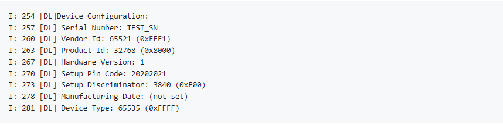

# Running the Matter Demo over Wi-Fi on EFR32 device

## Flashing Images/Binaries on EFR32MG24 Platform using Ozone, Simplicity Studio, or Simplicity Commander

Note: If you are coming from Simplicity Studio, you may have already installed
the demo image in Simplicity Studio, in which case you can skip to the
next step.

1.  Plug the WSTK and EFR into the laptop.

2.  Based on the Application being built, make sure to flash proper [bootloader]( /matter/<docspace-docleaf-version>/matter-prerequisites/matter-artifacts#matter-bootloader-binaries) internal or external binaries. 

3.  Follow instructions to [Flash a Silicon Labs Device](/matter/<docspace-docleaf-version>/matter-references) with the demo binary.

## Demo Execution - Commissioning a Wi-Fi Device using chip-tool for Linux

The commissioning procedure does the following:

- Chip-tool scans BLE and locates the Silicon Labs device that uses the
specified discriminator
- Establishes operational certificates
- Sends the Wi-Fi SSID and Passkey
- The Silicon Labs device will join the Wi-Fi network and get an IP address.
It then starts providing mDNS records on IPv4 and IPv6
- Future communications (tests) will then happen over Wi-Fi

Commissioning can be done using chip-tool running either on Linux or Raspberry Pi

1. Get the SSID and PSK of the Wi-Fi network (WPA2 - Security) you are connected
   to.
2. Run the following:

```shell
$ cd $MATTER_WORKDIR/matter
```

### Commissioning Command:

```shell
$ out/standalone/chip-tool pairing ble-wifi <node_id> <ssid> <password> <pin_code> <discriminator>
```

In this command:
 - node_id is the user-defined ID of the node being commissioned.
 - ssid and password are credentials.
 - pin_code and discriminator are device-specific keys.

  **Note**:- You can find these values in the logging terminal of the device (for instance UART) when the device boots up. Foe example:



The node ID used here is 1122. This will be used in future commands.
'\$SSID' is a placeholder for your Wi-Fi SSID and '\$PSK' is a placeholder
for the password of your Wi-Fi network. '20202021' is the Setup Pin Code used to authenticate the device. '3840' is the Setup Discriminator used to discern between multiple commissionable device advertisements.

1. To turn **on** the LED on the EFR32MG24:

    ```shell
    $ out/standalone/chip-tool onoff on 1122 1
    ```

2. To turn **off** the LED on the EFR32MG24:

    ```shell
    $ out/standalone/chip-tool onoff off 1122 1
    ```

If there are any failures, run the following command and then re-run the
chip-tool command:

```shell
$ rm -rf /tmp/chip_*
```

If you are having difficulty getting the chip-tool to commission the device
successfully, it may be because you have more than one network interface
available to the chip-tool. The device on which you are running the chip-tool
must be on the same Wi-Fi network as your RS9116 or WF200 and there cannot be
another network interface on the device that is running the chip-tool. For
instance, if you have an Ethernet connection as well as a Wi-Fi connection, you
need to unplug the Ethernet connection and try running the chip-tool as in step
#2 above.

## Factory Reset the Device
As the device remembers the Access Point credentials given for commissioning, if
you want to run the demo multiple times, do a factory reset by pressing the BTN0
on EFR32MG24 for about 6-7 seconds. The LED0 will flash 3 times.