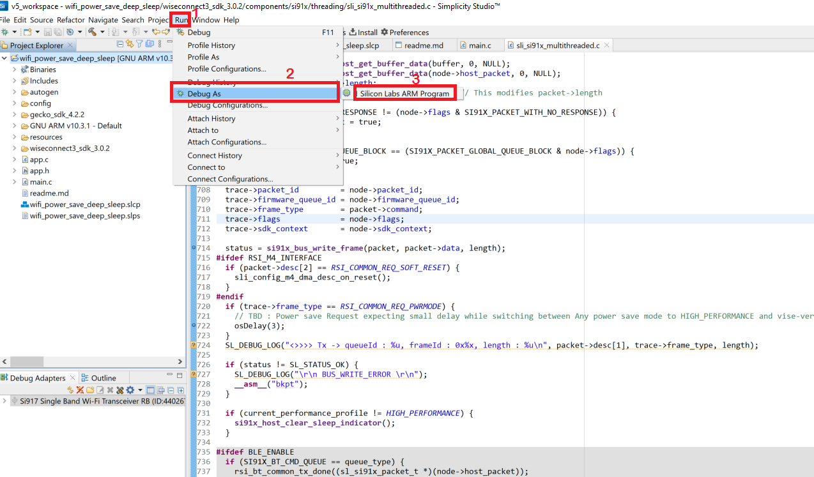
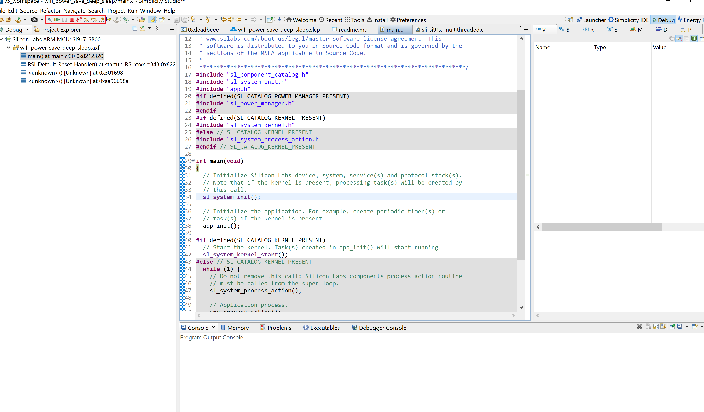

# **Running the Matter Demo over Wi-Fi**
Once Matter over Wi-Fi setup is ready, for executing the matter demo requires the application to be build, flashed and executed. Follow below procedure to run matter demo over Wi-Fi.

## **Flashing the Connectivity Firmware**

- To flash the connectivity firmware in NCP devices, refer [Upgrdation of Connectivity firmware for NCP devices](./loading-firmware-for-ncp-and-soc-boards#upgradation-of-connectivity-firmware-for-ncp-devices)
- To flash the connectivity firmware in SiWx917 SOC, refer [Upgradation of Connectivity Firmware for SoC devices](./loading-firmware-for-ncp-and-soc-boards#upgradation-of-connectivity-firmware-for-soc-devices)

## **Flashing the Bootloader Binary**
- Bootloader binary will be supported for EFR32 boards only and it can be flashed using simplicity commander software.
- To Flash Bootloader Binary for EFR32 Boards , refer [Flash Booatloder Binaries](./flashing-using-commander#flashing-the-bootloader-binaries-for-EFR32-board-using-simplicity-commander)

## **Building and Flashing the Matter Application using Simplicity studio**
- To build and flash application for EFR32, refer [EFR32 Building and Flashing Application](./build-efx32-application-using-studio)
- To build and flash application for SiWx917 SOC, refer [SiWx917 SOC Building and Flashing Application](./build-soc-application-using-studio)

## **Flashing the Matter pre-built binaries Using Simplicity Commander**
-  To Flash the application for EFR32 Board using Simplicity Commander refer [Flash EFR32 Matter Pre-Built Binaries](./flashing-using-commander#flashing-the-efr32-using-simplicity-commander)
              
   **Note**: For EFR32, need to use **.s37** format file only. 
-  To Flash the application for SiWx917 SOC Board using Simplicity Commander refer [Flash SiWx917 SOC Matter Pre-Built Binaries](./flashing-using-commander#flashing-the-siwx917-soc-matter-pre-built-binary-using-simplicity-commander)
  
   **Note**: For SiWx917 SOC, need to use **.rps** format file only.


## Setting up of Raspberrypi

 - Refer [Setting up of chip-tool in Raspberry PI](./build-pi-env) for setting up chip-tool controller in Raspberry PI.

## Execution of the Usecase
For executing the usecase, need to create a matter netowrk using chip-tool and then control the matter device from chip-tool.

### Creating the Matter Network
This procedure uses the chip-tool installed on the Matter Hub. The commissioning procedure does the following:

- Chip-tool scans BLE and locates the Silicon Labs device that uses the
specified discriminator.
- Establishes operational certificates.
- Sends the Wi-Fi SSID and Passkey.
- The Silicon Labs device will join the Wi-Fi network and get an IP address.
It then starts providing mDNS records on IPv4 and IPv6.
- Future communications (tests) will then happen over Wi-Fi.

Commissioning can be done using chip-tool running either on Linux or Raspberry Pi

1. Get the SSID and PSK of the Wi-Fi network (WPA2 - Security) you are connected
   to.
2. Go to **$MATTER_WORKDIR/matter** directory and run the following:
```shell
$ out/standalone/chip-tool pairing ble-wifi <node_id> <ssid> <password> <pin_code> <discriminator>
```
In this command:
 - node_id is the user-defined ID of the node being commissioned.
 - ssid and password are credentials.
 - pin_code and discriminator are device-specific keys.

  **Note**:- You can find these values in the logging terminal of the device (for instance UART) when the device boots up. Foe example:


The node ID used here is 1122. This will be used in future commands.
'\$SSID' is a placeholder for your Wi-Fi SSID and '\$PSK' is a placeholder
for the password of your Wi-Fi network. '20202021' is the Setup Pin Code used to authenticate the device. '3840' is the Setup Discriminator used to discern between multiple commissionable device advertisements.


If there are any failures, run the following command and then re-run the
chip-tool command:

```shell
$ rm -rf /tmp/chip_*
```
If you are having difficulty getting the chip-tool to commission the device successfully, it may be because you have more than one network interface available to the chip-tool. The device on which you are running the chip-tool must be on the same Wi-Fi network.For instance, if you have an Ethernet connection as well as a Wi-Fi connection, you need to unplug the Ethernet connection and try running the chip-tool.

### Controlling the Matter Accessory Device

1. In a PuTTY session to the Matter hub, use the chip-tool to test the Matter light device.

   1. Control the light status of the light MAD Using `./chip-tool onoff on nodeID  1`. You can also use  `chip-tool toggle nodeID 1`.
   2. For dev board with buttons available, you can use BTN1 to toggle the light status locally.

### Factory Reset the Device
As the device remembers the Access Point credentials given for commissioning, if
you want to run the demo multiple times, do a factory reset by pressing the BTN0
on WSTK for about 6-7 seconds. The LED0 will flash 3 times.


## Debug the Application
1. In the Project Explorer pane, select the project name.
   
2. From the menu bar, select Run > Debug As > 1 Silicon Labs ARM Program.
   

3. Studio will switch to debug mode and halt execution at the main() function in your application.
   
4. Add a break point in the desired location of the code and click the Resume button (having an icon with a rectangular bar and play button).
   
5. Execution will halt at the break point.
   
6. Use the following debug functions to direct the execution of the code:
   - Step In button (having an icon with a arrow pointing between two dots).
   - Step Over button (having an icon with an arrow going over a dot).
   - Step Out button (having an icon with an arrow pointing out from between two dots).
   

7. View the standard output or enter input data as needed.