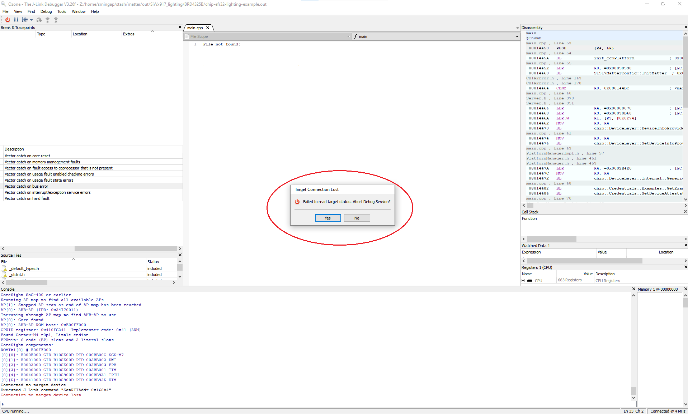
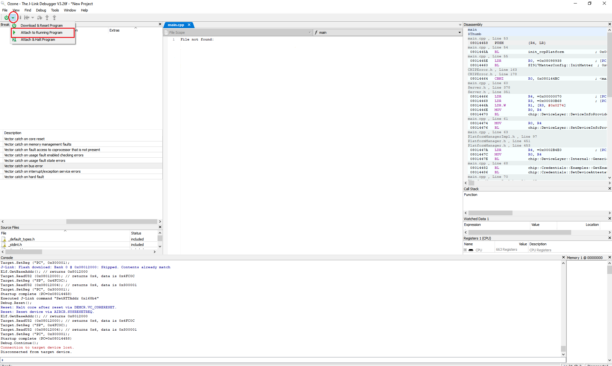

# SiWx917 SoC Factory Reset

## SiWx917 SoC Factory Reset without Ozone

1. Press and hold the BTN0 on WSTK for about 6-7 seconds. LED0 will flash 5 times and then the board will reboot.

## SiWx917 SoC Factory Reset with Ozone

1. You will get "Target Connection Lost" pop-up on Ozone, click **YES**.
   

2. Select **Attach to Running Program** in the dropdown next to the **Power** button on the top-left hand corner of the page.
   
