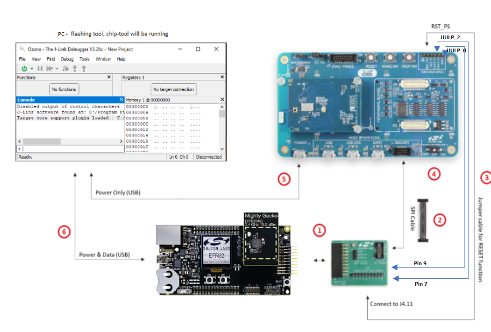
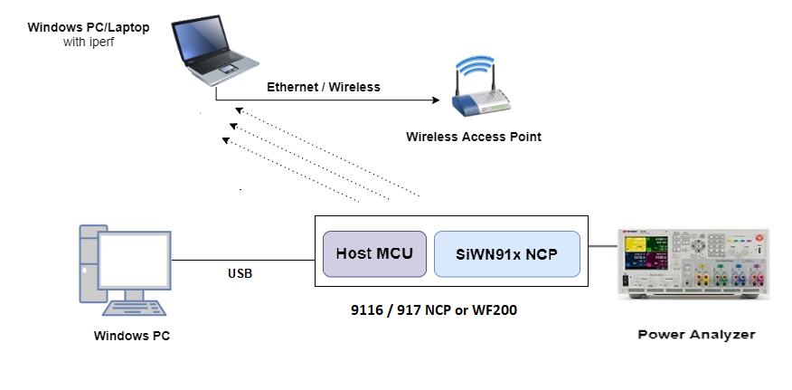
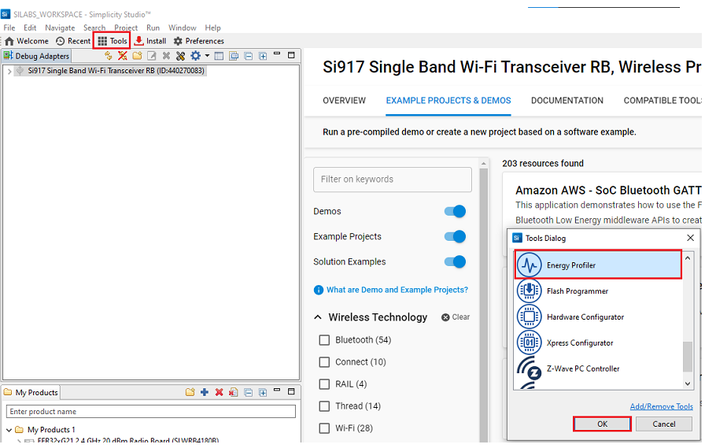
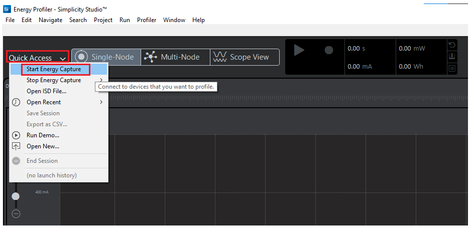
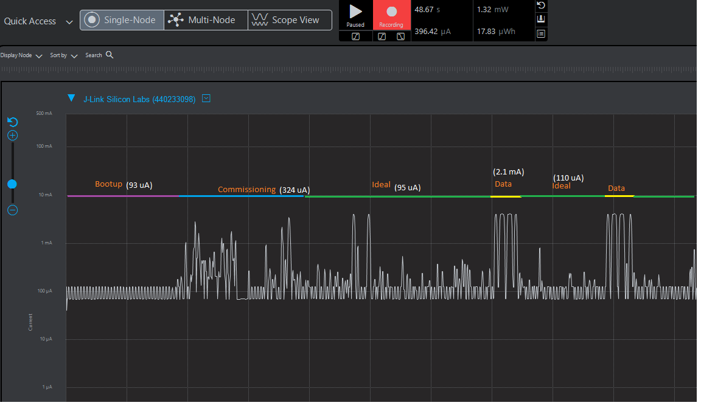
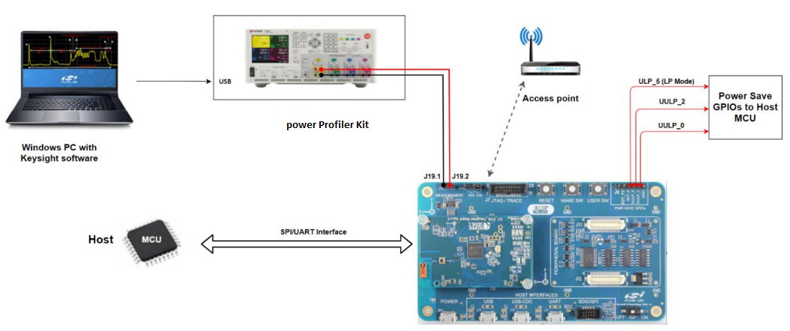
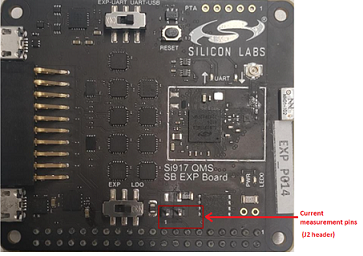

# Power Measurements for Wi-Fi Devices

This page explains how to measure the power values for EFR and Wi-Fi co-processor.

## EFR32 + RS9116 Setup for Sleepy Devices

Note: The following GPIO pins should be connected for 9116 and Host handshakes. \
pin 7 and 9 to UULP_2 and UULP_0 respectively.

## Using Simplicity Studio Energy Profiler for Current Measurement

After flashing the Matter application to the module, Energy profiler or a power meter can be used for power measurements.

In Simplicity Studio, click **Tools** on the toolbar, select Energy Profiler, and click "OK".

From the Quick Access or Profiler menu, select 'Start Energy Capture'. 

**Note**: A quick-start guide on the Energy Profiler user interface is in the Simplicity Studio User's Guide's [Energy Profiler User Interface section](https://docs.silabs.com/simplicity-studio-5-users-guide/latest/ss-5-users-guide-tools-energy-profiler/energy-profiler-user-interface).

## Power Consumption Measurement (EFR) Using Energy Profiler

Analyze the power values using Energy Profiler.

## Power Consumption Measurement Using a Power Meter

### Power Consumption Measurement Pins for RS9116 Evk Boards

### Power Consumption Measurement Pins for EXP Boards

The power meter's negative probe is used for pin-1 and the positive probe is used for pin-2.

Analyze the power values using the power meter.

