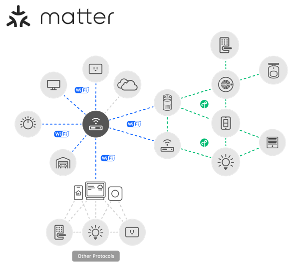
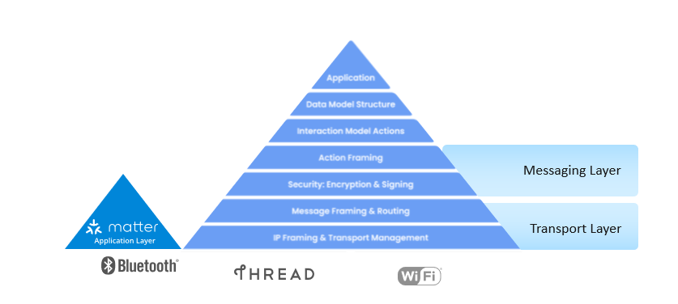

# Introduction to Matter

## Why Matter?

The Connectivity Standards Alliance (CSA) seeks to enable smart home devices to be secure, reliable, and interoperable with other Internet of Things (IoT) devices, regardless of manufacturer. One of the biggest pain points of smart home devices is the various application-layer implementations that limit the compatibility of different smart home devices. Therefore, Matter was adopted so that matter-enabled devices, under the same standard, provide a better experience for both the manufacturers and users.

While Matter was created to make the IoT seamless and effortless for users, it is important to acknowledge the complexity involved under the surface. Matter leverages a range of tools to enable seamless and secure connectivity within an IoT system. Understanding these tools is crucial for a comprehensive overview of this technology.

## Matter Enablement

Matter implements the Application Layer of the OSI model. It builds on the lower layers, such as the transport and network layers, to enable reliable communication between nodes.

There are two prominent connectivity technologies that Matter may sit on top of: Thread and Wi-Fi. Thread is a low-power wireless mesh networking protocol that facilitates reliable communication between nodes. It enables extended coverage and reliable connections to improve the overall performance of an IoT system.

Matter is an IPv6-based protocol and utilizes transport layer protocols like TCP/UDP to facilitate network addressing and reliable transmission of data packets, respectively. Due to this, Matter is compatible with multiple connectivity options (such as Thread and Wi-Fi). This flexibility allows Matter-enabled devices to communicate over various network protocols, ensuring broad compatibility and integration with different networking technologies.

The true power of Matter lies in its commitment to interoperability. Industry leaders such as Google, Apple, Amazon, and Samsung Smart Things have implemented Matter in their IoT devices, fostering wider adoption from other manufacturers. Matter also supports bridging from other existing technologies, such as Zigbee, Bluetooth Mesh and Z-Wave. This allows already existing IoT technology to be integrated into an interoperable environment. The compatibility and seamless integration across brands create a unified ecosystem where your smart devices work harmoniously.

## Matter Network Architecture

In theory, Matter can sit on top of any IPv6 bearing network, however in practice, the Matter specifications solely focus on three link layer technologies, enabling Matter to run on Ethernet, Wi-Fi, and Thread 802.15.4 networks only. As mentioned above, one of the great benefits of Matter is its flexibility, especially when it comes to network configuration. The Matter protocol can operate without a globally routable IPv6 infrastructure and allows the flexibility of having multiple Matter networks run over the same set of constituent IP Networks.

There are two common underlying network topologies commonly used in Matter. There is what is known as a Single Network topology, where Matter runs solely over one Network. This means the Matter Network could run over one 802.15.4 Thread network or over a Wi-Fi network. In this scenario all Matter devices are connected to the same single logical network.

The other, more common network topology, is the star network that consists of multiple peripheral networks joined together by a central hub network. If a peripheral network is used it must be directly joined to a hub via one or more border routers.  A Border Router is a special router (or an edge router) that can provide routing services between two IP Subnets like a Thread network with an existing Wi-Fi/ethernet network acting as a sort of bridge between  the two different networks. This enables a lot of flexibility and interoperability between various home networks to all be interconnected.

Regardless of the Network topology being used, Matter has this concepts of Fabrics. A Matter Fabric is a security domain that contains a collection of nodes that can be identified and can communicate with each other, within the context of that security domain. Each Matter Fabric has a unique Node ID for each node within the fabric and has a unique Fabric ID. Any Matter device can be a part of multiple Matter fabrics, and in turn will have multiple associated Node ID / Fabric ID depending on the fabric it is communicating with.

 Below is a table of some basic Identifiers that are commonly used in matter to Identify and Communicate with Nodes on the fabric.

| **Identifiers** | **Definition** |
|-----------------|----------------|
| Fabric  | 64 bit number that Uniquely Identifies the Matter Fabric  |
| Vendor  | 16 bit number uniquely Identifies a particular product manufacturer, vendor, or group thereof |
| Product  | 16 bit number that uniquely Identifies the product from a specific vendor |
| Group  | 16 bit number ID set of nodes across a Matter Fabric  |
| Universal Group | 16 bit subrange of the Group ID reserved for groups across Matter Standard. Specifically a UID for All Nodes, All non-sleepy nodes, and All Proxies. |
| Operational Node  | 64 bit number that uniquely identifies an individual Node on the Fabric |
| PAKE Key Identifiers | This is a subrange of Node ID used to assign an Access Control subject to a particular PAKE key, this creates ACL entry (Access Control List) to provide admin access via a PASE session establishment |

## Matter Layered Architecture

Matter is split up into a layered architecture to help separate the different responsibilities and encapsulate various pieces of the protocol stack. The diagram below shows the various interactions between the matter application stack:

The **Application Layer** of the Matter stack is the highest layer that corresponds to the high level logic of the device. The user application is built on the unified data model, which helps improve interoperability. The **Data Model** layer corresponds to how the data and action elements support the functionality of the application like the defines of the elements, namespaces for endpoints, clusters, and attributes in the application. The **Interaction Model** handles, as by the name suggests, the interactions between the nodes and is responsible for how data is transferred between nodes. Both the Data Model and Interaction Model are inherited from the well-known dotdot standard used by Zigbee. Next is the **Messaging Layer,**  where the interactions are transformed into a message payload. This process is noted by the CSA as  **Action Framing**. Next, the **Security Layer** will take the payload and will encrypt and append the packet with a MAC (Message authentication code).  From here, the Packet will transfer down to the Transport layer where the packet will go to what the CSA refers to as the **Message Framing and Routing** which will update the payload with the necessary routing information such as fabric and Node ID. Finally this packet will be sent to the **Transport and IP Framing** layer where the payload will be sent through the IP network either through TCP (which is not yet currently supported) or Matter's Message Reliability Protocol, a software layer on top of UDP, for IP management of the Data. Note that the IP Framing in Matter is handled by the Networking Protocol stack to handle this. Once the data is received on a peer device, it will travel up the Matter Protocol stack in reverse and deliver the message to the **Application** layer.

## Matter Security

As mentioned before, one of the main benefits of using Matter is the enhanced security that it offers. Matter offers security at many layers throughout the network. There are a lot of security features integrated in commissioning a Matter device onto an existing network. Matter requires all devices to have a device specific passcode that delivers "proof of ownership" to commissioning devices and requires all devices to have immutable credentials that can be cryptographically verified that the joining devices are Matter certified devices. In fact, the network credentials are only given to the Matter device after the device has been authenticated and verified. This helps keep the Matter network secure from foreign and unsecure devices, significantly improving the overall network security. Furthermore,  Matter enables encryption and authentication to all  unicast messages, as well as  providing relay protection. Below is a list of Common Matter Security terms that are commonly used.

| **Concepts** | **Definition** |
|--------------|----------------|
| **DAC (Device Attestation Certificate)** | This is an immutable certificate of credentials that can be cryptographically verified that the device is a certified Matter Device. |
| **PASE (Passcode Authentication Session Establishment)** | This process at the Commissioning stage that uses a passcode provided out-of-band (like a device's QR code) to commission a Matter device on the Network. |
| **CASE (Certificate Authentication Session Establishment)** | This process at the Operational stage that establishes and provides an authentication key exchanged between two devices.  |

More detailed information on the Matter Security can be found in our [Matter Security Documentation](/matter/<docspace-docleaf-version>/matter-overview-guides/matter-security) and [Matter Commissioning Documentation](/matter/<docspace-docleaf-version>/matter-overview-guides/matter-commissioning). 
