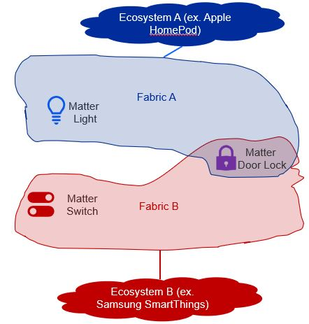
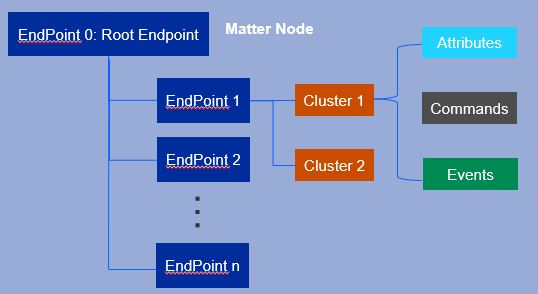
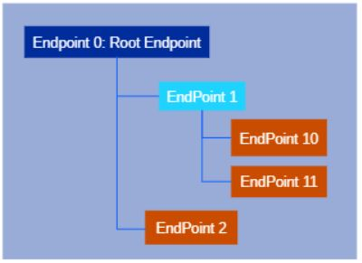
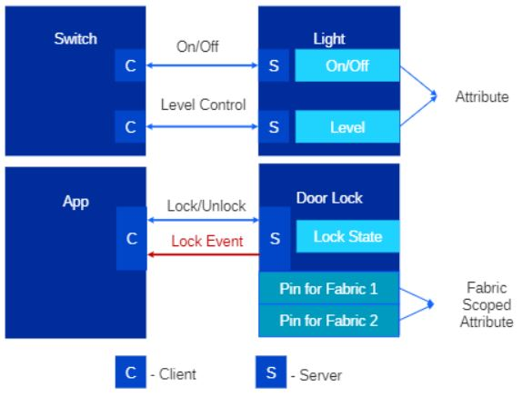

# The Matter Data Model

## Device Data Model (DM) Overview

The Data Model in Matter describes a hierarchical encapsulation of data elements
in the Matter network, including, but not limited to, nodes, endpoints, clusters, and device types.

## Relating Matter to Zigbee

Ultimately, Matter serves to extend existing protocol stacks to maintain and bolster their architecture for future use. Thus, the Data Model originates from and resembles he Dotdot Architecture Model found here: [https://groups.csa-iot.org/wg/matter-tsg/document/18649](https://groups.csa-iot.org/wg/matter-tsg/document/18649) and Chapter 2 of the Zigbee Cluster Library Specification found here: [https://groups.csa-iot.org/wg/members-all/document/23019](https://groups.csa-iot.org/wg/members-all/document/23019). The Matter Data Model better defines the architecture in the Zigbee Cluster Library while keeping the certifiable cluster specifications.

## Matter Fabric

A Matter Fabric is a concept where a group of Matter nodes that share a common root of trust interoperate. On each separate fabric, a physical Matter device is represented by a node. Every node has a unique network address (Operational Node ID) that makes it uniquely identifiable in the fabric it is on. For example, in the following figure, on an Apple HomePod fabric (blue) a Matter Lighting device has an operational node ID unique to the HomePod fabric and on a separate Samsung SmartThings Station fabric (red) in the same home, a Matter Switch device has an operational node ID unique to the SmartThings fabric. These IDs may be the same or different; they are independent of each other because they are on two different fabrics.

A Matter device may also be part of more than one fabric and thus is represented on each different fabric by a different node. In following figure, a Matter Door Lock device is on both the HomePod and SmartThings fabrics. Thus, the Door Lock is represented by two different nodes; one for the HomePod fabric and another for the SmartThings fabric. The operational node IDs for the two nodes representing the device may be the same or different; the IDs are independent of each other because the nodes are on two different fabrics.

## Nodes

In the following figure, the hierarchical structure of endpoint, cluster, attributes/commands/events is shown going right

Each node contains the complete application functionality for its device on a single stack. Because of this, nodes can communicate directly with other nodes on the network without the need for an intermediate. Communication over a Matter network starts and ends at a node.

Nodes have a set of related behaviors, known as a role. There are a few main node roles:

- **Commissioner** - Commissions/adds new devices to a Matter network
- **Controller** - Controls one or more nodes
- **Controlee** - Can be controlled by one or more nodes
- **Over the Air (OTA) Provider** - Provides OTA software updates to the OTA Requestor
- **OTA Requestor** - Requests OTA software updates from the OTA Provider

## Endpoints

Endpoints enclose one component of a node’s complete functionality; together, they encapsulate all the node’s capabilities needed for functional wholeness. A smart thermostat, for example, could have multiple endpoints where one would implement the temperature control functionalities, and another would implement the temperature monitoring functionalities.

Each of these components is known as a feature set, which is made of clusters that define the attributes, events, and commands of a single device’s functionality. There are two distinct types of endpoints in Matter: leaf endpoints and composed endpoints. Leaf endpoints, such as Endpoints 2, 10, and 11 in the following figure, do not require other endpoints to function. Composed endpoints, such as Endpoint 1 in the following figure, require other endpoints to function. Connector lines to the right dictate the endpoints that a certain endpoint has access to.

Nodes have numbered endpoints starting from 0 that contain their own feature set. Same numbered endpoints on different nodes may enclose different feature sets. However, the exception is Endpoint 0, which is reserved exclusively for Utility Clusters. These unique clusters are specifically used for enclosing a node’s servicing functionality: the discovery process, addressing, diagnostics, and software updates.

Endpoints are individually addressable to easily modify feature sets separately.

## Clusters

Clusters are collections of data that group the attributes, events, and commands of a specific functionality, representing a single feature in an endpoint’s feature set. A cluster may be thought of as an interface, service, or object class and is the lowest independent functional element in the device data model. Endpoints have multiple clusters to create individual instances of the same functionality for easier unit control. For example, each light on a light strip may have its own designated cluster for independent access.

Attributes, events, and commands make up clusters:

- Attributes

  - Represent the current state, configuration, or capability of a node, for example whether a light is on or off, or if a switch is up or down
  - Fabric-scoped attributes are only accessible to devices in the same fabric
  - Can be of uint8, string, array, etc. data types

- Commands

  - Actions that a cluster can perform, analogous to verbs in the English language
  - Always have a direction, whether that is from client to server or vice versa
  - Two ways to respond to a command: response, request

    - **Request** - A request is static, such as toggling the ON/OFF attribute of a server cluster representing a light, a success status, or an error/unsupported status
    - **Response** - A response is an action item, such as another command
    - There can also be no response

- Events

  - Record of past transitions between states of the node
  - Includes data for a timestamp and priority of each change, as well as a monotonically increasing counter to track the number of state changes
  - Useful in capturing state transitions and modeling past data that attributes do not store

There are two main types of clusters:

- **Server cluster** - Stateful, holds the data for the attributes, events, and commands
- **Client cluster** - Stateless, interacts with other server clusters by reading and writing attributes, reading remote events, and/or invoking methods

Any cluster can be a server or a client, giving nodes the ability to both store information and horizontally communicate with other nodes. For a light and switch example, a client cluster in the light would send a command to a server cluster in the light to toggle the on/off feature of the light. The following figure illustrates examples of cluster communication. On the top is a light and switch example and on the bottom is an app controlling a door lock.

One unique utility cluster is the Descriptor Cluster Server, which contains introspection information describing its endpoint. There are four main lists of data each grouped in an attribute: server clusters with the “ServerList” attribute, client clusters with the “ClientList” attributes, device types with the “DeviceTypeList” attribute, and other endpoints needed for the device type with the “PartsList” attribute.

Every node has a Descriptor on Endpoint 0, which has a few unique qualities because it describes the Root Device Type. While on most other endpoints the “PartsList” attribute will be empty, the “PartsList” attribute on Endpoint 0 contains all endpoints except itself. This allows a client cluster that reads the Descriptor on Endpoint 0 to traverse to all available endpoints throughout the node and perform their operations.

However, not all device types are given access to all clusters /features of a device. These privileges are managed by the Access Control List (ACL), which is explored more in-depth in the System Model.

Due to a cluster’s modifiable nature, Matter has an official list of supported clusters under the Application Cluster Specification section. A cluster specification defines both a client and server side that correspond with each other through interactions. Certain sets of supported clusters on endpoints form a device type as specified under the requirements of the Device Library Specification.

## Device Types

Device types are a collection of clusters on their respective endpoints that define top-level attributes of the physical device they represent. Device types can require other types for operational purposes; these are known as composed device types and require composed endpoints.

A device can be made up of any combination of clusters. Therefore, to ensure the interoperability of devices from different manufacturers on a single network, Matter defined sets of requirements for official device types in the Matter Device Library for users to implement and extend. Every definition contains the device type ID, type revision number, and mandatory cluster(s) with their minimum revision number. Device Types are constantly updating, with each iteration tracked using the revision number starting from 1. However, changes to a device type’s definition do not change its functionality, but only serve to improve operation. It is also important to note that newer versions of a device will continue to interoperate with older revision levels.

The device types that Matter supports are an unyielding requirement for Matter nodes. Nodes that implement certain device types are required to include feature sets of clusters on one or more endpoints for the said device type. A node cannot implement a device type if it does not have all the required feature sets. Official documentation lists the application device types that Matter supports in the Device Library Specification, while the respective supported application clusters are defined in the Application Cluster Library. These two documents, along with the main Matter specification document, can be found on the website for CSA members: [Specifications Download Request - CSA-IOT](https://csa-iot.org/developer-resource/specifications-download-request/).
