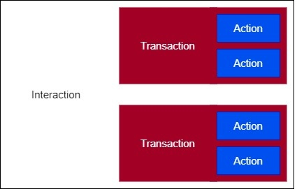

# The Matter Interaction Model

The Matter Device Interaction Model (IM) defines the methods of communication between nodes, serving as the common language for node-to-node information transmission.

Nodes communicate with each other through interactions. Interactions are a sequence of transaction(s), which in turn are a sequence of actions. For example, in a Read Interaction, a client cluster can initiate a Read Transaction, where the client can request to read an attribute and a server cluster can respond by reporting the attribute. Both the client request and the server response are separate actions, but they are part of the same Read Transaction, which the Read Interaction encompasses. Most interaction types only consist of one transaction.

Four types of interactions are supported by the Interaction Model:

- **Read**
- **Write**
- **Invoke**
- **Subscribe**

See [Interactions](interactions.md) for details about these top-level structures.

Five types of transactions are supported by the Interaction Model, roughly corresponding to their containing interactions:

- **Read** - Get attributes and/or events from a server.
- **Write** - Modify attribute values.
- **Invoke** - Invoke cluster commands.
- **Subscribe** - Create subscription for clients to receive periodic updates from servers automatically.
- **Report** - Maintain the subscription for the Subscribe Interaction.

The subscribe interaction encompasses both the Subscribe and Report transactions. See [Transactions](transactions.md) for more information about these action sequences. 

Finally, a [Light and Switch interaction example](light-and-switch.md) is provided.

## Relating Matter to Zigbee

The Matter Interaction Model originates from Chapter 2 in the Zigbee Cluster Library found here: [https://groups.csa-iot.org/wg/members-all/document/23019](https://groups.csa-iot.org/wg/members-all/document/23019); the Interaction model extends this by abstracting interactions from other layers (security, transport, message format, encoding). The Interaction Model fills in gaps in the Zigbee Cluster Library identified by the Matter Data Model Tiger Team, adding Multi-Element Message support, Synchronized Reporting, reduce message types in commands and actions, complex data type support in all messages, Events, and interception attack.
