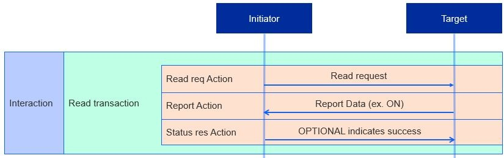
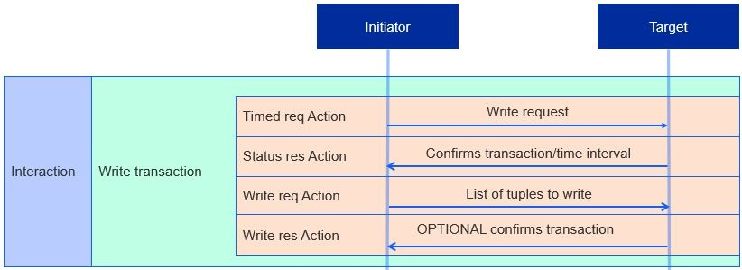
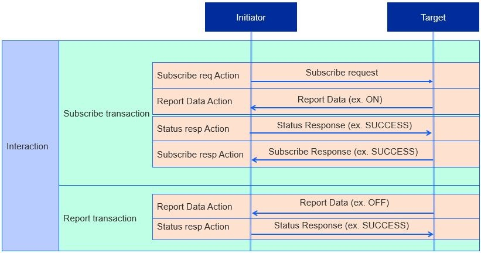

# Interactions

Interactions are sequences of transactions. Interactions follow the same general procedure: the initiator sends a request to the target, the target responds, and a status is sent.

Four types of interactions are supported by the Interaction Model:

- Read
- Write
- Invoke
- Subscribe

When using the Matter SDK, the individual actions **Grace should this be transactions, rather than actions?** in Read, Write, and Invoke interactions are handled automatically. This conveniently allows developers to call the overarching interactions instead of each individual transaction directly.

## Read Interaction

An initiator starts a Read Interaction when it wants to determine the value of one or more of a target node's attributes or events. A Read Transaction is begun and the following steps take place.

1. **Read Request Action** - Requests a list of the target’s attributes and/or events, along with paths to each
2. **Report Data Action** - Generated in response to the Read Request Action. Target sends back the requested list of attributes and/or events, a suppress response, and a subscription ID.

   1. Suppress response: flag that indicates whether the status response should be sent or withheld
   2. Subscription ID: integer that identifies the subscription transaction, only included if the report is part of a Subscription Transaction

3. **Status Response Action** (OPTIONAL) - Generates a Status Response by default; however, not sent if the suppress response flag is set. Ends transaction once the initiator sends the Status Response or receives a Report Data with the suppress flag set.

Read Transactions are restricted to unicast only. This means that the Read Request and Report Data actions cannot target groups of nodes, whereas the Status Response Action cannot be generated as a response to a groupcast.

## Write Interaction

An initiator may modify a target’s attributes through a Write Interaction, which consists of one of either a Timed or Untimed Write Transaction.

A **Timed** Write Transaction consists of the following sequence of actions:

1. **Timed Request Action** - Sets the time interval to send a Write Request Action.

2. **Status Response Action** - Confirms the transaction and time interval.

3. **Write Request Action** - Requests three items:

    1. List of tuples (each tuple is called a write request) containing the path and data to be modified.
    2. Timed request flag indicating if the transaction is timed.
    3. Suppress response.

   If the transaction is timed and a timed request flag is set, the initiator must also send a timeout: the number of milliseconds the transaction remains open, during which the next action to be received is still valid.

4. **Write Response Action (OPTIONAL)** - A list of paths or error codes for every write request. Like a Read Transaction Status Response, a Write Response is not sent if the suppress response flag is set.

An **Untimed** Write Transaction only uses steps 2 and 3 of the Timed Write Transaction, as there is no time interval to set nor confirm.

Untimed and timed Write Transactions differ in their restrictions. All actions in timed transactions are unicast-only, whereas Untimed Write Request Actions may be multicast but require the Suppress Response flag to be set to prevent the network from flooding with status responses. In terms of the diagram, a multicast Untimed Write Request would only have the top beige box of the Write Request. (**Grac - not sure this is clear - maybe reference the figure better. But this is untimed and the top box is timed?** )

### Invoke Interaction

An initiator may invoke command(s) on a target’s cluster(s) through Invoke Interactions, which consist of either a Timed or Untimed Invoke Transaction just like a Write Interaction consists of a Timed or Untimed Write Transaction.

Just like a Timed Write Transaction, a Timed Invoke Transaction consists of the following steps:

1. **Timed Request Action** - Sets the time interval to send a Write Request Action.
2. **Status Response Action** - Confirms the transaction and time interval.
3. **Invoke Request Action** - Requests four items:

    1. List of paths to cluster commands (each item in the list is an invoke command which may optionally contain argument(s) for the command).
    2. Timed request flag.
    3. Suppress response flag.
    4. Interaction ID: integer to match the Invoke Request to its corresponding Invoke Response.

   An Invoke Request initiating a timed Invoke Transaction must also send a timeout just like a timed Write Transaction.

4. **Invoke Response (OPTIONAL)** - Target responds by sending back the interaction ID and a list of invoke responses: command responses and statuses for each invoke request. Like a Write Response, an Invoke Response is not sent if the suppress response flag is set

Untimed and timed Invoke Transactions differ in the same way that untimed and timed Write Transactions differ, both in their actions and restrictions on unicast or multicast.

### Subscription Interaction

An initiator uses a Subscription Interaction to automatically receive periodic Report Data Transactions from the target. This creates a relationship between the initiator and target, which are referred to as the subscriber and publisher respectively after the subscription has been made.

Subscription Interactions have two distinct transactions: A Subscribe Transaction and Report Transaction.

The Subscribe Transaction is as follows:

1. **Subscribe Request Action** - Requests three items:

    1. Min interval floor (minimum interval between Data Reports).
    2. Max interval ceiling (maximum interval between Data Reports).
    3. Request for attributes and/or events to be reported.

2. **Subscribe Request Action** - A Report Data Action containing the first batch of data, known as the Primed Published Data
3. **Status Response Action** - Acknowledges the Report Data Action
4. **Subscribe Response Action** - Finalizes the subscription ID (an integer that acts as an identifier for the subscription) and the min interval floor and max interval ceiling. Indicates a successful subscription between the subscriber and publisher.

After a successful subscription, Report Transactions are sent to the subscriber. There are two types of Report Transactions: non-empty and empty.

1. **Non-empty**

   1. Report Data Action - Reports data and/or events with the SuppressResponse flag set to FALSE
   2. Status Response - Indicates a successful report or an error, the latter of which ends the interaction

2. **Empty**

   1. Report Data Action - A report that has no data or events with the SuppressResponse flag set to TRUE, meaning no Status Response.

Subscription Interactions have a few restrictions. First, the Subscribe Request and Subscribe Response are unicast-only, meaning an initiator cannot subscribe to more than one target simultaneously. Second, Report Data Actions in the same Subscription Interaction must have the same subscription ID. Third, a subscription may be ended if the subscriber responds to a Report Data Action with an “INACTIVE_SUBSCRIPTION” status or if the subscriber does not receive a Report Data Action within the max interval ceiling. The latter connotes that the publisher may end a subscription by not sending Report Data Actions.
