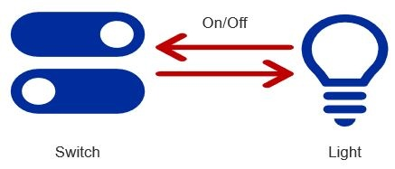

# Light and Switch Interaction Example

In the following example, the switch toggles the light on and off. 

*

In an example of a Matter light and switch, the switch would first establish a secure connection to the light using a Match Transaction to get the path to the cluster containing the “OnOff” attribute.

The switch may read certain attributes or events from the Data Model of the light, such as the “OnOff” attribute on the Light cluster. The controller sends a Read Request Action command (ex. “Endpoint1.Light.OnOff” for the state of the light) and the light sends back a Report Data Action (ex. “Off” to indicate that the light is off). Now, the controller may display the necessary icon to the user on the GUI.

Invoke Transaction may be used to remotely toggle the light using the “Toggle” command on the Light cluster. In a timed transaction, the switch begins by sending a Timed Request (ex. “Timeout=1 second”). When the switch responds with a Status Response (ex. “SUCCESS”), the switch then sends an Invoke Request (ex. “Light.Toggle”). The light receives the Request and sends back an Invoke Response (ex. “SUCCESS”) to indicate that the state has been toggled.

Wrapping up the light and switch example, the switch can use a Subscription Transaction to subscribe to one or more attributes of the door lock, such as the “OnOff” attribute on the Light cluster, enabling the user to receive notifications whenever the light turns on manually. To subscribe to the light state, the switch first sends a Subscribe Request (ex. “Light.OnOff”). In response, the light sends back a Report Data (ex. “OFF”) to which the switch sends a Status Response (ex. “SUCCESS”). To complete the transaction, the light sends back a Subscribe Response (ex. “SUCCESS”). After this sequence, the light will send a Report Data (ex. “ON”) whenever the light turns on manually and the switch will reply with a Status Response (ex. “SUCCESS”) to indicate the Report Data has been received.
