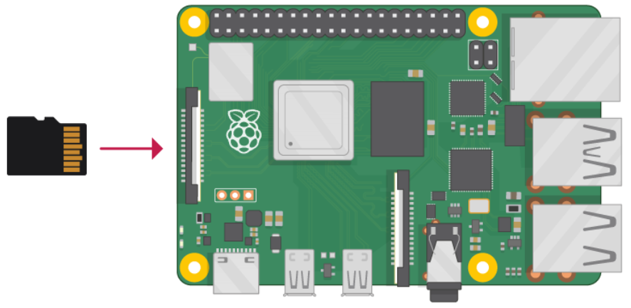

# Building the Chip-Tool

NOTE: The chip-tool binary is a part of the mattertool utility provided with the Silicon Labs Matter Hub RapberryPi image. It is not necessary to build chip-tool from scratch if using Matter Hub.

This page covers:

- Building the chip-tool for Linux
- Building the chip-tool for Raspberry Pi

## Build Environment for Linux

This section goes through the steps required to build the chip-tool for Linux.

**Do not execute any commands on this page as ROOT (no _su_ required), unless specified.**

### Prepare Linux Packages

Update the latest packages by typing following commands in the terminal:

```shell
$ sudo apt update
$ sudo apt install
```

### Prerequisites for Matter (CHIP) Project on Linux

#### Install Packages on Ubuntu Laptop/PC

- Open the Linux terminal from Start menu.
- Install required packages on Ubuntu Laptop/PC using the following commands:

    ```shell
    $ sudo apt install git gcc g++ pkg-config libssl-dev libdbus-1-dev
    libglib2.0-dev libavahi-client-dev ninja-build python3-venv python3-dev python3-pip unzip libgirepository1.0-dev libcairo2-dev libreadline-dev
    ```

#### Build the chip-tool Environment

To build the chip-tool environment, first set up the software and then compile the chip-tool.

##### Software Setup

If you have not downloaded or cloned the repository, you can run the following commands on a Linux terminal running on either Linux machine, WSL or Virtual Machine to clone the repository and run bootstrap to prepare to build the sample application images.

1. To download the [Matter codebase](https://github.com/project-chip/connectedhomeip.git), run the following commands.

    ```shell
     $ git clone https://github.com/project-chip/connectedhomeip.git
    ```

2. Bootstrapping:

    ```shell
    $ cd matter
    $ ./scripts/checkout_submodules.py --shallow --recursive --platform efr32
    $ . scripts/bootstrap.sh
    # Create a directory where binaries will be updated/compiled called `out`
    $ mkdir out
    ```

**Compiling the chip-tool**

To control the Wi-Fi Matter Accessory Device, you must compile and run the chip-tool on either a Linux, Mac, or Raspberry Pi. The chip-tool builds faster on the Mac and Linux machines so that is recommended, but if you have access to a Raspberry Pi, that will work as well.

1. Build the chip-tool.

    ```shell
    $ ./scripts/examples/gn_build_example.sh examples/chip-tool out/standalone
    ```

This will build chip-tool in `out/standalone`.

## Build Environment using Raspberry Pi 4

### Flash the Ubuntu OS onto the SD Card

1. Insert the flashed SD card (directly or using a card reader) into the laptop/PC that will run the Raspberry Pi Imager tool.
2. Launch Raspberry Pi 4 Imager.
3. Flash the Pi image using any one of the following procedures:

   - Click **Choose OS > Other General-purpose OS > Ubuntu > Ubuntu xx.xx 64-bit server OS**.

     Note: Flash the latest version of Ubuntu Server (64-bit server OS for arm64 architecture).

   - Download the Matter Hub Raspberry Pi Image provided on the [Matter Artifacts page](/matter/{build-docspace-version}/matter-prerequisites/matter-artifacts), then click **Choose OS > Use custom** and then select the Matter Hub Raspberry Pi Image that you downloaded.

4. Click **Storage** and select the **SD card detect**.
5. This Raspberry Pi 4's console can be accessed in multiple ways. In [this guide](https://www.raspberrypi.com/documentation/computers/remote-access.html), Raspberry Pi 4 is being accessed using PuTTY.
6. Enter the details like User name, Password, SSID, and its password to connect to network. Click **Save**.
7. Click **Write** and then **Yes** when you are asked for permission to erase data on the SD card. It will then start flashing the OS onto the SD card.
8. When it is done, click **Continue**.
9. Remove the SD card from the reader and insert it into the Raspberry Pi as shown below:



On powering up the board, the red and green lights should start blinking.

### Start Using the Raspberry Pi

1. Power-up the RPi4B. Once it is booted up, check the Raspberry Pi's IP address. Refer to [Finding Raspberry Pi IP address](/matter/{build-docspace-version}/matter-references/find-raspi) in the Resources section to get the IP address or enter the Hostname directly in PuTTY.

2. Once you find the IP address, launch PuTTY, select **Session**, enter the IP address of the Raspberry Pi, and click **Open**.

3. Enter the username and password given at the time of flashing and click **Enter**.

   Note: If the username and password are not provided while flashing then by default:

   - Username: ubuntu
   - Password: ubuntu

4. Switch to root mode and navigate to path _/home/ubuntu/connectedhomeip/out/standalone_ to find the chip-tool.
   Matter hub/chip-tool are ready and working. Keep the PuTTY session open for later steps.

5. Update the latest packages by running following commands in the terminal:

   ```shell
   $ sudo apt update 
   $ sudo apt install
   ```

6. Install required packages using the following commands:

    ```shell
   $ sudo apt-get install git gcc g++ pkg-config libssl-dev libdbus-1-dev libglib2.0-dev libavahi-client-dev ninja-build python3-venv python3-dev python3-pip unzip libgirepository1.0-dev libcairo2-dev libreadline-dev
   ```

   If you see any popups between installs, you can select **OK** or **Continue**.

### Build Environment

1. Follow the instructions in [the Project CHIP GitHub Site](https://github.com/project-chip/connectedhomeip/blob/master/docs/guides/BUILDING.md), in the section "Installing prerequisites on Raspberry Pi 4".

2. To build the environment, follow the steps in the [Light and Switch Step-by-Step Example](/matter/{build-docspace-version}/matter-light-switch-example/01-wifi-light-switch-example).

### Bluetooth Setup

Because Bluetooth LE (BLE) is used for commissioning on Matter, make sure BLE is up and running on Raspberry Pi. Raspberry Pi internally has some issues with BLE that may cause it to crash.

```shell
$ sudo systemctl status bluetooth.service
```

To stop BLE if it is already running:

```shell
$ sudo systemctl stop bluetooth.service
```

To restart the Bluetooth service, first enable it:

```shell
$ sudo systemctl enable bluetooth.service
```

When you check the status of the Bluetooth service, it will be inactive because it has been enabled but not restarted:

```shell
$ sudo systemctl status bluetooth.service
```

Restart the service:

```shell
$ sudo systemctl restart bluetooth.service
```

Now the status of the service should be active and running:

```shell
$ sudo systemctl status bluetooth.service
```
