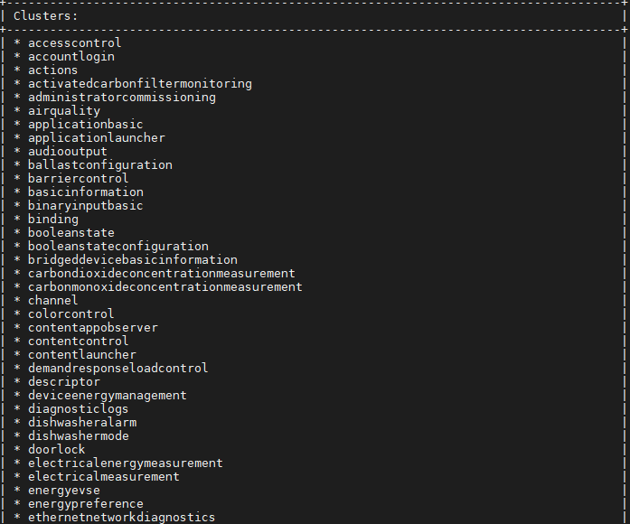
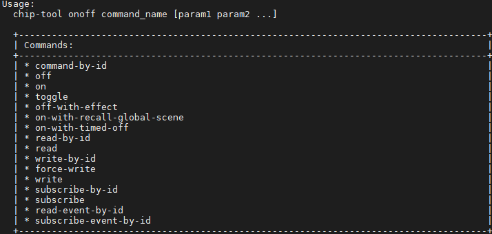

# Using the chip-tool

 The following commands shows commission Matter End Device (Matter Accessory Device), and then send the commands with the chip-tool. The chip-tool provides various commands used to create and interact with a Matter network. Also chip-tool used to control,read/write the attriutes of the Matter End Device which is in Matter network.

## Basic chip-tool Usage

In terminal run chip-tool with no parameters so it will give the information about usage, list of clusters supported and the commands list as given below.

```shell
$ ./chip-tool
```
### Usage
  chip-tool cluster_name command_name [param1 param2 ...]

or:

  chip-tool command_set_name command_name [param1 param2 ...]

 

 

 If cluster-name/command is given with chip-tool command then it will provide the list of commands supported by that cluster.

 

Chip-tool gives the information of the commands as just keep typing the parts of the command to get to the next level.

## Commissioning using chip-tool

This procedure uses the chip-tool installed on the Matter Hub. The commissioning procedure does the following:

- Chip-tool scans BLE and locates the Silicon Labs device that uses the specified discriminator.
- Establishes operational certificates.
- Sends the Wi-Fi SSID and Passkey.
- The Silicon Labs device will join the Wi-Fi network and get an IP address. It then starts providing mDNS records on IPv4 and IPv6.
- Future communications (tests) will then happen over Wi-Fi.

```shell
$ ./out/standalone/chip-tool pairing ble-wifi <node_id> <ssid> <password> <pin_code> <discriminator>
```
In this command:
- pairing is the cluster to be used for connection here ble is used for provisioning and wifi will be used for controlling the MAD.
- node_id is the user-defined ID of the node being commissioned.
- ssid and password are credentials.
- pin_code and discriminator are device-specific keys.


The node ID used here is 1122. This will be used in future commands. '\$SSID' is a placeholder for your Wi-Fi SSID, and '\$PSK' is a placeholder for the password of your Wi-Fi network. '20202021' is the Setup Pin Code used to authenticate the device. '3840' is the Setup Discriminator used to discern between multiple commissionable device advertisements.

Ex:
```shell
 ./out/standalone/chip-tool pairing ble-wifi 1122 test test@123 20202021 3840
 ```

## Controlling the Matter Accessory Device
This sections gives information about how to control the commissioned Matter device using chip-tool commands. Basic commands for light,lock,window applications are given in the next sections for reference.  

### Controlling Matter lighting device

In a PuTTY session to the Matter hub, use the chip-tool to test the Matter light device.

   1. Control the light status of the light MAD Using `./chip-tool onoff on <nodeID>  1`. You can also use  `chip-tool toggle <nodeID> 1`.

   Ex:

   ```shell
    $ ./chip-tool onoff on 1122  1
   ```
   ```shell
    $ ./chip-tool onoff toggle 1122  1
   ```
   2. For dev board with buttons available, you can use **BTN1** to toggle the light status locally.

### Controlling Matter lock device

In a PuTTY session to the Matter hub, use the chip-tool to test the Matter lock device.

   1. Control the lock status of the lock MAD Using `./chip-tool doorlock unlock-door <nodeID> 1 --timedInteractionTimeoutMs 1000`. Lock status can be checked by using `./chip-tool doorlock read lock-state <nodeID> 1`

   Ex:

   ```shell
   ./chip-tool doorlock unlock-door 1122 1 --timedInteractionTimeoutMs 1000
   ```
   ```shell
   ./chip-tool doorlock lock-door 1122 1 --timedInteractionTimeoutMs 1000
   ```
   ```
   ./chip-tool doorlock read lock-state 1122 1
   ```
   2. For dev board with buttons available, you can use **BTN1** to lock/unlock the door locally.

### Controlling Matter window device

In a PuTTY session to the Matter hub, use the chip-tool to test the Matter window device.

   1. Control the window status of the window MAD Using `./chip-tool windowcovering down-or-close <nodeID> 1`. Window status can be checked by using `./chip-tool  windowcovering read current-position-tilt-percent100ths <nodeID> 1`

   Ex:

   ```shell
   ./chip-tool windowcovering down-or-close 1122 1
   ```
   ```shell
  ./chip-tool  windowcovering read current-position-tilt-percent100ths 1122 1
   ```
   2. For dev board with buttons available, you can use **BTN0** to up/**BTN1** to down the window locally.

### Controlling Matter thermostat device

In a PuTTY session to the Matter hub, use the chip-tool to test the Matter thermostat device.Control the status of the thermostat MAD Using `./chip-tool thermostat write min-heat-setpoint-limit 1100 <nodeID> 1`. The status can be checked by using `./chip-tool thermostat read min-heat-setpoint-limit <nodeID> 1`

   Ex:

   ```shell
   ./chip-tool thermostat write min-heat-setpoint-limit 1100 1122 1
   ```
   ```shell
   ./chip-tool thermostat read min-heat-setpoint-limit 1122 1
   ```