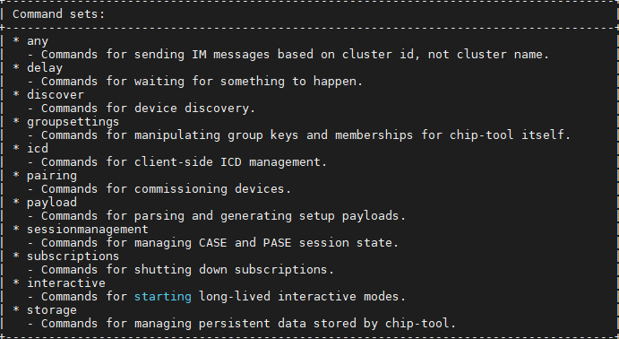

# Using the Chip-Tool

 The following commands show how to commission a Matter End Device (Matter Accessory Device), and then send the commands with the chip-tool. The chip-tool provides various commands used to create and interact with a Matter network. Also, the chip-tool can be used to control and read/write the attributes of the Matter End Device, which is in the Matter network.

## Basic chip-tool Usage

In a terminal, run the chip-tool with no parameters so it will provide information about usage, list of clusters supported, and the commands list as shown below.

```shell
$ ./chip-tool
```
### Usage
  chip-tool cluster_name command_name [param1 param2 ...]

or:

  chip-tool command_set_name command_name [param1 param2 ...]

 

 

 If the cluster-name/command is given with chip-tool command, then it will provide the list of commands supported by that cluster.

 

 The chip-tool provides the information of the commands. Keep typing the parts of the command to get to the next level.

## Commissioning using chip-tool

This procedure uses the chip-tool installed on the Matter Hub. The commissioning procedure does the following:

- Chip-tool scans BLE and locates the Silicon Labs device that uses the specified discriminator.
- Establishes operational certificates.
- Sends the Wi-Fi SSID and Passkey.
- The Silicon Labs device joins the Wi-Fi network and gets an IP address. It then starts providing mDNS records on IPv4 and IPv6.
- Future communications (tests) will then happen over Wi-Fi.

```shell
$ ./chip-tool pairing ble-wifi <node_id> <ssid> <password> <pin_code> <discriminator>
```
In this command:
pairing is the cluster to be used for connection; here, BLE is used for provisioning, and Wi-Fi is used for controlling the MAD.
- node_id is the user-defined ID of the node being commissioned.
- ssid and password are credentials.
- pin_code and discriminator are device-specific keys.


The node ID used here is 1122. This will be used in future commands. '\$SSID' is a placeholder for your Wi-Fi SSID, and '\$PSK' is a placeholder for the password of your Wi-Fi network. '20202021' is the Setup Pin Code used to authenticate the device. '3840' is the Setup Discriminator used to discern between multiple commissionable device advertisements.

Ex:
```shell
 ./chip-tool pairing ble-wifi 1122 SlWifi 12345678 20202021 3840
 ```

## Controlling the Matter Accessory Device
This sections gives information about how to control the commissioned Matter device using chip-tool commands. Basic commands for light, lock, window and thermostat applications are given in the next sections for reference.  

### Controlling Matter Lighting device

In a PuTTY session to the Matter hub, use the chip-tool to test the Matter light device.

   1. Control the light status of the light MAD using `./chip-tool onoff on <node_id> 1`. You can also use  `chip-tool toggle <node_id> 1`.

   Ex:

   ```shell
    $ ./chip-tool onoff on 1122  1
   ```
   ```shell
    $ ./chip-tool onoff toggle 1122  1
   ```
   2. For development boards with buttons available, you can use **BTN1** to toggle the light status locally.

### Controlling Matter Lock device

In a PuTTY session to the Matter hub, use the chip-tool to test the Matter lock device.

   1. Control the lock status of the lock MAD using `./chip-tool doorlock unlock-door <node_id> 1 --timedInteractionTimeoutMs 1000`. Lock status can be checked by using `./chip-tool doorlock read lock-state <node_id> 1`

   Ex:

   ```shell
   ./chip-tool doorlock unlock-door 1122 1 --timedInteractionTimeoutMs 1000
   ```
   ```shell
   ./chip-tool doorlock lock-door 1122 1 --timedInteractionTimeoutMs 1000
   ```
   ```
   ./chip-tool doorlock read lock-state 1122 1
   ```
   2. For development boards with buttons available, you can use **BTN1** to lock/unlock the door locally.

### Controlling Matter Window device

In a PuTTY session to the Matter hub, use the chip-tool to test the Matter window device.

   1. Control the window status of the window MAD using `./chip-tool windowcovering down-or-close <node_id> 1`. Window status can be checked by using `./chip-tool  windowcovering read current-position-tilt-percent100ths <node_id> 1`

   Ex:

   ```shell
   ./chip-tool windowcovering down-or-close 1122 1
   ```
   ```shell
  ./chip-tool  windowcovering read current-position-tilt-percent100ths 1122 1
   ```
   2. For development boards with buttons available, you can use **BTN0**(up)/**BTN1**(down) to modify the window locally.

### Controlling Matter Thermostat device

In a PuTTY session to the Matter hub, use the chip-tool to test the Matter thermostat device.Control the status of the thermostat MAD using `./chip-tool thermostat write min-heat-setpoint-limit 1100 <node_id> 1`. The status can be checked by using `./chip-tool thermostat read min-heat-setpoint-limit <node_id> 1`

   Ex:

   ```shell
   ./chip-tool thermostat write min-heat-setpoint-limit 1100 1122 1
   ```
   ```shell
   ./chip-tool thermostat read min-heat-setpoint-limit 1122 1
   ```
   ```shell
   ./chip-tool thermostat read occupied-cooling-setpoint 1122 1
   ```