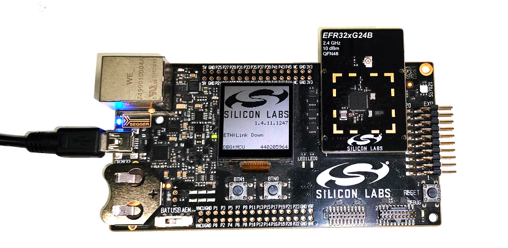
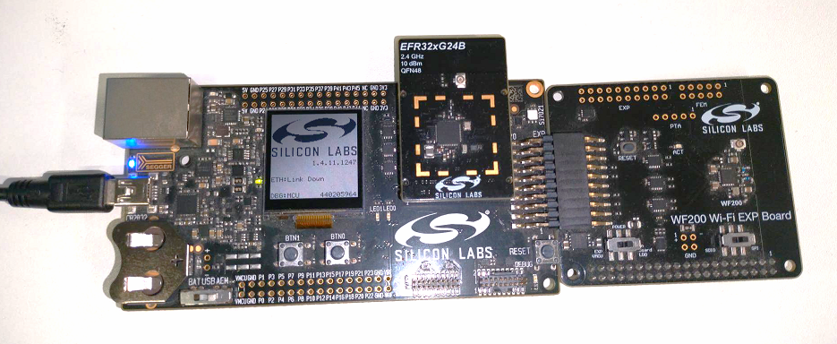

# Getting Started with EFR32 Host in NCP Mode

This page describes how to get started with developing an application on EFR32 host in Network Co-Processor (NCP) mode, where the application runs on the EFR32 host and the connectivity stack runs on the Wi-Fi chipset.

## Check Prerequisites

To run Matter over Wi-Fi, check for the following prerequisites:

### Hardware Requirements

The following hardware devices are required for executing Matter over Wi-Fi:

- Silicon Labs Wireless starter/development kit (WSTK)
- Silicon Labs Wi-Fi development Kits & boards
  - For Network Co-Processor (NCP) variants,
    - Silicon Labs EFR32 - is used as a host processor and, with the WF200, provides Bluetooth LE capabilities
    - Silicon Labs Wi-Fi Processor
      - WF200 expansion board
      - SiWx917 NCP expansion board

- **MG24 boards**

  - BRD4186C / SLWSTK6006A / Wireless Starter Kit / 2.4GHz@10dBm
    - [XG24-RB4186C](https://www.silabs.com/development-tools/wireless/xg24-rb4186c-efr32xg24-wireless-gecko-radio-board)
    - MG24 with WSTK : [xG24-PK6009A](https://www.silabs.com/development-tools/wireless/efr32xg24-pro-kit-10-dbm?tab=overview)
  - BRD4187C / SLWSTK6006A / Wireless Starter Kit / 2.4GHz@20dBm
    - [XG24-RB4187C](https://www.silabs.com/development-tools/wireless/xg24-rb4187c-efr32xg24-wireless-gecko-radio-board)
    - MG24 with WSTK : [xG24-PK6010A](https://www.silabs.com/development-tools/wireless/efr32xg24-pro-kit-20-dbm?tab=overview)
  
  >**Note**: A custom board binary can also be generated. The configuration file `sl_spidrv_exp_config` for 917NCP and WF200 should have the SPI pin and port defines enabled. The configuration file `sl_custom_board.h` contains the SPI pins, which should be updated according to the custom board's pin configuration.

- **Wi-Fi Dev Kits & boards**

  - **SiWx917**
    - SiWx917 NCP Mode / Wi-Fi Expansion Board / 2.4GHz
      - BRD8045A (B0 Expansion v2.0)
  - **WF200**
    - WF200 / Single Band Wi-Fi Expansion Board / 2.4GHz
      - [SLEXP8022A](https://www.silabs.com/development-tools/wireless/wi-fi/wf200-wifi-expansion-kit)
    - WFM200S / Single Band Wi-Fi Expansion Board / 2.4GHz
      - [SLEXP8023A](https://www.silabs.com/development-tools/wireless/wi-fi/wfm200-wifi-expansion-kit)

- Windows/Linux/MacOS computer with a USB port
- USB cable for connecting WSTK Board to Computer
- Raspberry Pi with a >32 GB SD Card
- Access Point with Internet Access
- Interconnect board (included in the Wi-Fi kits)
  
### Software Requirements

Below are the software tools, packages, and images required for executing Matter over Wi-Fi:

### Software Tools Requirements

- Simplicity Commander for flashing bootloader on EFR32 Boards and Siwx917 NCP.
- Tera Term for flashing firmware on EFR32 NCP Boards.
- Simplicity Studio
- PuTTY for controlling EFR32 hardware using chip-tool controller
- Ozone Debugger for logging and debugging (Optional)
- JLink RTT for logging only (Optional)

### Software Packages

- Simplicity SDK v2024.x
- WiSeConnect SDK
  - For SiWx917 use WiSeConnect SDK v3.x

### Firmware Images

- Download the firmware images from [Matter Artifacts page](/matter/{build-docspace-version}/matter-prerequisites/matter-artifacts).

- For flashing the firmware images, refer to [Flashing Firmware Images](/matter/{build-docspace-version}/matter-wifi-run-demo/loading-firmware-for-ncp-and-soc-boards).

## Installation of the Wi-Fi Software Tools and Packages

Refer to the [Wi-Fi Software Installation page](./software-installation).

## Connect the Boards to a Computer

1. Mount the EFR32 radio board onto the EFR32 WSTK board.

    

2. Connect the NCP expansion board to the EXP header on the EFR32 WSTK board.

    

3. Toggle the upper switch on the NCP expansion board to EXP-UART.
4. Connect the EFR32 WSTK board to computer using a USB cable.

## Troubleshoot Board Detection Failure

If Simplicity Studio does not detect the EFR32 radio board, try the following:

- In the **Debug Adapters** panel, click the **Refresh** button (the icon with two looping arrows).
- Press the **RESET** button on the EFR32 radio board.
- Power-cycle the EFR32 radio board by disconnecting and reconnecting the USB cable.

## Building and Flashing an Application

This section describes how to create a project for the EFR32 boards.

1. In Simplicity Studio, click on **Matter**, under **Example Projects and Demos**, select a project, and click **Create**.

   
     

2. In the Project Configuration window, after selecting the board, click **Finish**.

   

3. Once the project is created, click the **Open in VS Code** option on the top right corner.
    

4. In VS Code, click on the Studio Extension on the left panel and select **Build** option (Hammer Icon) in the Workspace tab.

    

4. Once the project is compiled successfully, the binaries can be flashed either using the **Simplicity Commander** from the tools or using the **Flash** option beside the **Build**.

    

5. When using Commander, select the kit and click on the **Flash** option in the left panel. Click on **Erase chip**.

6. Select the path for the project's *.s37* binary and click **Flash**.

    

**Note:** Output of the EFR32 NCP Host application will be displayed on the J-Link RTT Viewer.
