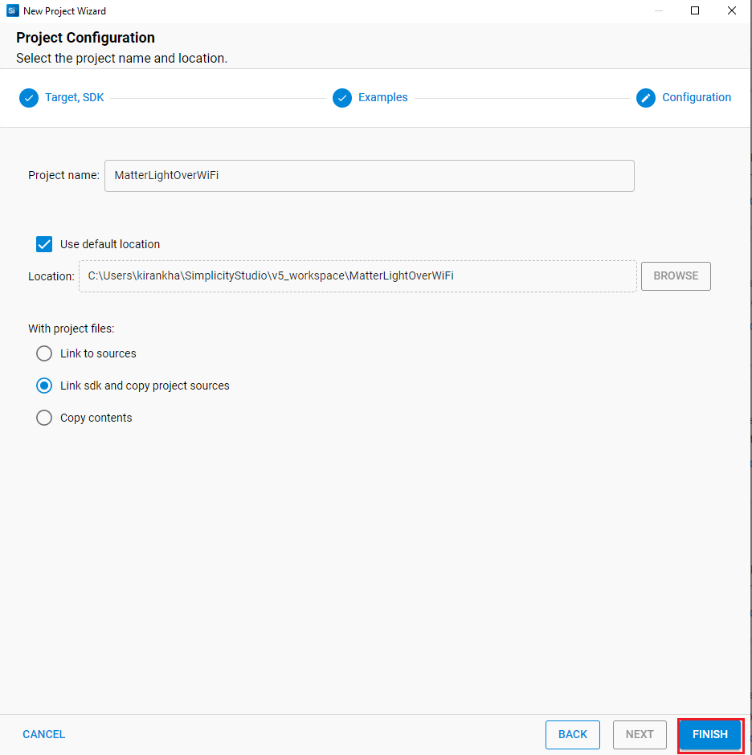

# Getting Started with EFR32 Host in NCP Mode 

This page describes how to get started with developing an application on EFR32 host in Network Co-Processor (NCP) mode, where the application runs on the EFR32 host and the connectivity stack runs on the Wi-Fi chipset.

## Check Prerequisites

In order to run Matter over Wi-Fi, check for the following prerequisites:

### Hardware Requirements

The following hardware devices are required for executing Matter over Wi-Fi:

- Silicon Labs Wireless starter/development kit (WSTK)
- Silicon Labs Wi-Fi development Kits & boards
  - For Network Co-Processor (NCP) variants,
      - Silicon Labs EFR32 - is used as a host processor and, with the WF200, provides Bluetooth LE capabilities
      - Silicon Labs Wi-Fi Processor
         - RS9116 development kit
         - WF200 expansion board
         - SiWx917 NCP expansion board
-   **MG24 boards:**

-   BRD4186C / SLWSTK6006A / Wireless Starter Kit / 2.4GHz@10dBm
    -   [XG24-RB4186C](https://www.silabs.com/development-tools/wireless/xg24-rb4186c-efr32xg24-wireless-gecko-radio-board)
    -   MG24 with WSTK : [xG24-PK6009A](https://www.silabs.com/development-tools/wireless/efr32xg24-pro-kit-10-dbm?tab=overview)
-   BRD4187C / SLWSTK6006A / Wireless Starter Kit / 2.4GHz@20dBm
    -   [XG24-RB4187C](https://www.silabs.com/development-tools/wireless/xg24-rb4187c-efr32xg24-wireless-gecko-radio-board)
    -   MG24 with WSTK : [xG24-PK6010A](https://www.silabs.com/development-tools/wireless/efr32xg24-pro-kit-20-dbm?tab=overview)

-   **MG12 boards:**

    -   [EFR32MG12 Development Kit](https://www.silabs.com/development-tools/wireless/zigbee/efr32mg12-dual-band-starter-kit)
    -   BRD4161A / SLWSTK6000B / Wireless Starter Kit / 2.4GHz@19dBm
        -   [SLWRB4161A](https://www.silabs.com/development-tools/wireless/zigbee/slwrb4161a-efr32mg12-radio-board)
    -   BRD4162A / SLWSTK6000B / Wireless Starter Kit / 2.4GHz@10dBm
        -   [SLWRB4162A](https://www.silabs.com/development-tools/wireless/zigbee/slwrb4162a-efr32mg12-radio-board)
    -   BRD4163A / SLWSTK6000B / Wireless Starter Kit / 2.4GHz@19dBm
        -   [SLWRB4163A](https://www.silabs.com/development-tools/wireless/zigbee/slwrb4163a-efr32mg12-radio-board)
    -   BRD4164A / SLWSTK6000B / Wireless Starter Kit / 2.4GHz@19dBm
        -   [SLWRB4164A](https://www.silabs.com/development-tools/wireless/zigbee/slwrb4164a-efr32mg12-radio-board)
    -   BRD4170A / SLWSTK6000B / Multiband Wireless Starter Kit / 2.4GHz@19dBm, 915MHz@19dBm
        -   [SLWRB4170A](https://www.silabs.com/development-tools/wireless/zigbee/slwrb4170a-efr32mg12-radio-board)

-   **Wi-Fi Dev Kits & boards**

-   RS9116
    -   SB-EVK1 / Single Band Wi-Fi Development Kit / 2.4GHz
        -   [RS9116X-SB-EVK1](https://www.silabs.com/development-tools/wireless/wi-fi/rs9116x-sb-evk-development-kit)
    -   SB-EVK2 / Single Band Wi-Fi Development Kit / 2.4GHz
        -   [RS9116X-SB-EVK2](https://www.silabs.com/development-tools/wireless/wi-fi/rs9116x-sb-evk2-development-kit)
    -   DB-EVK1 / Dual Band Wi-Fi Development Kit / 2.4GHz & 5GHz
        -   [RS9116X-DB-EVK1](https://www.silabs.com/development-tools/wireless/wi-fi/rs9116x-db-evk-development-kit)
        **Note:** Matter only supported over 2.4GHz on this Dev kit.
    -   Interconnect board (included in the Wi-Fi kits)
    -   SPI Cable (included in the RS9116 kit)
    -   Jumper Cables (included in the RS9116 kit)
-   SiWx917
    -   SiWx917 NCP Mode / Wi-Fi Expansion Board / 2.4GHz
        -   BRD8036A (A0 Expansion v1.0)
        -   BRD8036A (A0 Expansion v1.1)
-   WF200
    -   WF200 / Single Band Wi-Fi Expansion Board / 2.4GHz
        -   [SLEXP8022A](https://www.silabs.com/development-tools/wireless/wi-fi/wf200-wifi-expansion-kit)
    -   WFM200S / Single Band Wi-Fi Expansion Board / 2.4GHz
        -   [SLEXP8023A](https://www.silabs.com/development-tools/wireless/wi-fi/wfm200-wifi-expansion-kit)

- Windows/Linux/MacOS computer with a USB port
- USB cable for connecting WSTK Board to Computer
- Raspberry Pi with a >32 GB SD Card
- Access Point with Internet Access
- Interconnect board (included in the Wi-Fi kits)
- SPI Cable (included in the RS9116 kit)
- Jumper Cables (included in the RS9116 kit)
  
### Software Requirements

Below are the software tools, packages and images required for executing Matter over Wi-Fi:

### Software Tools Requirements

- Simplicity Commander for flashing bootloader on EFR32 Boards and firmware on Siwx917 SOC
- Tera Term for flashing firmware on EFR32 NCP Boards.
- Simplicity Studio
- Putty for controling EFR32 hardware using chip-tool controller
- Ozone Debugger for logging and debugging (Optional) 
- JLink RTT for logging only (Optional)

### Software Packages

- Gecko SDK v4.x
- WiseConnect SDK 
   - For RS9116 use WiseConnect SDK v2.x
   - For SiWx917 use WiseConnect SDK v3.x

### Firmware Images

Refer to the [Matter Artifacts Page](/matter/<docspace-docleaf-version>/matter-prerequisites/matter-artifacts#rs9116-firmware) for pre-built firmware images for the Matter over Wi-Fi demo.

## Installation of the Wi-Fi Software Tools and Packages

Refer to the [Wi-Fi Software Installation Page](./software-installation)

## Connect the Boards to a Computer

1. Mount the EFR32 radio board on the EFR32 WSTK board.

2. Connect the NCP expansion board to the EXP header on the EFR32 WSTK board.

3. Toggle the upper switch on the NCP expansion board to EXP-UART.
4. Connect the EFR32 WSTK board to computer using a USB cable.

## Troubleshoot Board Detection Failure

If Simplicity Studio does not detect EFR32 radio board, try the following:
- In the Debug Adapters panel, Click the Refresh button (the icon with two looping arrows).

- Press the RESET button on the EFR32 radio board.

- Power-cycle the EFR32 radio board by disconnecting and reconnecting the USB cable.

## Building and Flashing an Application

This document describes  how to create a project for the EFR32 boards.

1. In Simplicity Studio, click on Example Projects and Demos Option, select a project, and click **Create**. 
   

9. In the New Project Wizard window, click **Finish**.
   

10. Once the project is created, right-click the project and select *Build Project* in the Project Explorer tab.
     

11. Once the project is compiled successfully, go to the Project Explorer view and expand the binaries folder to flash the binary.
    

12. Right-click the selected *.s37* binary and click **flash to device**.
    

13. Flash programmer window will be opened. Click **Erase** and then **Program** to start flashing.
    

**Note:** Output of the EFR32 NCP Host application will be displayed on the J-Link RTT Viewer.