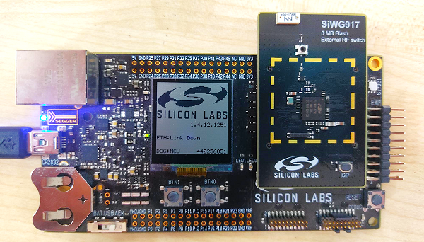
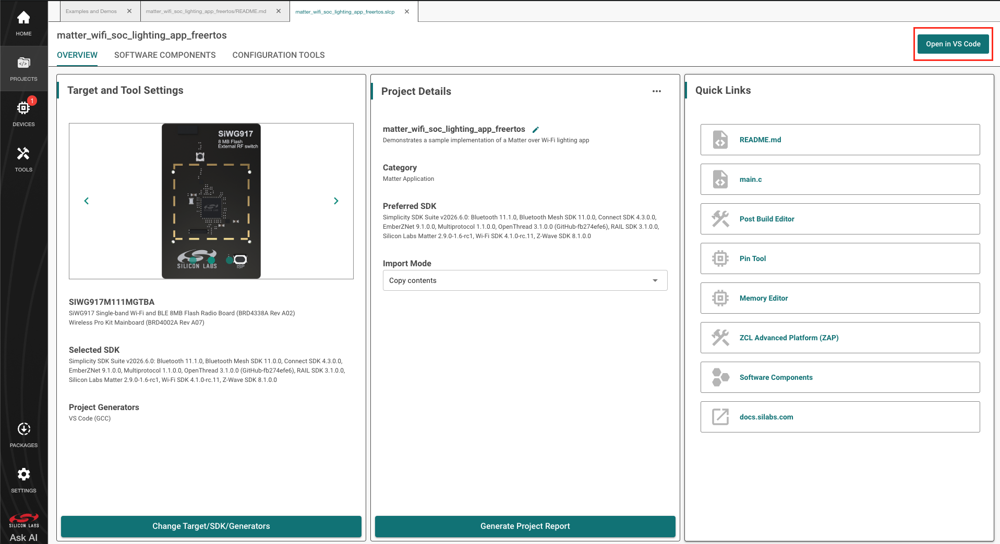

# Getting Started with SoC Mode

This guide describes how to get started developing an application for the SiWx91x in System-on-chip (SoC) mode, where both the application and the networking stack run on the SiWx917 chipset.

## Check Prerequisites

To run Matter over Wi-Fi, check for the following prerequisites:

### Hardware Requirements

The following hardware devices are required for executing Matter over Wi-Fi:

- Silicon Labs Wireless starter/development kit (WSTK)
- SiWx917 SoC development kit
- Wi-Fi Dev Kit
  - SiWx917
    - SoC mode:
      - BRD4388A (B0 2.0 common flash)
             SiWx917
- Windows/Linux/MacOS computer with a USB port
- USB cable for connecting WSTK Board to Computer
- Raspberry Pi with a >32 GB SD Card
- Access Point with Internet Access

### Software Requirements

Below are the software tools, packages, and images required for executing Matter over Wi-Fi:

### Software Tools Requirements

- Simplicity Commander for flashing firmware/binary
- Tera Term
- Simplicity Studio
- PuTTY for controlling EFR32 hardware using chip-tool controller
- JLink RTT for logging only

### Software Packages

- Simplicity SDK v2024.x
- WiSeConnect SDK v3.x

### Firmware Images

- Download the firmware images from [Matter Artifacts page](/matter/{build-docspace-version}/matter-prerequisites/matter-artifacts#siwx917-firmware-for-siwn917-ncp-and-siwg917-soc).

- For flashing the firmware images, refer to [Flashing Firmware Images](/matter/{build-docspace-version}/matter-wifi-run-demo/loading-firmware-for-ncp-and-soc-boards).

## Installation of the Wi-Fi Software Tools and Packages

Refer to the [Wi-Fi Software Installation page](./software-installation).

## Connect SiWx917 SoC to Computer

1. Mount the SiWx917 radio board onto the SiWx917 WSTK board.

    

2. Connect your SiWx917 Wireless Starter Kit (WSTK) board to your computer using a USB cable.
3. Simplicity Studio will detect and display your radio board.

## Troubleshooting a Board Detection Failure

If Simplicity Studio does not detect the SiWx917 SoC board, try the following:

- In the Debug Adapters panel, click **Refresh** (the icon of two looping arrows).
- Press the **RESET** button on the SiWx917 SoC radio board.
- Power-cycle the SiWx917 SoC radio board by disconnecting and reconnecting the USB cable.

## Building the 917 SoC Matter Accessory Devices Using Simplicity Studio

In Simplicity Studio 6, create the Light Matter Accessory Devices (MAD):

1. In Simplicity Studio, click on **Matter**, under **Example Projects and Demos**, select a project, and click **Create**.

   
     

2. In the Project Configuration window, Select the board and click **Next**.
   
   - Set -
      - Solution and Project Name.
      - Select Target IDE.
      - Click **Finish**.
      
   

3. Once the project is created, click the **Open in VS Code** option on the top right corner.
    

4. In VS Code, click the Studio Extension on the left panel and select **Build** option (Hammer Icon) in the Workspace tab.

    

4. Once the project is compiled successfully, the binaries can be flashed either using the **Simplicity Commander** from the tools or using the **Flash** option beside the **Build**.

    

5. When using Commander, select the kit and click the **Flash** option in the left panel. Click **Erase chip**.

6. Select the path for the project's *.s37* binary and click **Flash**.

    
