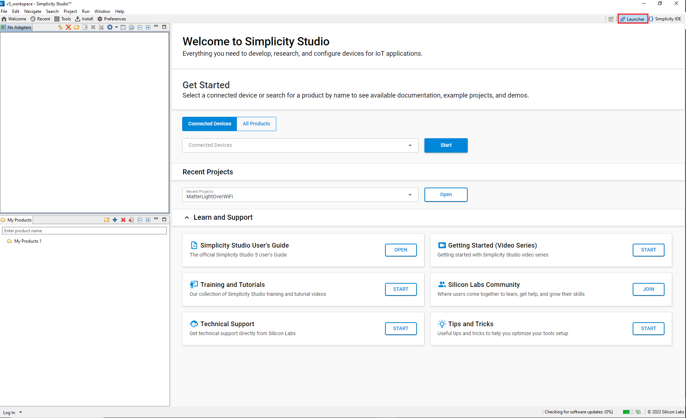
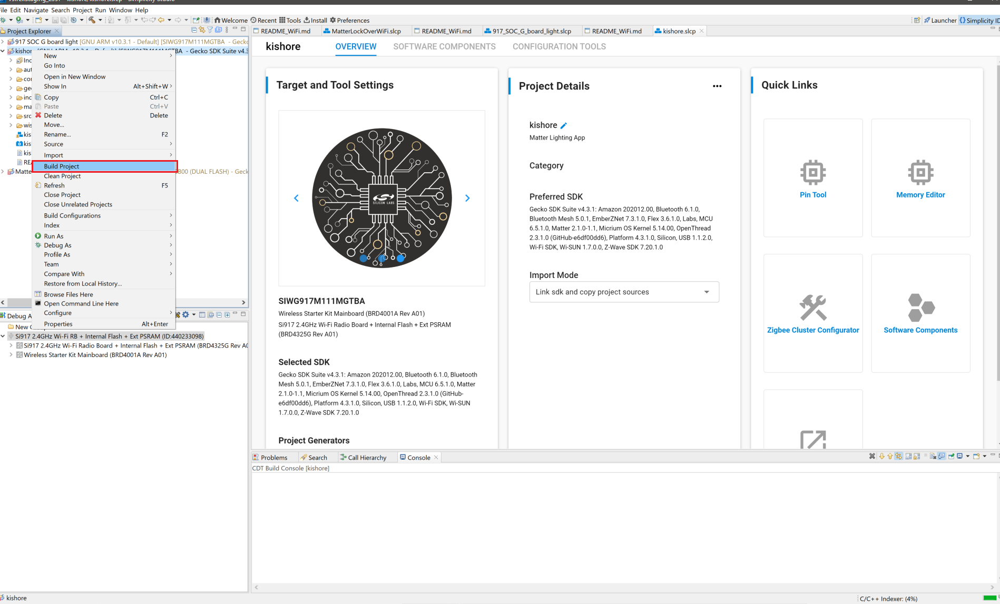
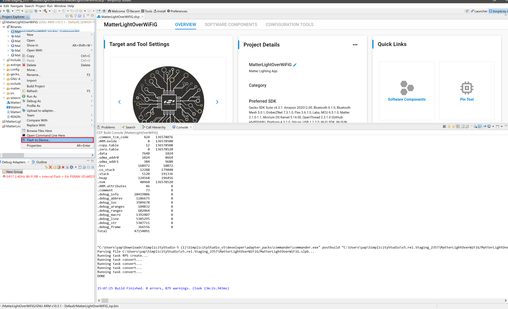

# Getting Started with SoC Mode

This guide describes how to get started developing an application for the SiWx91x in System-on-chip (SoC) mode, where both the application and the networking stack run on the SiWx917 chipset.

## Check Prerequisites

In order to run Matter over Wi-Fi, check for the following prerequisites:

### Hardware Requirements

The following hardware devices are required for executing Matter over Wi-Fi:

- Silicon Labs Wireless starter/development kit (WSTK)
- SiWx917 SoC development kit
- Wi-Fi Dev Kit
  - SiWx917
    - SoC mode:
      - BRD4388A (B0 2.0 common flash)
             SiWx917
- Windows/Linux/MacOS computer with a USB port
- USB cable for connecting WSTK Board to Computer
- Raspberry Pi with a >32 GB SD Card
- Access Point with Internet Access

### Software Requirements

Below are the software tools, packages, and images required for executing Matter over Wi-Fi:

### Software Tools Requirements

- Simplicity Commander for flashing firmware/binary
- Tera Term
- Simplicity Studio
- Putty for controlling EFR32 hardware using chip-tool controller
- JLink RTT for logging only

### Software Packages

- Gecko SDK v4.x
- WiseConnect SDK v3.x

### Firmware Images

- Download Pre-built Firmware images ,Refer to the [Matter Artifacts Page](/matter/<docspace-docleaf-version>/matter-prerequisites/matter-artifacts#siwx917-firmware-for-siwx917-soc).

- For Flashing the firmware images, Refer to [Flashing Firmware Images](/matter/<docspace-docleaf-version>/matter-wifi-run-demo/loading-firmware-for-ncp-and-soc-boards).

## Installation of the Wi-Fi Software Tools and Packages

Refer to the [Wi-Fi Software Installation Page](./software-installation).

## Connect SiWx917 SOC to Computer

1. Mount the SiWx917 radio board on the SiWx917 WSTK board.

2. Connect your SiWx917 Wireless Starter Kit (WSTK) board to your computer using a USB cable.
3. Simplicity Studio will detect and display your radio board.

## Troubleshooting a Board Detection Failure

If Simplicity Studio does not detect the SiWx917 SoC board, try the following:

- In the Debug Adapters panel, click Refresh (the icon of two looping arrows).
- Press the RESET button on the SiWx917 SoC radio board.
- Power-cycle the SiWx917 SoC radio board by disconnecting and reconnecting the USB cable.

## Building the 917 SoC Matter Accessory Devices Using Simplicity Studio

In Simplicity Studio 5, create the Light Matter Accessory Devices (MAD):

1. [Download](https://www.silabs.com/developers/simplicity-studio) and Install Simplicity Studio 5.
2. To install the software packages for Simplicity Studio, refer to the [Software Package Installation Section](/matter/<docspace-docleaf-version>/matter-wifi-getting-started-example/software-installation#installation-of-software-packages)

3. Switch to the Launcher view (if not already in it).

4. Go to `All Products` in the launcher tab and select one compatible board from the following supported list of SiWx917 SOC dev boards.

   - BRD4338A (Common Flash)

   

5. Once the board shows up in the Debug Adapters view, select it.

6. Open the Example Projects and Demos tab, select the **Matter** filter and enter "*Wi-Fi*" in **Filter on keywords**. Click **CREATE**.

7. Optionally rename the project, and click **Finish**.

8. Once the project is created, right-click on the project and select *Build Project* in the Project Explorer tab.

9. To flash the application, connect the compatible dev board to the PC if not yet done.
10. Once the project is compiled successfully, go to the Project Explorer view and select the binary to be flashed.

11. Right-click the selected *_isp.bin* binary and click *flash to device*.

12. The Flash programmer window opens. Click **Program** to start flashing.

   **Note:** Output of the SiWX917 SoC application will be displayed on the J-Link RTT Viewer.

1.  In order to debug your Matter Application, Right-click on the selected **Matter Project** and click on *Debug As*.
