# Matter Over Wi-Fi Development Software Requirements

This document provides information and procedures to install the required software, tools, and packages for Silicon Labs Matter over Wi-Fi Matter Accessory Device (MAD) development.

## Required Software Tools

These are the generic software tools required for both NCP and SoC devices.

1. [**Silicon Labs Simplicity Studio**](https://www.silabs.com/developers/simplicity-studio): Simplicity Studio is the main IDE and development platform provided by Silicon Labs.

2. [**Ozone - The J-Link Debugger for Windows**](https://www.segger.com/products/development-tools/ozone-j-link-debugger/): Ozone is a full-featured graphical debugger for embedded applications. With Ozone, it is possible to debug any embedded application on C/C++ source and assembly level.
3. [**Simplicity Commander**](https://www.silabs.com/documents/public/software/SimplicityCommander-Windows.zip): Simplicity Commander is a utility that provides GUI and command line access to the debug features of an EFM32 device. It allows you to flash firmware, update the kit firmware, and lock or unlock debug access.

4. [**Tera Term**](https://osdn.net/projects/ttssh2/releases/): Tera Term is the terminal emulator for Microsoft Windows, which supports serial port, telnet, and SSH connections.

5. [**PuTTY**](https://www.putty.org/) (SSH Client, Terminal, or similar): SSH client is used to communicate with the Raspberry Pi over a secure shell.

6. [**Raspberry Pi Disk Imager**](https://www.raspberrypi.com/software/): Raspberry Pi Disk Imager is used to flash the SD Card that contains the operating system for the Raspberry Pi.

## Install Software Packages

The following packages will be installed during the installation of Simplicity Studio:

### Simplicity SDK Extension

While installing Simplicity Studio, the Simplicity Installer by default installs the latest Simplicity SDK and extensions.

>**Note:** Version numbers mentioned in the screenshots might be outdated. Install the latest packages available with the studio.

#### Install Simplicity SDK Through the Simplicity Installer

- **Using Package Manager:**
    1. In the Simplicity Studio home page, select **Packages** from the left panel. The Simplicity Installer will open.

    2. Select the **Package Manager** option.
   
        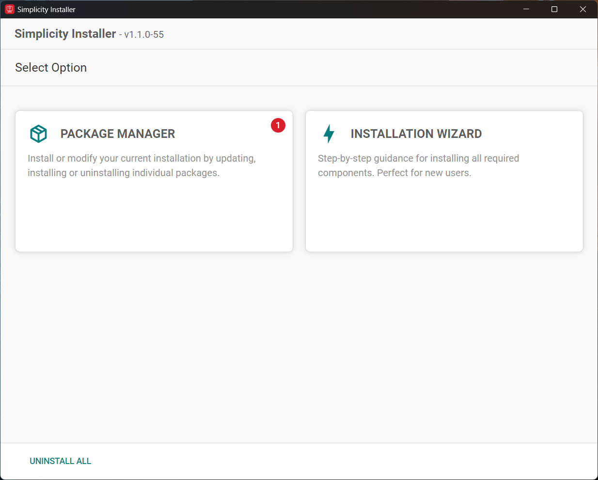

    3. Select the **Simplicity SDKs** option in the left panel and click **Add new SDK**. Ensure to check the Simplicity SDK, Matter Extension and WiseConnect boxes.
   
        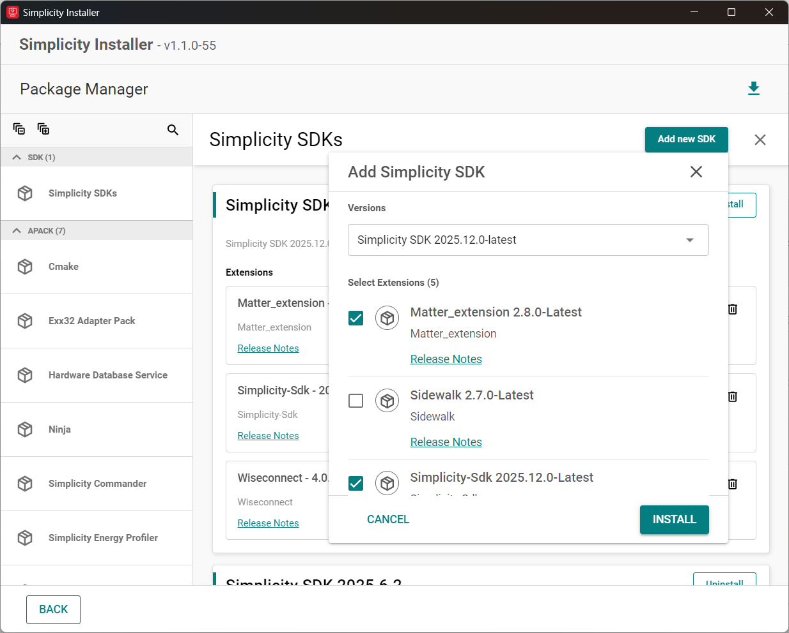

- **Using Installation Wizard:**
    1. In the Simplicity Studio home page, select **Packages** from the left panel. The Simplicity Installer will open.

    2. Select the **Installation Wizard** option.
   
        

    3. Click **Advanced**.

        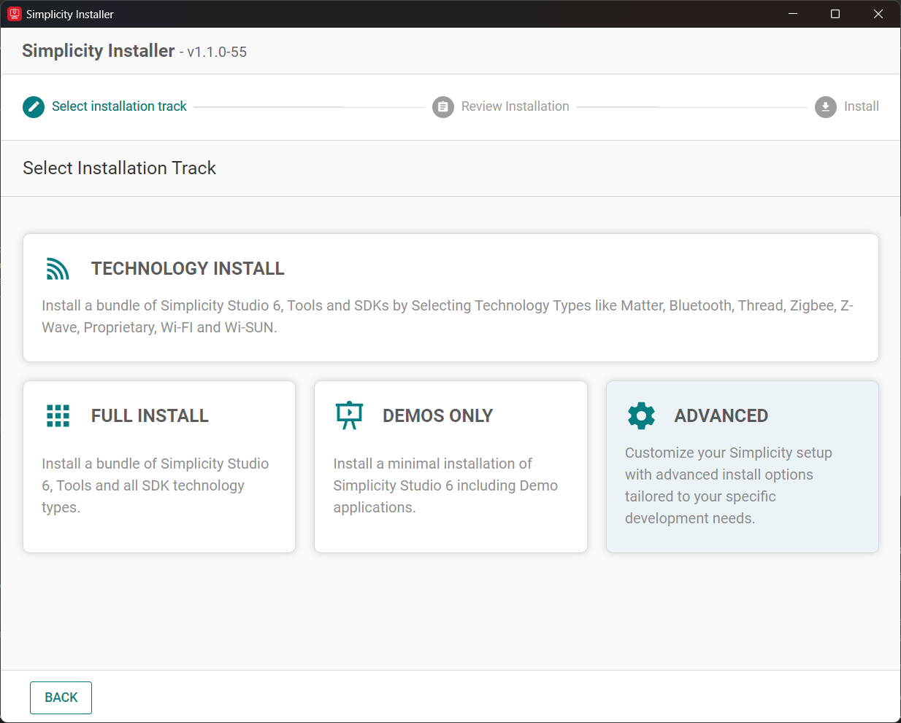

    4. From the list, select the **Simplicity SDK** version you want to install.
    5. Check the checkbox at the bottom for Terms of Service and License Agreement.

        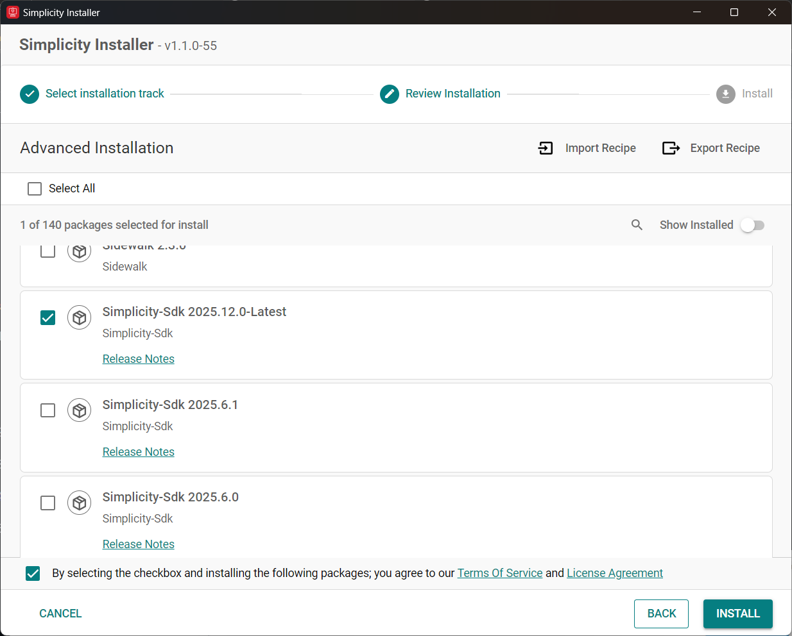

    6. Click **Install** to begin the installation.

#### Install the Simplicity SDK Through the "Manage SDK" Window

1. Download the Simplicity SDK v2025.x source code from the following URL after substituting 2025.x with the desired release version:

   [https://github.com/SiliconLabs/simplicity_sdk.git](https://github.com/SiliconLabs/simplicity_sdk)

   If you don't know the release version, go to the GitHub releases page and select the version to download.

2. Unzip the downloaded Simplicity SDK zip file.

3. Launch Simplicity Studio.

4. In the **Settings** panel, select **SDKs**.

5. Select **Add SDK**.

    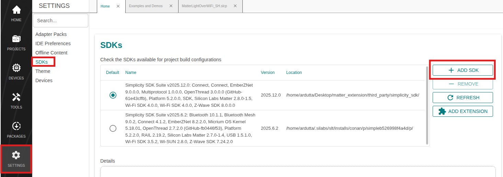

6. In the **Add SDK** window, click **Browse**.

7. Locate and select the Simplicity SDK sub-folder extracted in step 2 above, which contains the source code.

8.  Studio will detect the Simplicity SDK extension.

9.  Select the detected extension and click **Finish**.

    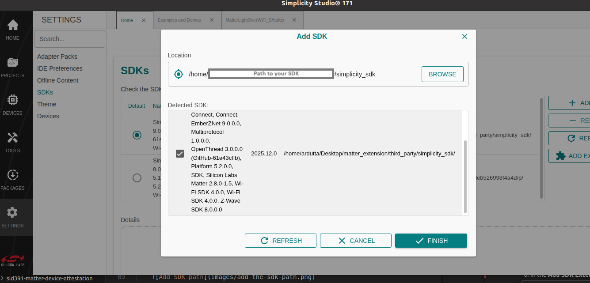

10. If a **Verify SDK** popup is displayed, click **Trust**.

    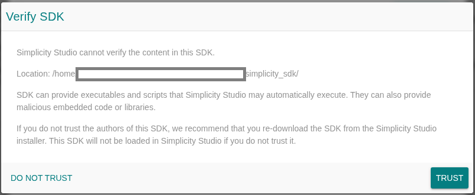

11. The selected SiSDK extension will be displayed.

### Install WiSeConnect SDK v4.x Extension

If you already selected the WiSeConnect extension while installing Simplicity Studio, you may skip this section.

Before installing the WiSeConnect SDK v4.x extension, if necessary, upgrade to a compatible SiSDK version by following the steps above.

Install WiSeConnect SDK v4.x extension through Installation Manager.

#### Install WiSeConnect SDK Through the Simplicity Installer
1. In the Simplicity Studio home page, select **Packages** from the left panel. The Simplicity Installer will open.

2. Select the **Installation Wizard** option.
   
    

3. Click **Advanced**.
   
    

4. From the list, select the **WiseConnect SDK** version you want to install.
5. Check the checkbox at the bottom for Terms of Service and License Agreement.
   
    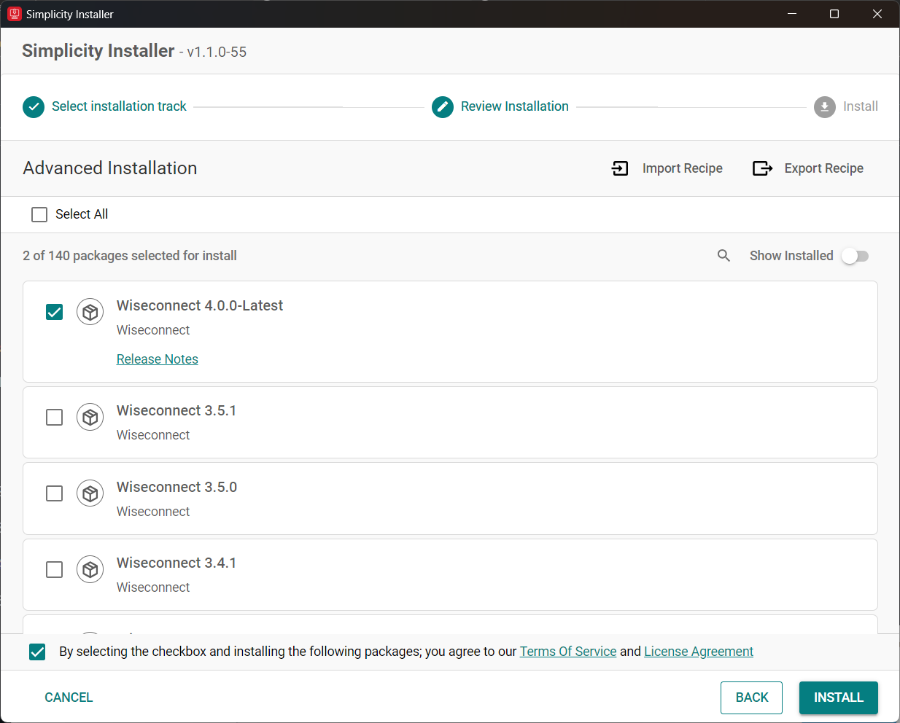

6. Click **Install** to begin the installation.

#### Install WiSeConnect SDK Through the Manage SDKs Window

1. Download the WiSeConnect v4.x source code from the following URL after substituting 4.x.x with the desired release version:

   [https://github.com/SiliconLabs/wiseconnect.git](https://github.com/SiliconLabs/wiseconnect)

   If you don't know the release version, go to the GitHub releases page and select the version to download.

2. Unzip the downloaded wiseconnect zip file.

3. Launch Simplicity Studio.

4. In the **Settings** panel, select **SDKs**.

5. Select the SDK where you want to add the Extension. Click **Add Extension**.

    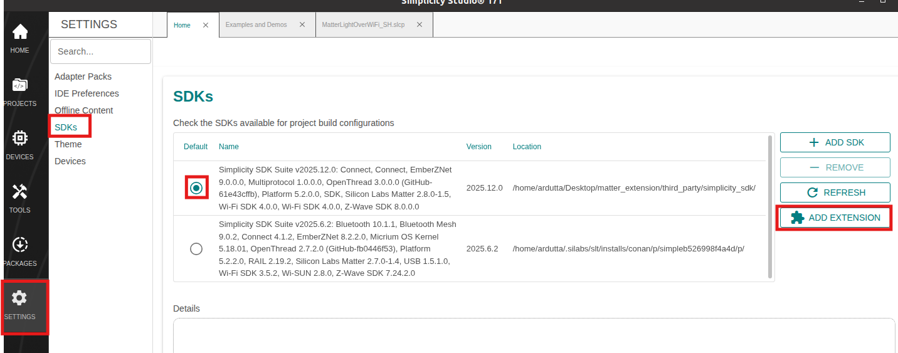

6. In the **Add SDK Extension** window, click **Browse**.

7. Locate and select the WiseConnect SDK sub-folder extracted in step 2 above, which contains the source code.

8.  Studio will detect the WiseConnect SDK extension.

9.  Select the detected extension and click **Finish**.

    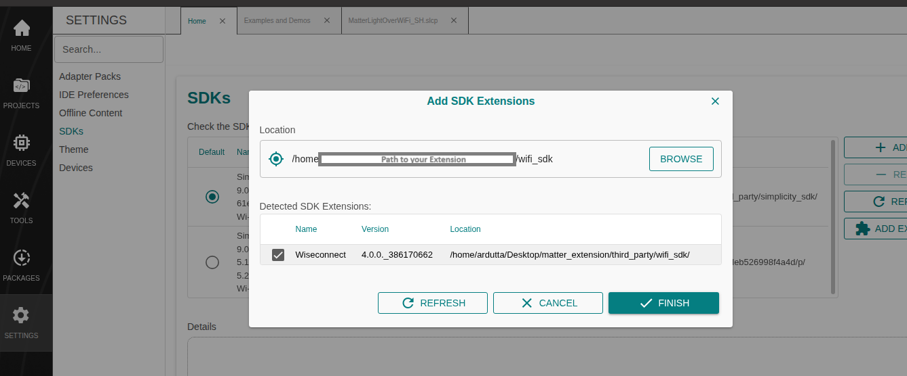

10. If a **Verify SDK** popup is displayed, click **Trust**.

    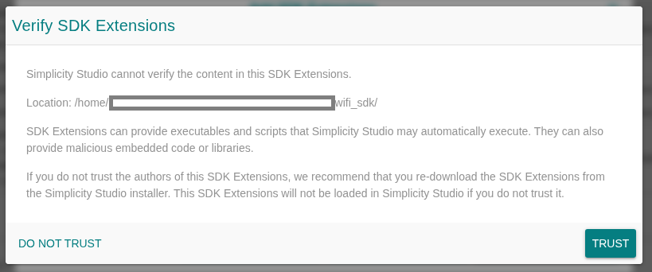

11. The selected SiSDK extension will be displayed.