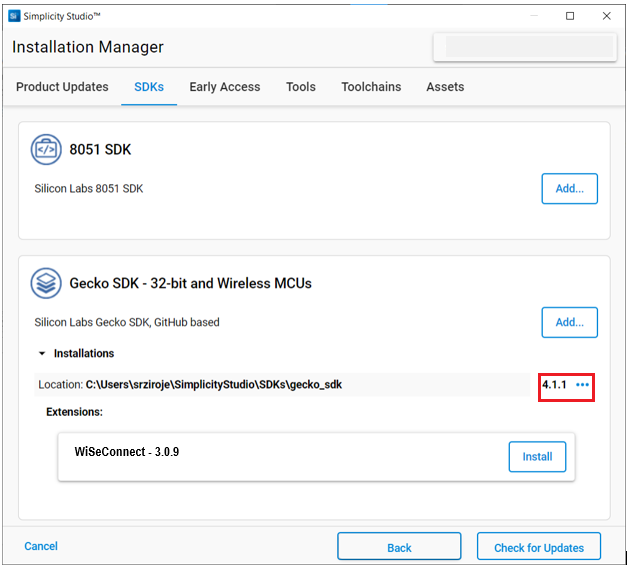
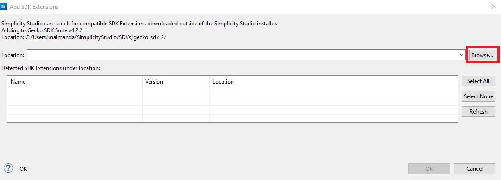
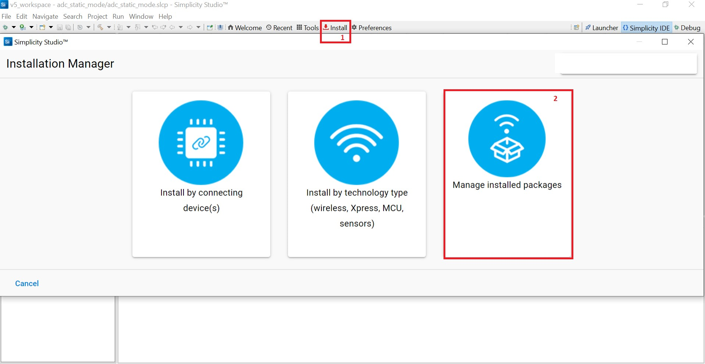
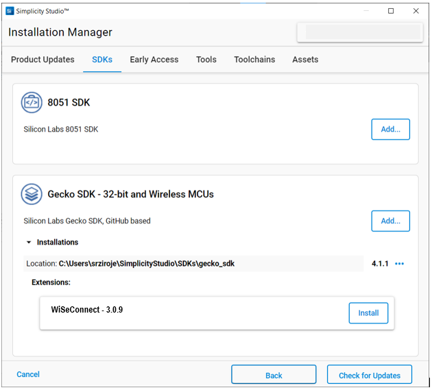

# Matter Over Wi-Fi Development Software Requirements

This document provides information and procedures to install the required software, tools, and packages for Silicon Labs Matter over Wi-Fi Matter Accessory Device (MAD) development.

## Required Software Tools

These are the generic software tools required for both NCP and SoC devices.

1. [**Silicon Labs Simplicity Studio**](https://www.silabs.com/developers/simplicity-studio): Simplicity Studio is the main IDE and development platform provided by Silicon Labs.

2. [**Ozone - The J-Link Debugger for Windows**](https://www.segger.com/products/development-tools/ozone-j-link-debugger/): Ozone is a full-featured graphical debugger for embedded applications. With Ozone, it is possible to debug any embedded application on C/C++ source and assembly level.
3. [**Simplicity Commander**](https://www.silabs.com/documents/public/software/SimplicityCommander-Windows.zip): Simplicity Commander is a utility that provides GUI and command line access to the debug features of an EFM32 device. It allows you to flash firmware, update the kit firmware, and lock or unlock debug access.

4. [**Tera Term**](https://osdn.net/projects/ttssh2/releases/): Tera Term is the terminal emulator for Microsoft Windows, which supports serial port, telnet, and SSH connections.

5. [**PuTTY**](https://www.putty.org/) (SSH Client, Terminal, or similar): SSH client is used to communicate with the Raspberry Pi over a secure shell.

6. [**Raspberry Pi Disk Imager**](https://www.raspberrypi.com/software/): Raspberry Pi Disk Imager is used to flash the SD Card that contains the operating system for the Raspberry Pi.

## Install Software Packages

The following packages will be installed during the installation of Simplicity Studio:

### Gecko SDK Extension

If you already selected the Gecko SDK extension while installing Studio, you may skip this section. You may install Gecko SDK by following these steps:

- Installation Manager (recommended)
- Manage SDKs Window

**Note:** Version numbers mentioned in the screenshot might be outdated. Install the latest packages available with the studio.

#### Install Gecko SDK Through the Installation Manager

1. Log in to Simplicity Studio.

2. In the Simplicity Studio home page, select **Install > Manage installed packages**.

3. Select the **SDKs** tab.

4. Next to the Gecko SDK version, click the three dots button.

5. Select **Change Version** and select **New Version** from dropdown to install, and click **Finish**.

#### Install the Gecko SDK Through the "Manage SDK" Window

1. Download the Gecko SDK v4.x source code from the following URL after substituting 4.x.x with the desired release version:

   [https://github.com/SiliconLabs/gecko_sdk.git](https://github.com/SiliconLabs/gecko_sdk.git)

   If you don't know the release version, go to the GitHub releases page and select the version to download.

2. Unzip the downloaded Gecko SDK-4.x.x.zip file.

3. Launch Simplicity Studio and log in.

4. In the **Debug Adapters** panel, select the radio board.

5. In the **General Information** section, click **Manage SDKs**.

    

6. The Preferences window will be opened in the SDKs section.

7. Select **Add SDK**.

    

8. In the **Add SDK Extensions** window, click **Browse**.

    

9. Locate and select the Gecko SDK sub-folder extracted in step 2 above, which contains the source code.

10. Studio will detect the Gecko SDK extension.

11. Select the detected extension and click **OK**.

    

12. If a **Verify SDK Extension** popup is displayed, click **Trust**.

    

13. The selected GSDK extension will be displayed.

    

14. Click **Apply** and **Close**.

### Install WiSeConnect SDK v2.x or v3.x Extension

If you already selected the WiSeConnect extension while installing SImplicity Studio, you may skip this section.

Before installing the WiSeConnect SDK v2.x or v3.x extension, if necessary, upgrade to a compatible GSDK version by following the steps above.

Install WiSeConnect SDK v2.x or v3.x through one of the following alternative paths:

- Installation Manager (recommended)
- Manage SDKs Window

#### Install WiSeConnect SDK Through the Installation Manager

1. Log in to Simplicity Studio if not already done.

2. In the Simplicity Studio home page, select **Install > Manage installed packages**.

    

3. Select the **SDKs** tab.

4. Next to the WiSeConnect SDK v2.x or v3.x extension, click **Install**.

    

#### Install WiSeConnect SDK Through the Manage SDKs Window

1. Download the WiSeConnect v3.x source code from the following URL after substituting 3.x.x with the desired release version:

   [https://github.com/SiliconLabs/wiseconnect/archive/refs/tags/v3.x.x.zip](https://github.com/SiliconLabs/wiseconnect/archive/refs/tags/v3.x.x.zip)

   If you don't know the release version, go to the GitHub releases page and select the version to download.

2. Unzip the downloaded wiseconnect-3.x.x.zip file.

3. Launch Simplicity Studio and log in.

4. In the **Debug Adapters** pane, select your radio board.

5. In the **General Information** section, click **Manage SDKs**.

    

6. The **Preferences** window will be opened in the **SDKs** section.

7. Select Gecko SDK Suite vx.x.x and click **Add Extension**.

    

8. In the Add SDK Extensions window, click **Browse**.

    

9. Locate and select the WiSeConnect SDK v2.x or v3.x sub-folder extracted in step 2 above, which contains the source code.

10. Studio will detect the WiSeConnect 3 SDK extension.

11. Select the detected extension and click **OK**.

    

12. If a Verify SDK Extension popup is displayed, click **Trust**.

    

13. The selected WiSeConnect SDK v2.x or v3.x extension will be displayed.

    

14. Click **Apply and Close**.
