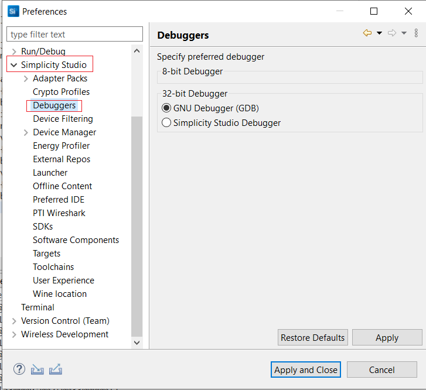

# Debug the Application

1. In the Project Explorer pane, select the project name.
  
2. To Enable GNU Debugger, select **Preferences** in the **Launcher** tab.

3. Expand the **Simplicity Studio** tab, and click **Debuggers**. Select **GNU Debugger** and click **Apply and Close**.

   

4. From the menu bar, select **Run > Debug As > 1 Silicon Labs ARM Program**.

   

5. SImplicity Studio will switch to debug mode and halt execution at the main() function in your application.
  
6. Add a break point in the desired location of the code, and click the **Resume** button (having an icon with a rectangular bar and play button).

7. Execution will halt at the break point.

8. Use the following debug functions to direct the execution of the code:
   - Step In button (having an icon with a arrow pointing between two dots).
   - Step Over button (having an icon with an arrow going over a dot).
   - Step Out button (having an icon with an arrow pointing out from between two dots).

   

9. View the standard output or enter input data as needed.
