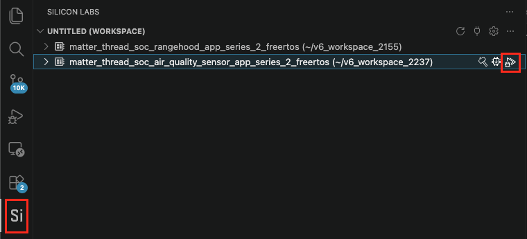
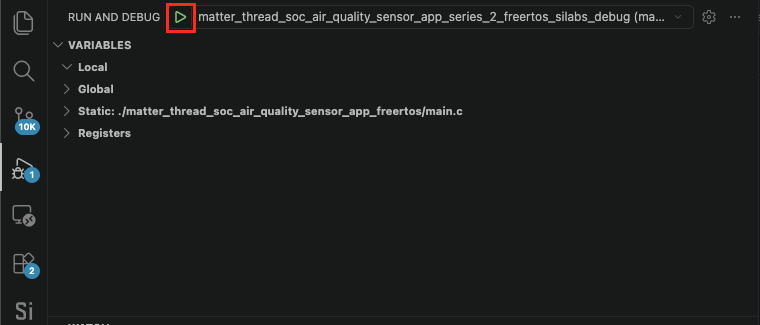
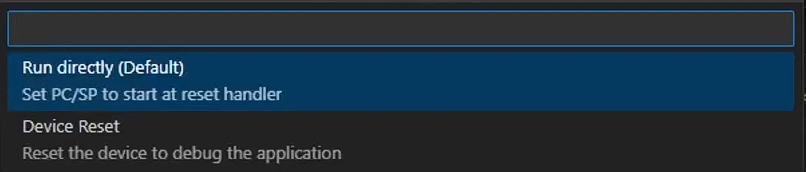
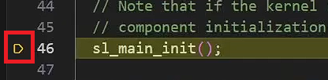
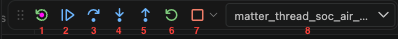

# Debug the Application

1. In the VS Code Extension, click the **Debug** icon beside your Project Name in Workspace.
   
   

2. When the debug section starts successfully, the **Run and Debug** view displays. Click **Start Debugging** icon. 
   
   

3. When starting a debug session for the first time, you’ll be prompted to choose one of two startup modes: Run Directly (default) or Device Reset.
   
   

4. The debug session will start and it will halt execution at the main() function in your application.

5. Add a break point in the desired location of the code using the yellow arrow beside line number, and click the **Continue** button (having an icon with a bar and play button).
   
   

6. Execution will halt at the break point.

7.  Use the following debug functions to direct the execution of the code:
   
    
   
   | #  | Option Name          | Description                                                     |
   |----|----------------------|-----------------------------------------------------------------|
   | 1  | **Restart**          | Restarts the debug session.                                     |
   | 2  | **Continue**         | Resumes program execution.                                      |
   | 3  | **Step Over**        | Executes next line, skips functions.                            |
   | 4  | **Step Into**        | Steps into function calls.                                      |
   | 5  | **Step Out**         | Exits current function scope.                                   |
   | 6  | **Reset Device**     | Resets the target hardware.                                     |
   | 7  | **Stop**             | Terminates debugging session.                                   |
   | 8  | **Select Instance**  | Switch between instances when running multiple debug instances. |

> **Note:** For more detailed documentation, refer to [Studio VS Code Extension Docs](https://docs.silabs.com/ss-vscode/latest/ss-vscode-getting-started-overview/explore-vscode-extension).
