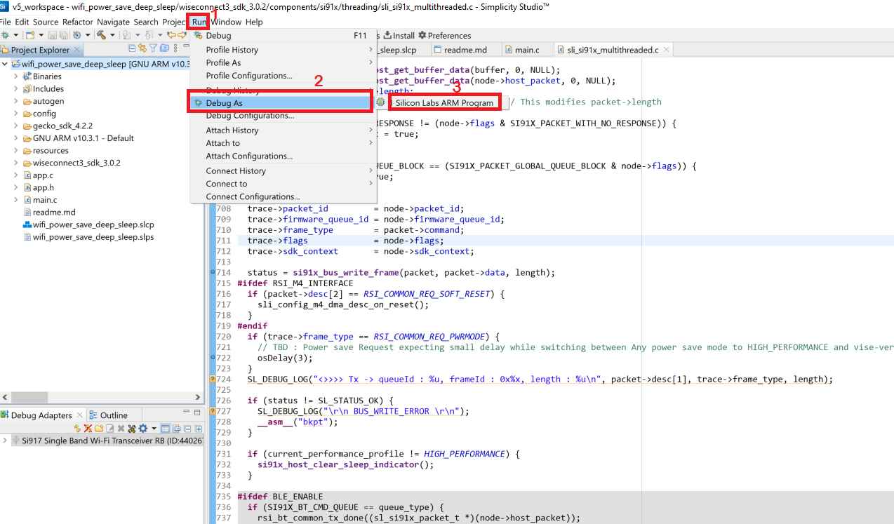
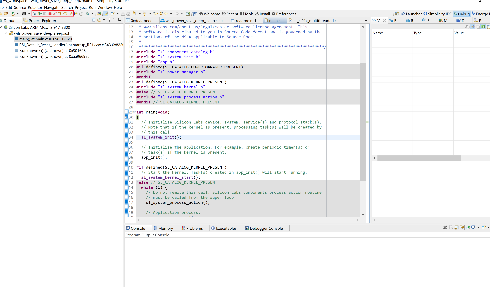

# Debug the Application

1. In the Project Explorer pane, select the project name.
  
2. From the menu bar, select Run > Debug As > 1 Silicon Labs ARM Program.

   

3. Studio will switch to debug mode and halt execution at the main() function in your application.
  
4. Add a break point in the desired location of the code and click the Resume button (having an icon with a rectangular bar and play button).

5. Execution will halt at the break point.

6. Use the following debug functions to direct the execution of the code:
   - Step In button (having an icon with a arrow pointing between two dots).
   - Step Over button (having an icon with an arrow going over a dot).
   - Step Out button (having an icon with an arrow pointing out from between two dots).

   

7. View the standard output or enter input data as needed.
