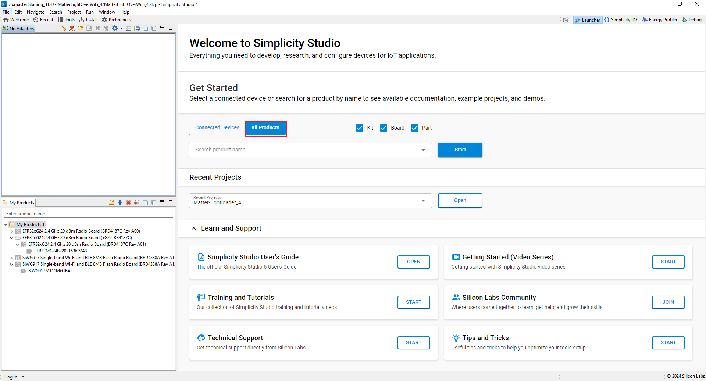
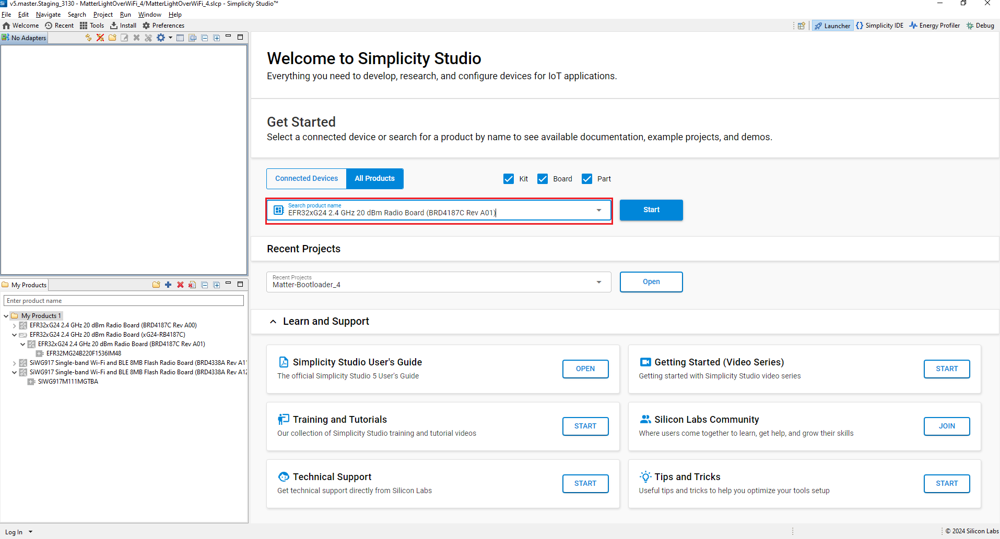
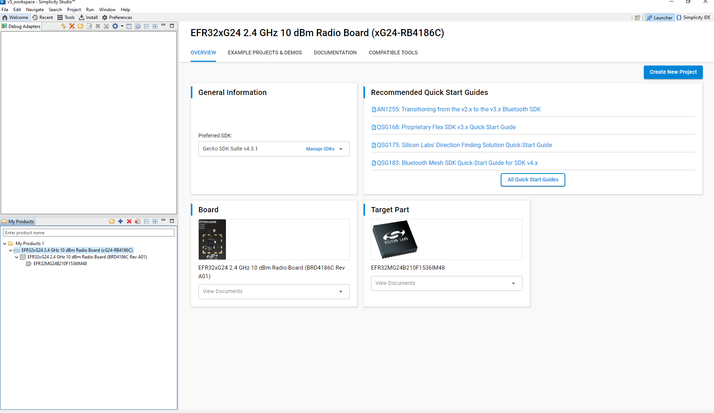
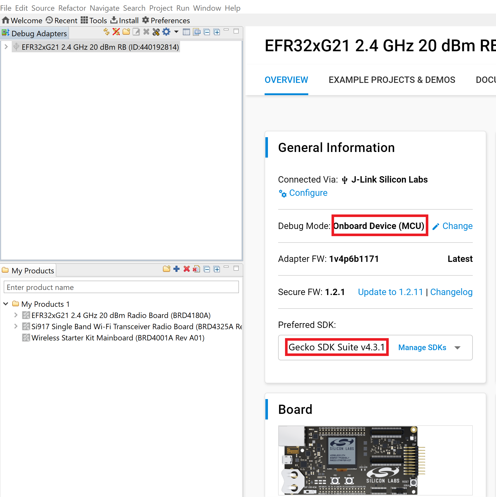
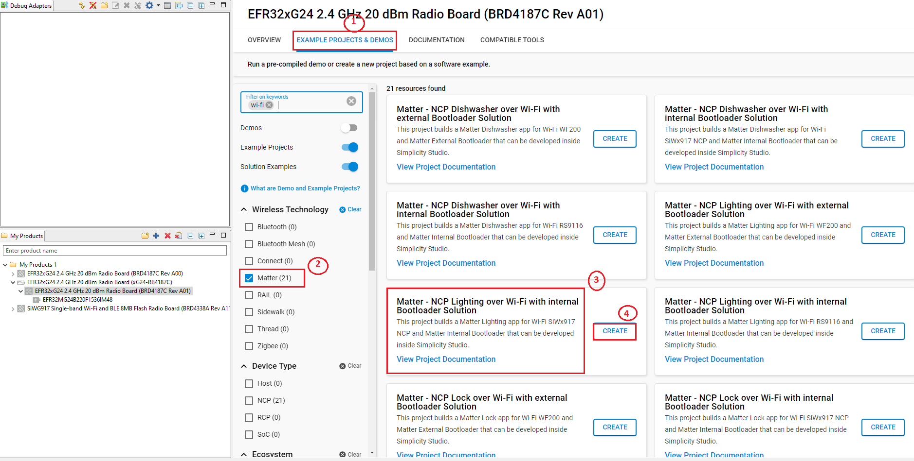
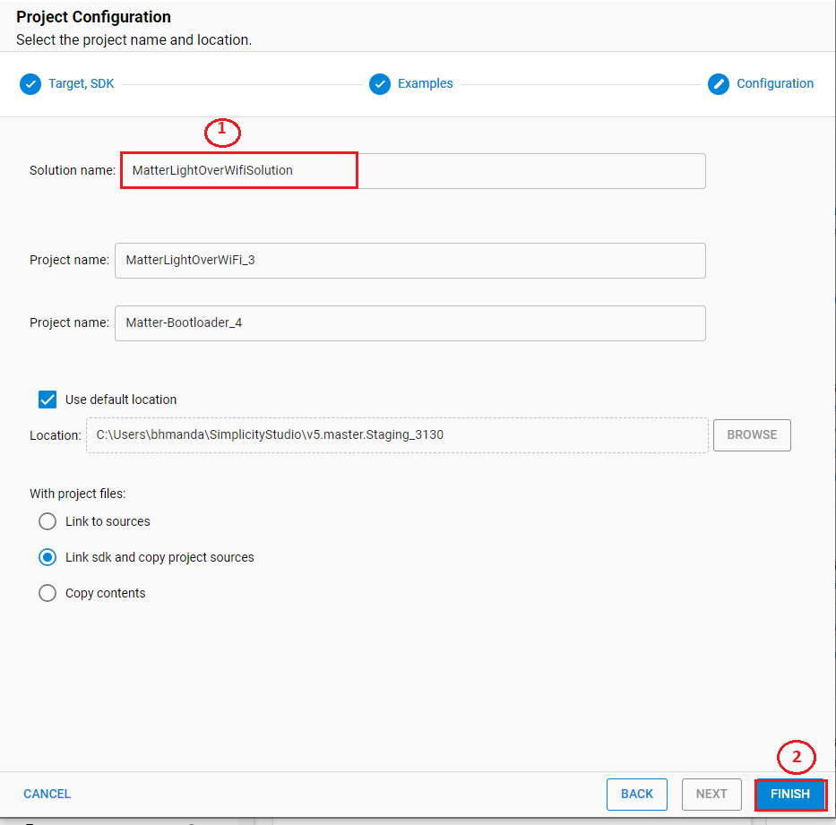
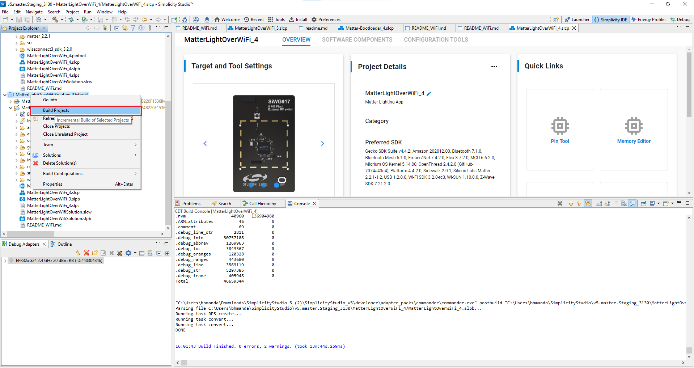
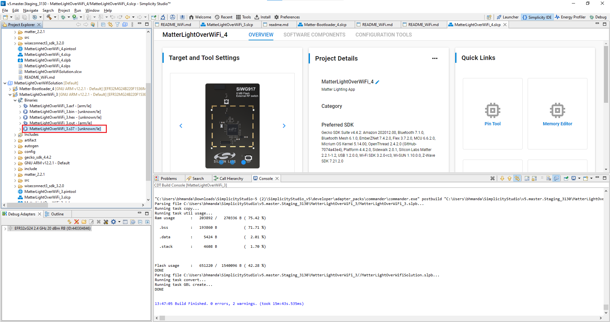
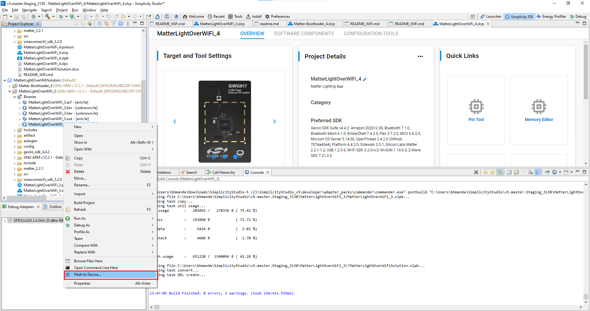
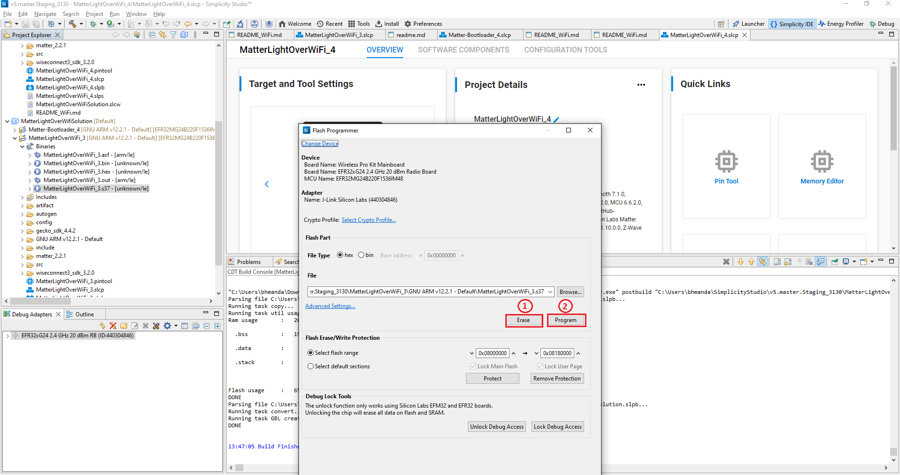

# Create a Project for an EFR32 Application

This page provides a detailed description on how to create an Wi-Fi NCP project for EFR32 boards.

1. [Download](https://www.silabs.com/developers/simplicity-studio) and Install Simplicity Studio.

2. To install the software packages for Simplicity Studio, refer to [Software Package Installation](/matter/<docspace-docleaf-version>/matter-prerequisites/software-requirements#installation-of-software-packages).

3. Log in to Simplicity Studio and connect the EFR32 WSTK board to the computer.

4. Go to the **All Products** section.

   

   

5. Search and select the radio board from the displayed list and select **Start**.

   

6. The Launcher page will display the selected radio board's details.

   

7. Verify the following in the General Information section:
   - The Debug Mode is Onboard Device (MCU).
   - The Preferred SDK is the version you selected earlier.

   

8. Open the **Example Projects and Demos** tab, select a project, and click **Create Project**.

   

9. In the New Project Wizard window, click **Finish**.

   

10. Once the solution is created, right-click the project and select **Build Project** in the Project Explorer tab.

    

11. Once the project is compiled successfully, go to the Project Explorer view and expand the binaries folder to flash the binary.

    

12. Right-click the selected '.s37' binary and click **flash to device**.

    

13. The Flash programmer window opens. Click **Erase** and then **Program** to start flashing.

    

**Note:** Output of the EFR32 NCP Host application will be displayed on the J-Link RTT Viewer.
