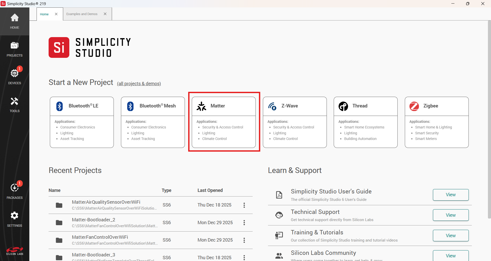
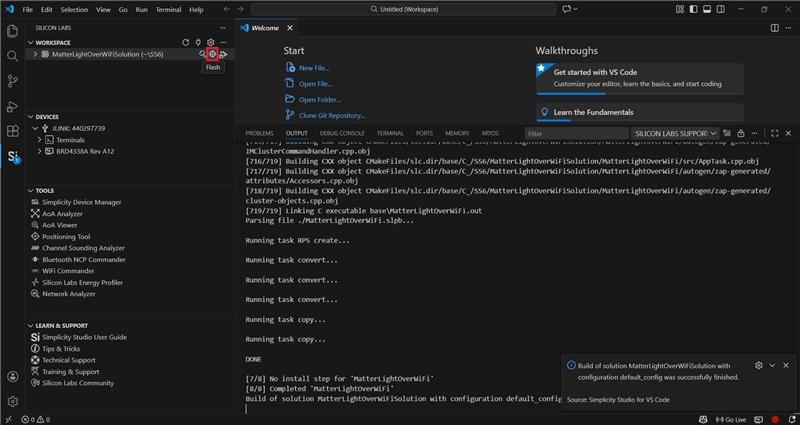

# Create a Project for an EFR32 Application

This page provides a detailed description on how to create a Wi-Fi NCP project for EFR32 boards.

1. [Download](https://www.silabs.com/developers/simplicity-studio) and Install Simplicity Studio.

2. To install the software packages for Simplicity Studio, refer to [Software Package Installation](/matter/{build-docspace-version}/matter-prerequisites/software-requirements#installation-of-software-packages).

3. In Simplicity Studio, click **Matter**, under **Example Projects and Demos**, select a project, and click **Create**.

   
     

4. In the Project Configuration window, after selecting the board, click **Finish**.

   

5. Once the project is created, click the **Open in VS Code** option on the top right corner.
    

6. In VS Code, click the Studio Extension on the left panel and select **Build** option (Hammer Icon) in the Workspace tab.

    

7. Once the project is compiled successfully, the binaries can be flashed either using the **Simplicity Commander** from the tools or using the **Flash** option beside the **Build**.

    

8. When using Commander, select the kit and click the **Flash** option in the left panel. Click **Erase chip**.

9. Select the path for the project's *.s37* binary and click **Flash**.

    

