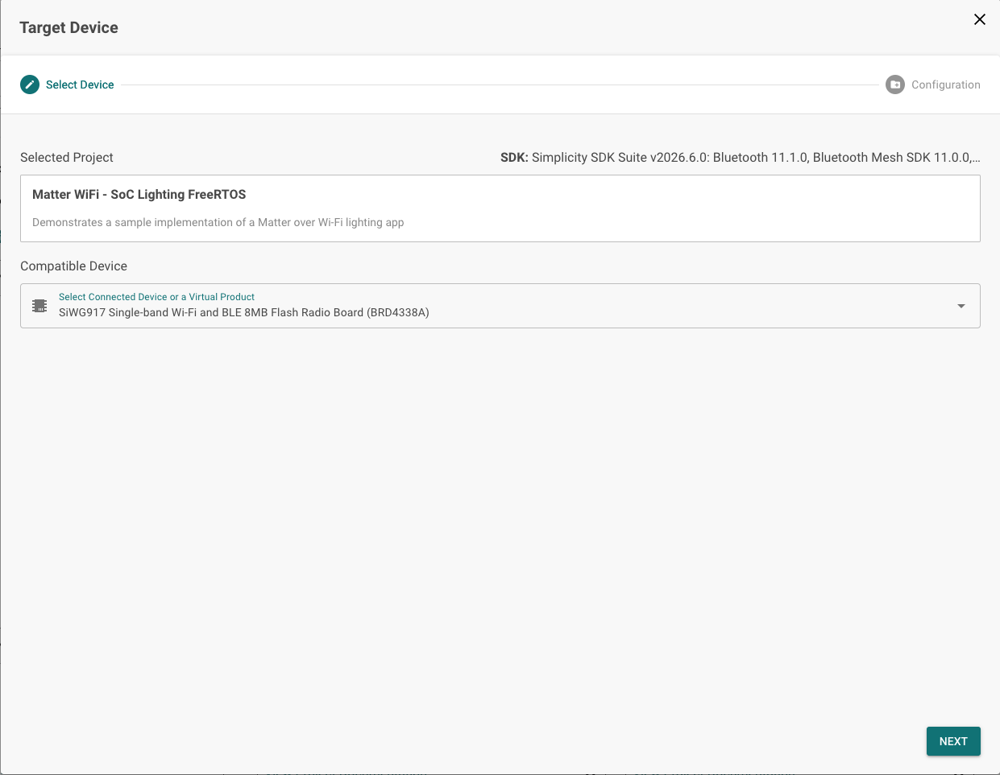

# Building the 917 SoC Matter Accessory Devices (MADs) using Simplicity Studio

In Simplicity Studio 6, create the Light MAD:

1. In Simplicity Studio, click **Matter**, under **Example Projects and Demos**, select a project, and click **Create**.

   
     

2. In the Project Configuration window, Select the board and click **Next**.
   
   - Set -
      - Solution and Project Name.
      - Select Target IDE.
      - Click **Finish**.

   

3. Once the project is created, click the **Open in VS Code** option on the top right corner.
    

4. In VS Code, click the Studio Extension on the left panel and select **Build** option (Hammer Icon) in the Workspace tab.

    

5. Once the project is compiled successfully, the binaries can be flashed either using the **Simplicity Commander** from the tools or using the **Flash** option beside the **Build**.

    

6. When using Commander, select the kit and click the **Flash** option in the left panel. Click **Erase chip**.

7. Select the path for the project's *.s37* binary and click **Flash**.

    