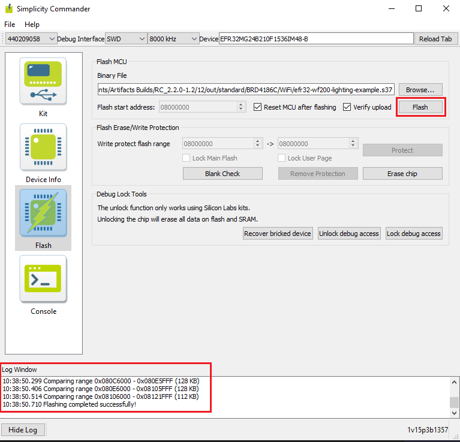

# Flashing the Matter Binaries Using Simplicity Commander

To flash the application for EFR32 and SiWx917 SOC Board Simplicity Commander software will be used.

Before flashing the application for EFR32 Boards, flash **bootloader images** as per board variants:

- **BRD4186C Board**
  - For MG24 + RS9116 :- Internal Bootloader (bootloader-storage-internal-single-512k-BRD4186C-gsdk4.1)
  - For MG24 + WF200 :- External Bootloader (bootloader-storage-spiflash-single-1024k-BRD4186C-gsdk4.1)
- **BRD4187C Board**
  - For MG24 + RS9116 :- Internal Bootloader (bootloader-storage-internal-single-512k-BRD4187C-gsdk4.1)
  - For MG24 + WF200 :- External Bootloader (bootloader-storage-spiflash-single-1024k-BRD4187C-gsdk4.1)

Bootloader binaries are available in the respective path of codebase **third_party/silabs/matter_support/matter/efr32/bootloader_binaries** folder. Silicon Labs recommends always flashing the latest bootloader binaries from the codebase.

**Note**: Bootloader binaries are flashed using Simplicity Commander only. It supports EFR32 Boards only.

## Flashing the Bootloader Binaries for EFR32 Board using Simplicity Commander

1. In the Simplicity Studio home page, click Tools.

2. In the Tools dialog, select Simplicity Commander and click OK.


3. In the Simplicity Commander window, click **Select Kit** and choose your radio board.


4. In the navigation pane, go to the Flash section.

5. Above beside "Reload tab" board will be displayed, click Browse next to the Binary File field and locate bootloader binary.


6. Click Flash, the bootloader will be flashed and the Log Window will display a "Flashing completed Successfully" message.


## Flashing the EFR32 Matter Binary using Simplicity Commander

1. In the Simplicity Studio home page, click **Tools**.

2. In the **Tools** dialog, select **Simplicity Commander** and click **OK**.

    

3. In the Simplicity Commander window, click S**elect Kit** and choose your radio board.

    

4. In the navigation pane, go to the **Flash** section.

5. Your board will be displayed. Click **Browse** next to the **Binary File** field and locate the binary.

    

6. Click **Flash**. The binary will be flashed and the Log Window will display a "Flashing completed Successfully" message.

    

## Flashing the SiWx917 SOC Matter Binary using Simplicity Commander

SiWx917 SoC device support is available in the latest [Simplicity Commander](https://community.silabs.com/s/article/simplicity-commander?language=en_US). The SiWx917 SOC board will support **.rps** only file to flash. Follow these steps to create and flash **.rps** file using **.s37**.

1. Locate Simplicity Commander in your PC/Laptop where it is installed through command prompt(cmd).

    

2. Copy and paste the built **.s37** binary file to the Simplicity commander path.

3. Convert **.s37** binary to **.rps** using the command below using commander terminal.

```shell
    commander rps convert <file_name.rps> --app <file_name.s37>
```

4. Flash to the device using command or follow the next steps to flash through Commander Software.

```shell
    commander rps load <file-name>.rps
```

5. In the Simplicity Studio home page, click **Tools**.

6. In the Tools dialog, select Simplicity Commander and click OK.

    

7. In the Simplicity Commander window, click **Select Kit** and choose your radio board.

    

8. In the navigation pane, go to the **Flash** section.

9. Above beside "Reload tab" board will be displayed, click **Browse** next to the **Binary File** field and locate binary.

    

10. Click **Flash**. The binary will be flashed and the Log Window will display a "Flashing completed Successfully" message.

    