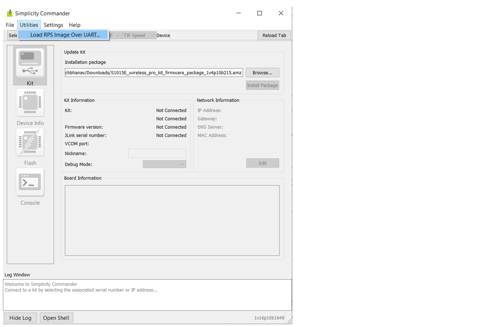
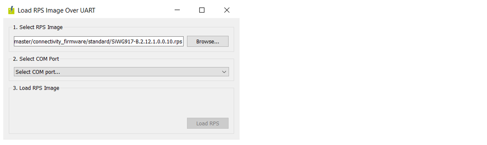
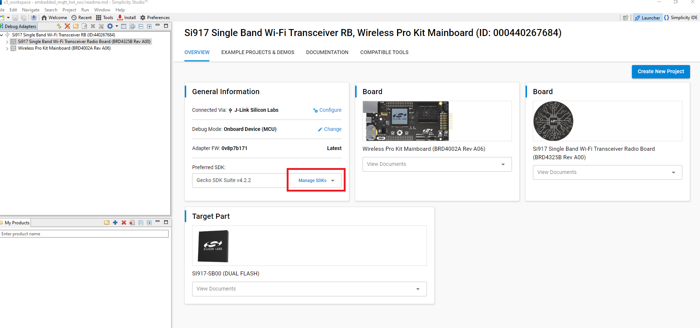
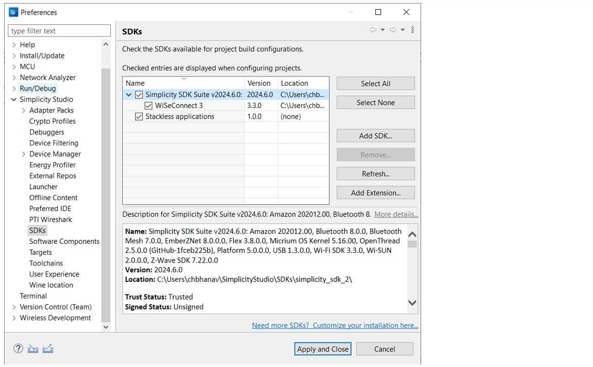
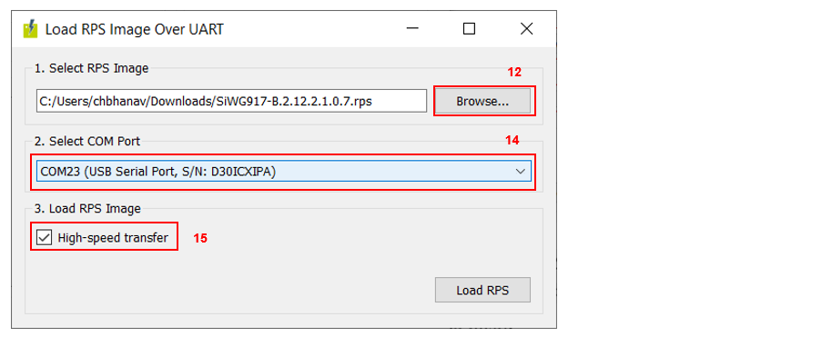
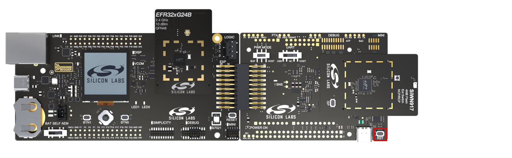
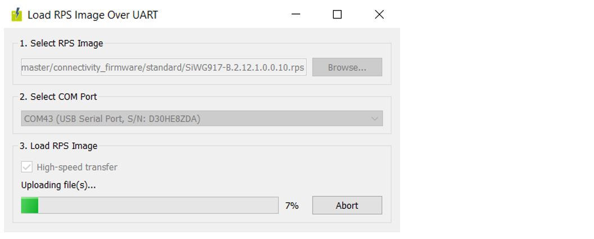
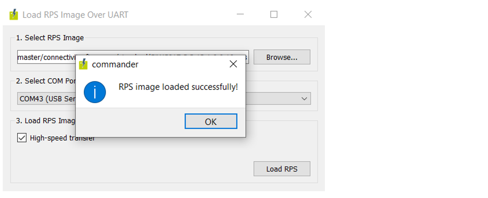

# Upgrading the Wi-Fi Connectivity Firmware

Silicon Labs recommends that an upgrade of the NCP combos connectivity firmware be done under the following circumstances:

- When the EFR32 evaluation kit (EVK) is first received.
- When the radio board is first received.
- When upgrading to a new version of the WiSeConnect SDK v2.x or v3.x extension.

## Upgrading the Connectivity Firmware on NCP devices

The SiWx917 NCP or RS9116 EVK connectivity firmware can be upgraded using Tera Term or kermit.

### Connectivity Firmware Upgrade Using Tera Term

#### Firmware Upgrade On RS9116

1. Connect the EVK to PC using the USB interface labeled **UART** as identified below.

   

2. If this is the first time connecting the EVK to your PC, verify that it is properly detected by the PC. The EVK will appear to the PC as a COM port labeled **USB Serial Port (COMx)**.

3. Configure your terminal application with the following settings:

   - Configure the serial port settings to 115200 baud / 8-bit data / No parity / 1 stop bit
   - Enable local echo
   - Set receive and transmit new-line characters to CR+LF

4. Refer to [Setup Tera Term and Updating the Firmware](https://docs.silabs.com/rs9116/wiseconnect/2.0/tera-term-setup).

5. Once firmware flashing is done, the console displays **Loading...** followed by **Loading Done**.

#### Firmware Upgrade On SIWx917 NCP

- SiWx917 NCP connectivity firmware can be upgraded using Simplicity Commander.

### Connectivity Firmware Upgrade Using Simplicity Commander

1. On the Simplicity Studio home page, click **Tools**.

2. In the Tools dialog, select **Simplicity Commander** and click **OK**.

    

3. The Simplicity Commander window is displayed.
   
4. In the Simplicity Commander window, select Utilities > Load RPS Image Over UART...

    

5. The Load RPS Image Over UART window is displayed.

    

6. Click Browse next to the Select RPS Image field.

7. Locate and select the firmware file to flash from within the connectivity_firmware/standard sub-folder of the WiSeConnect 3 extension path.
   
    **Note**: The connectivity_firmware/lite sub-folder can be ignored since the Lite OPN is not supported in NCP mode.
    The WiSeConnect 3 extension path is where the extension was downloaded during installation. If you're not sure what the path is, refer to the location in the Preferences > SDKs page shown on clicking Manage SDKs.

    

    

8. Under Select COM Port, select the COM port for the connected adapter board.
   
9. Under Load RPS Image, make sure High-speed transfer is selected.

    

    **Note**: When High-speed transfer is selected, Simplicity Commander sets the baud rate to 921600 before performing the firmware update.

10. Press the RST button on the adapter board.

    

11. Click Load RPS to update firmware.

    

    

    **Note**: It takes around 2 minutes to perform a firmware update.

12. On successful firmware update, the following message is displayed: "RPS image loaded successfully!".

### Troubleshooting an NCP Firmware Update Failure

If the firmware update fails, try the following:

- Toggle the power switch toward **AEM** (Advanced Energy Monitoring) on the WPK board.
- Perform the following steps and try the firmware update again.
  - Press the **RESET** button on the WSTK board.
  - Retry the firmware upgrade.

## Upgrading the Connectivity Firmware on SoC Devices

- SiWx917 SOC connectivity firmware can be upgraded using Simplicity Commander.

### Connectivity Firmware Upgrade Using Simplicity Commander

1. On the Simplicity Studio home page, click **Tools**.

2. In the Tools dialog, select **Simplicity Commander** and click **OK**.

   

3. In the Simplicity Commander window, click **Select Kit** and choose your radio board.

   

4. In the navigation pane, go to the **Flash** section.

5. Click **Browse** next to the **Binary File** field.

   

6. Refer to [Firmware for SiWx917 SoC](/matter/{build-docspace-version}/matter-prerequisites/matter-artifacts#siwx917-firmware-for-siwx917-so-c) to identify the correct firmware to be flashed into the specific hardware. Locate and select the firmware file to flash.

7. Click **Flash**.

   

8. The firmware will be flashed, and the Log Window will display a "Resetting" message.

   

### Troubleshoot SiWx917 SOC Firmware Update Failure

If the firmware update fails, try the following:

- Toggle the power switch toward **AEM** (Advanced Energy Monitoring) on the WSTK board.
- Perform the following steps and try the firmware update again
  - Press the **RESET** button on the WSTK board.
  - Retry the firmware upgrade.
