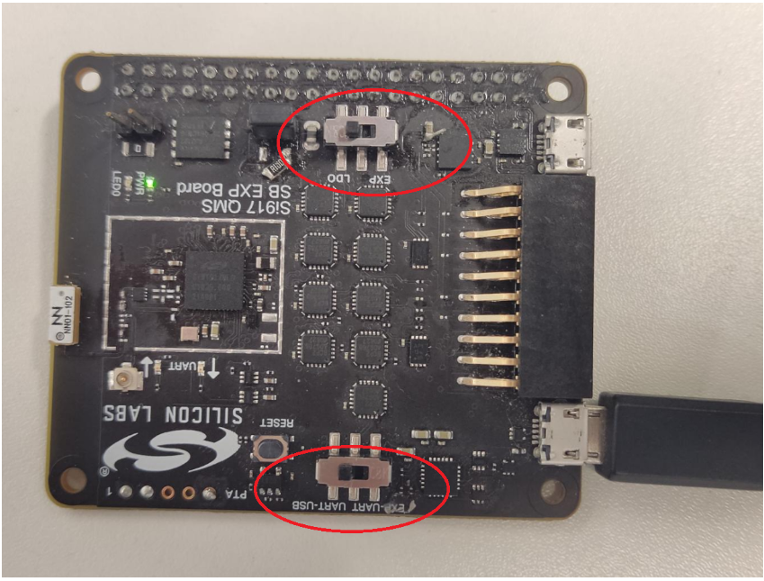
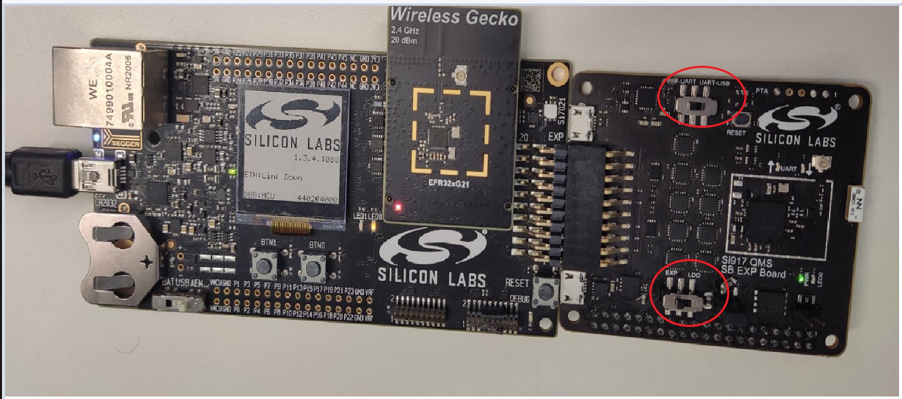

# Upgrading the Wi-Fi Connectivity Firmware

- It is recommended that an upgrade of the NCP combos connectivity firmware be done under the following circumstances:

  - When the EFR32 evaluation kit (EVK) is first received.
  - When the radio board is first received.
  - When upgrading to a new version of the WiSeConnect SDK v2.x or v3.x extension.

## Upgrading the Connectivity Firmware on NCP devices

- The SiWx917 NCP or RS9116 EVK connectivity firmware can be upgraded using Teraterm or kermit.

### Connectivity Firmware Upgrade Using Teraterm

1. Make sure that the switches on the expansion board are pushed towards the UART side.


2. Refer to [Updating the Firmware](https://docs.silabs.com/rs9116/wiseconnect/2.0/update-evk-firmware).

    ```shell
    Instructions are the same for both SiWx917 NCP and RS9116 EVK.
    ```

3. Once firmware flashing is done make sure to put the switches back to Expansion mode, while using it with the host platform.


### Troubleshooting an NCP Firmware Update Failure

If the firmware update fails, try the following:
  - Toggle the power switch towards AEM (Advanced Energy Monitoring) on the WSTK board.
  - Perform the following steps and try the firmware update again
     - Toggle the ISP switch towards ISP on the radio board.
     - Press the RESET button on the WSTK board.
     - Toggle the ISP switch away from ISP on the radio board.
     - In the Flash section in step 5 above, click Erase chip.
     - The flash will be erased.
     - Retry the firmware upgrade.

## Upgrading the Connectivity Firmware on SoC Devices

- SiWx917 SOC connectivity firmware can be upgraded using studio.

### Connectivity Firmware Upgrade Using Simplicity Studio
  
1. In the Simplicity Studio home page, click Tools.
   
2. In the Tools dialog, select Simplicity Commander and click OK.


3. In the Simplicity Commander window, click Select Kit and choose your radio board.


4. In the navigation pane, go to the Flash section.
   
5. Click Browse next to the Binary File field.


6. Refer to [Firmware for SiWx917 SoC](/matter/<docspace-docleaf-version>/matter-prerequisites/matter-artifacts#siwx917-firmware-for-siwx917-soc) to identify the correct firmware to be flashed into the specific hardware. Locate and select the firmware file to flash. 
   
7. Click Flash


8. The firmware will be flashed and the Log Window will display a "Resetting" message.


### Troubleshoot SiWx917 SOC Firmware Update Failure

If the firmware update fails, try the following:

  - Toggle the power switch towards AEM (Advanced Energy Monitoring) on the WSTK board.
  - Perform the following steps and try the firmware update again
     - Toggle the ISP switch towards ISP on the radio board.
     - Press the RESET button on the WSTK board.
     - Toggle the ISP switch away from ISP on the radio board.
     - In the Flash section in step 5 above, click Erase chip.
     - The flash will be erased.
     - Retry the firmware upgrade.