# Upgrading the Wi-Fi Connectivity Firmware

Silicon Labs recommends that an upgrade of the NCP combos connectivity firmware be done under the following circumstances:

- When the EFR32 evaluation kit (EVK) is first received.
- When the radio board is first received.
- When upgrading to a new version of the WiSeConnect SDK v2.x or v3.x extension.

## Upgrading the Connectivity Firmware on NCP devices

### Firmware Upgrade On SIWx917 NCP

SiWx917 NCP connectivity firmware can be upgraded using Simplicity Commander.

### Connectivity Firmware Upgrade Using Simplicity Commander

1. Plug the SiWx917 radio board into the radio board connectors of the adapter board as shown below.

2. Make sure the UART switch on the adapter board is in the **USB** position.

3. Make sure the **PWR MODE** switch on the adapter board is in either the **BUF** or **HOST** position.

4. Connect the adapter board to the EFR32 WPK board.

5. Connect the EFR32 WPK board to your computer using a type C USB cable.

6. Connect the USB port of the adapter board to your computer's USB port using a type C USB cable.

7. On the Simplicity Studio home page, click **Tools**.

8. In the Tools tab, select **Commander** and click **Open Tool**.

   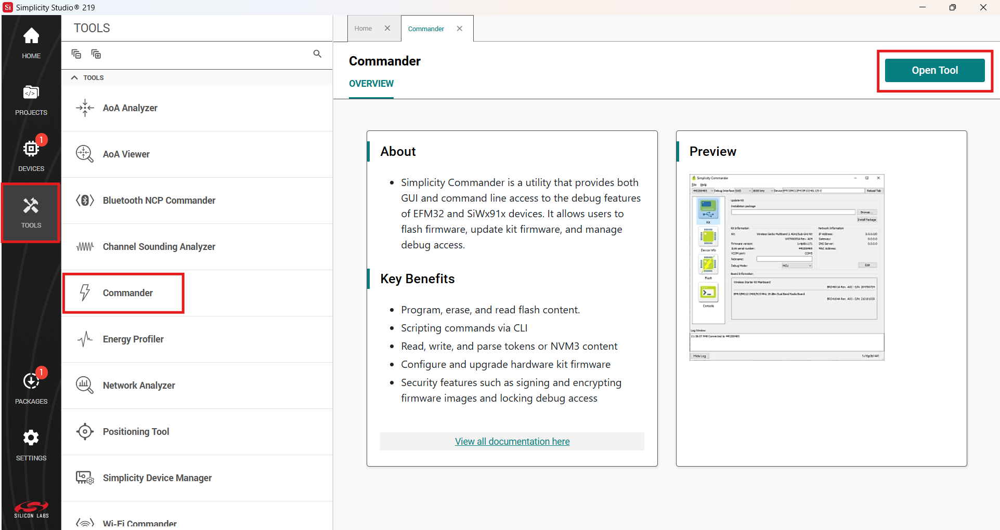

    The Simplicity Commander window is displayed.

9. In the Simplicity Commander window, select **Utilities > Load RPS Image Over UART...**.

    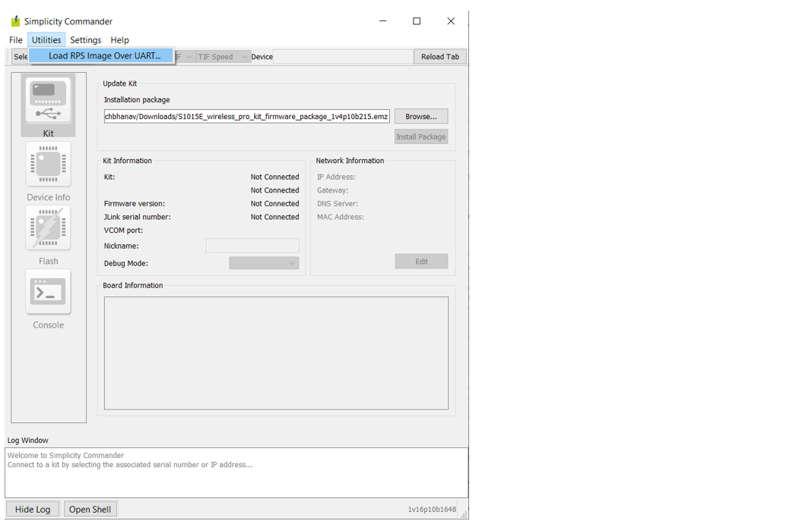

    The Load RPS Image Over UART window is displayed.

    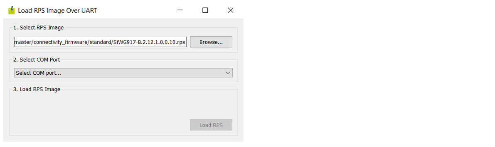

10. Click **Browse** next to the **Select RPS Image** field.

11. Refer to [Firmware for SiWx917 NCP](/matter/{build-docspace-version}/matter-prerequisites/matter-artifacts#siwx917-firmware-for-siwx917-so-c) to identify the correct firmware to be flashed into the specific hardware. Locate and select the firmware file to flash.

12. Under **Select COM Port**, select the COM port for the connected adapter board.

13. Under **Load RPS Image**, make sure High-speed transfer is selected.

    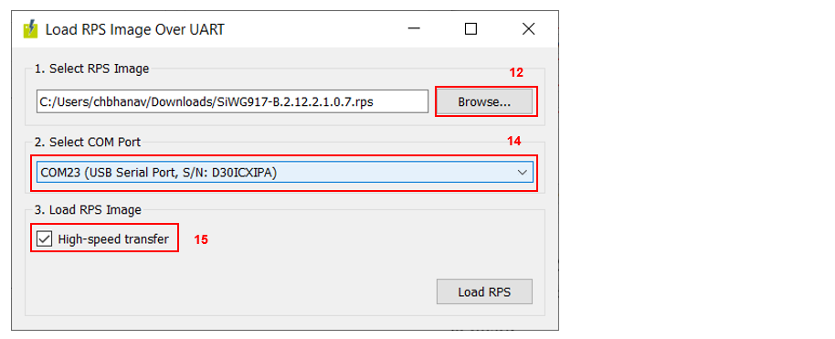

    >**Note**: When High-speed transfer is selected, Simplicity Commander sets the baud rate to 921600 before performing the firmware update.

14. Press the **RST** button on the adapter board.

    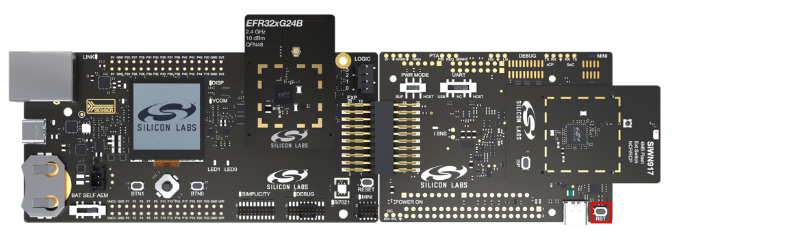

15. Click **Load RPS** to update firmware.

    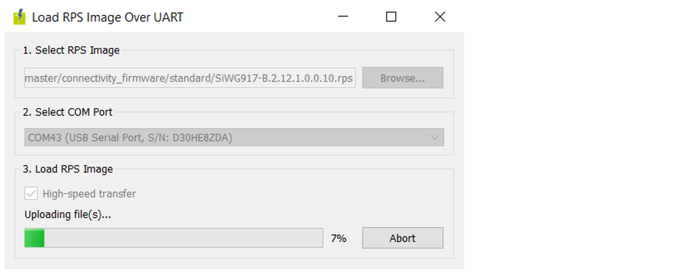

    **Note**: It takes approximately 2 minutes to perform a firmware update.

16. On successful firmware update, the following message is displayed: "RPS image loaded successfully!".

    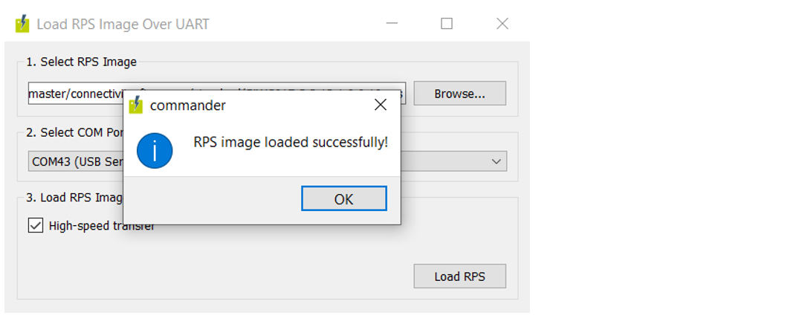

### Troubleshooting an NCP Firmware Update Failure

If the firmware update fails, try the following:

- Toggle the power switch toward **AEM** (Advanced Energy Monitoring) on the WPK board.
- Perform the following steps and try the firmware update again.
  - Press the **RESET** button on the WSTK board.
  - Retry the firmware upgrade.

## Upgrading the Connectivity Firmware on SoC Devices

- SiWx917 SOC connectivity firmware can be upgraded using Simplicity Commander.

### Connectivity Firmware Upgrade Using Simplicity Commander

1. On the Simplicity Studio home page, click **Tools**.

2. In the Tools tab, select **Commander** and click **Open Tool**.

   

3. In the Simplicity Commander window, click **Select Kit** and choose your radio board.

   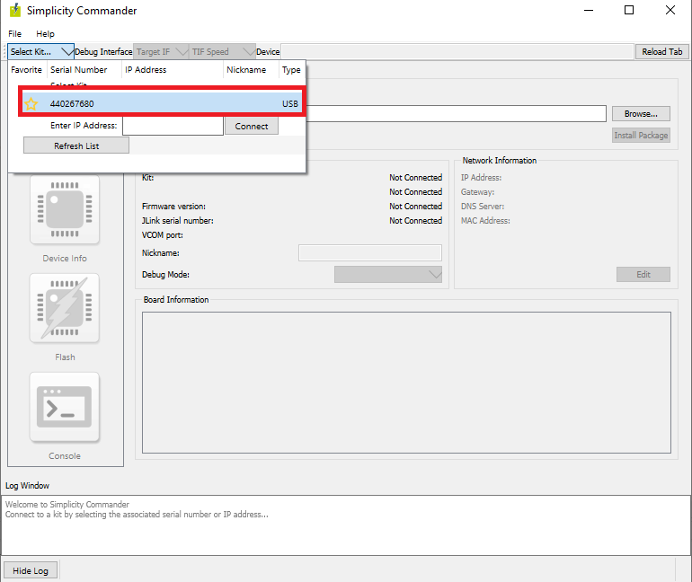

4. In the navigation pane, go to the **Flash** section.

5. Click **Browse** next to the **Binary File** field.

   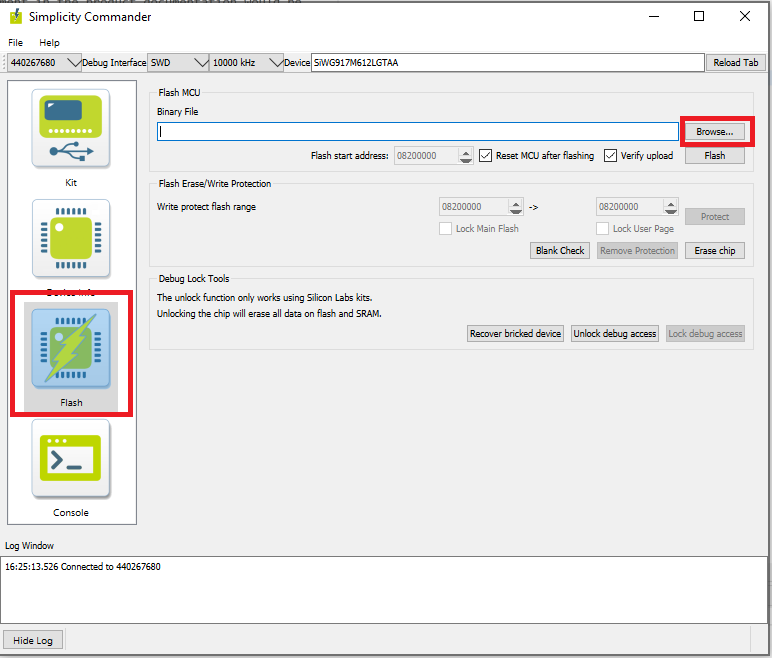

6. Refer to [Firmware for SiWx917 SoC](/matter/{build-docspace-version}/matter-prerequisites/matter-artifacts#siwx917-firmware-for-siwn917-ncp-and-siwx917-soc) to identify the correct firmware to be flashed into the specific hardware. Locate and select the firmware file to flash.

7. Click **Flash**.

   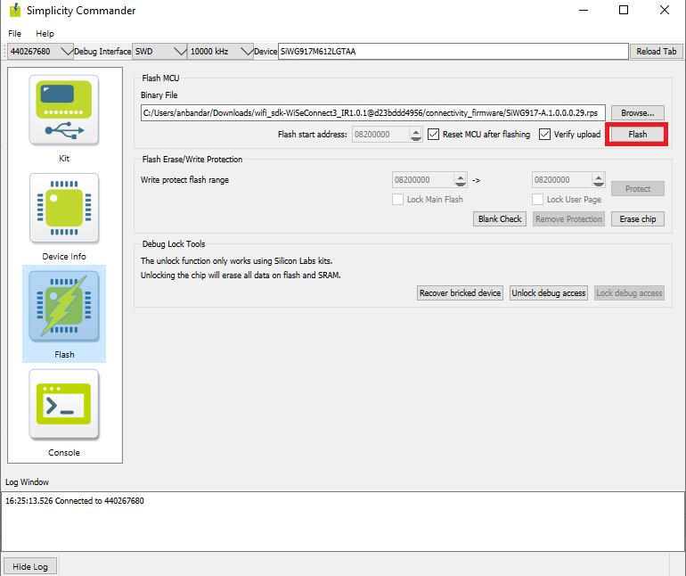

8. The firmware will be flashed, and the Log Window will display a "Resetting" message.

   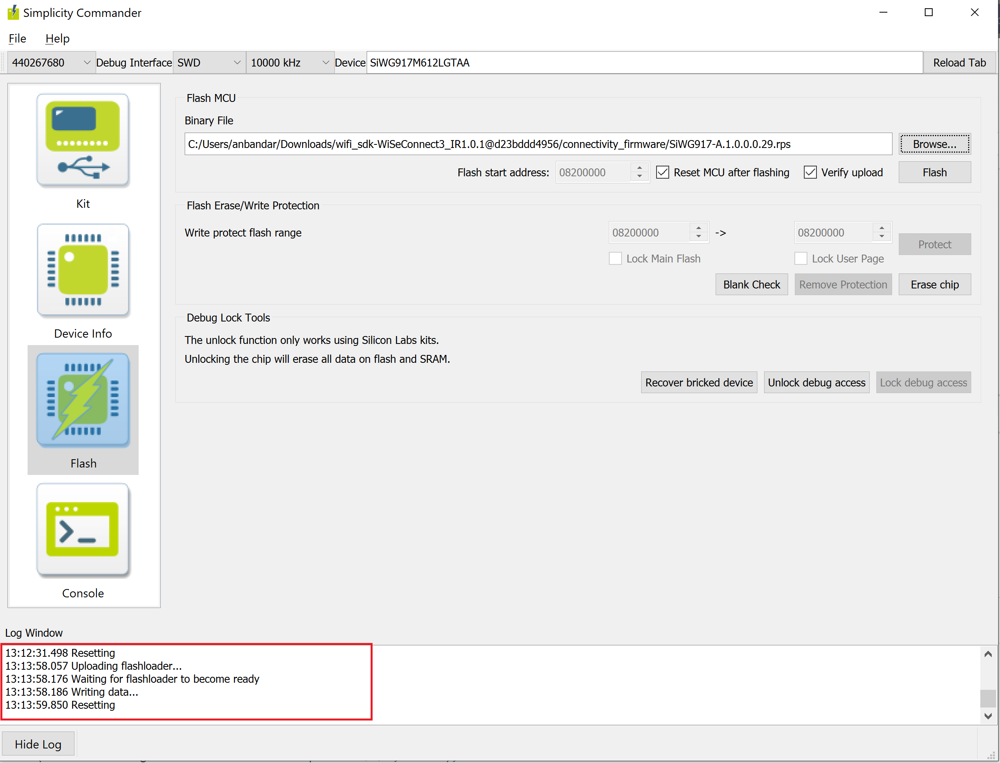

### Troubleshoot SiWx917 SOC Firmware Update Failure

If the firmware update fails, try the following:

- Toggle the power switch toward **AEM** (Advanced Energy Monitoring) on the WSTK board.
- Perform the following steps and try the firmware update again
  - Press the **RESET** button on the WSTK board.
  - Retry the firmware upgrade.
