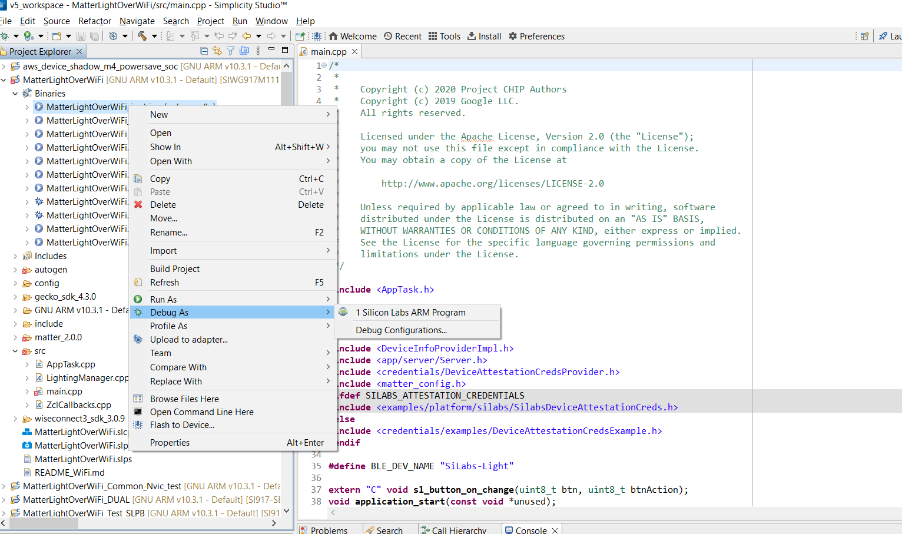

# Building the 917 SoC Matter Accessory Devices (MADs) using Simplicity Studio

In Simplicity Studio 5, create the Light MAD:

1. [Download](https://www.silabs.com/developers/simplicity-studio) and Install Simplicity Studio 5.

2. To install the software packages for Simplicity Studio, refer to the [Software Package Installation Section](/matter/{build-docspace-version}/matter-wifi-getting-started-example/software-installation#installation-of-software-packages).

3. Switch to the Launcher view (if not already in it).

    

4. Go to **All Products** in the **Launcher** tab and select one compatible board from the below supported list of SiWx917 SOC dev boards.

    ```shell
      BRD4338A (Common Flash)
    ```

    

5. Once it shows up in the **Debug Adapters** view, select it.

    

6. Open the **Example Projects and Demos** tab, select the **Matter** filter, enter "*Wi-Fi*" in **Filter on keywords**, and click **CREATE**.

    

   **Note**:- Make sure Installed Simplicity Studio is having IDE/GNU ARM v12.2.x version.

7. Rename the **Project Name** if you wish, and click **Finish**.

    

8. Once the project is created, right-click the project and select **Build Project** in the **Project Explorer** tab.

    

9. To flash the application, connect the compatible dev board to the machine or PC if not yet done.

10. Once the project is compiled successfully, go to the Project Explorer view and select the binary to be flashed.

    

11. Right-click the selected *_isp.bin* binary and click **flash to device**.

    

12. The Flash programmer window will open. Click the **Program** button to start the flashing.

    

    **Note:**
   Output of the SiWX917 SoC application will be displayed on the J-Link RTT Viewer.

13. In order to debug Matter Application, right-click the selected *_isp.bin* binary and click **Debug As**.

    
