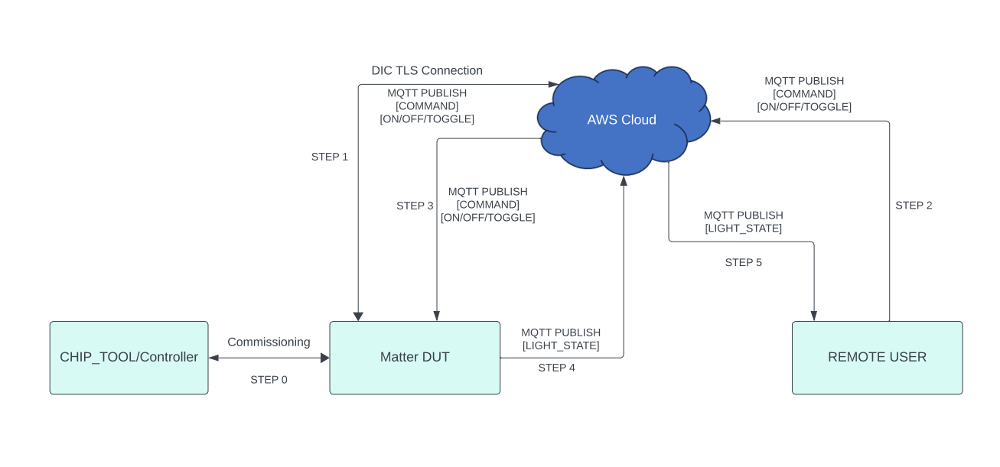
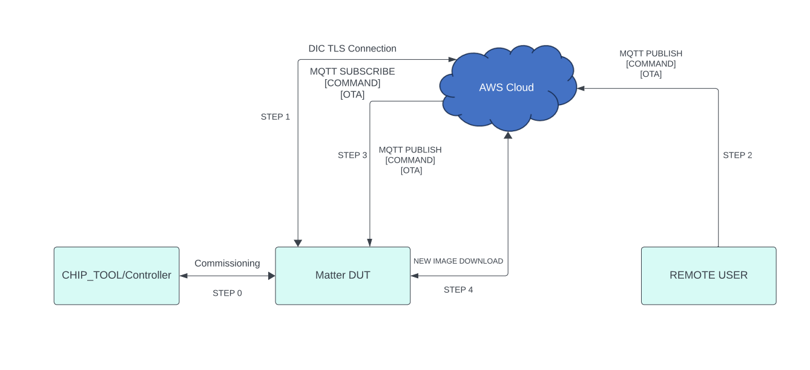
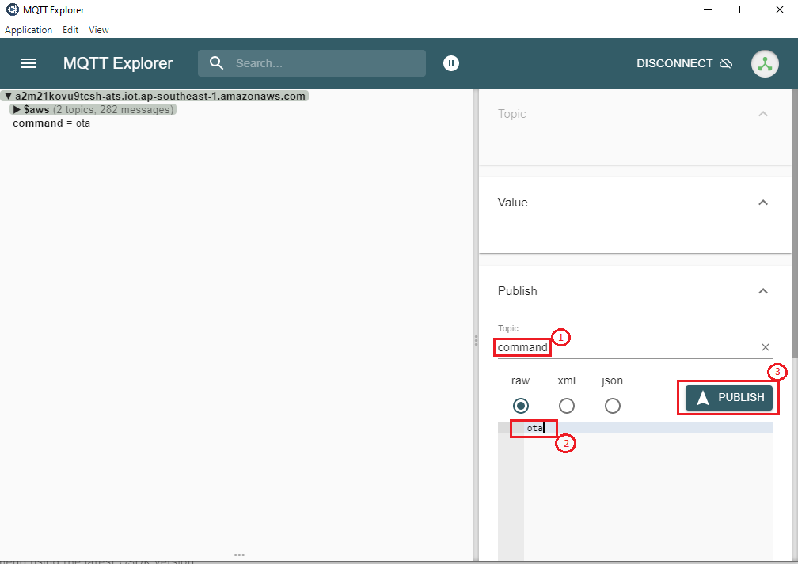

# Matter Wi-Fi Direct Internet Connectivity

- Direct Internet Connectivity (DIC) is a Silicon Labs-only feature to connect Matter devices to proprietary cloud solutions (AWS,GCP,APPLE ...) directly. As such, a Matter Wi-Fi device must support connecting locally on the Matter Fabric, via IPv6, and connecting to the Internet via IPv4.
- Matter devices can be controlled by chip-tool or controller and the respective status of the attribute modified will be published to the cloud.
-  Remote user can install the cloud specific application to get the notifications on the attribute status and to control the device.

## DIC Feature Diagram
1. Below diagram gives end-to-end flow about Direct Internet Connectivity.
  
## Prerequisites

### Hardware Requirements
- Hardware required for DIC feature to run on Silicon Labs Platform, refer [Matter Hardware Requirements](/matter/<docspace-docleaf-version>/matter-prerequisites/hardware-requirements#matter-over-wi-fi-accessory-device-requirements)

### Software Requirements
In order to run DIC feature, refer [Software Requirements](/matter/<docspace-docleaf-version>/matter-prerequisites/software-requirements)

## End-to-End Set-Up Bring Up

### Message Queuing Telemetry Transport (MQTT)

- MQTT is an OASIS standard messaging protocol for the Internet of Things (IoT). It is designed as an extremely lightweight publish/subscribe messaging transport that is ideal for connecting remote devices with a small code footprint and minimal network bandwidth. Refer https://mqtt.org/ for more details

### Configuring the MQTT server

- To set up and configure AWS or Mosquitto for DIC support see the following documentation: 

- [AWS installation](./aws-configuration-registration.md)
- [Mosquitto installation](./mosquitto-setup.md)

### Remote User Setup (MQTT Explorer)

- A remote user is used to check the state of Matter device. In this context MQTT explorer is used as a remote user.

[MQTT explorer setup and configuration](./mqtt-explorer-setup.md)

### Building Matter DIC Application using Simplicity Studio
1. Follow [Build DIC](./build-dic.md), to enable DIC feature in code.

2. After Enabling DIC feature in matter extension code, Click on **Preferences** and go to **SDKs tab** in Simplicity Studio.
   

3. Inside **SDKs** tab click on **Gecko SDK** and click on **Refresh** button. It will refresh matter extension code for changes made in step1.
   

4. After Refreshing matter extension, create and build project for Silicon Labs Device Platform. Refer the following:
    - [Creating and Building Project for NCP Board](./build-efx32-application-using-studio.md)
    - [Creating and Building Project for SOC Board](./build-soc-application-using-studio.md)

**Note**: matter extension code is located at (C:\Users\system_name\SimplicityStudio\SDKs\gecko_sdk\extension) this path.

## End-to-End Test of DIC Application

User Setup (MQTT Explorer):

  - Sharing status of device to cloud
    - Below diagram gives end-to-end flow for sharing status from matter device to cloud
    
**Note**: For reference, Lighting App commands given in the above image. Similarly other application commands also can be passed.    
    - End-to-end command to be executed from chip-tool, refer [Running the Matter Demo on EFR32 hosts](/matter/<docspace-docleaf-version/matter-wifi-run-demo)
    - Below is the application specific attribute/s information or state shared to the cloud:
       - For Lighting App, On/Off Attributes
       - For Lock App, lock/unlock Attributes
       - For Windows App, lift/tilt Attributes
       - For Thermostat App, SystemMode/CurrentTemp/LocalTemperature/OccupiedCoolingSetpoint/OccupiedHeatingSetpoint Attributes
       - For On/off Plug App, On/Off Attributes
    - Application status would be updated on the mqtt_explorer UI, as shown in below image.
      

 - **Control of the device through cloud interface**
     - Below diagram gives end-to-end flow for Control of the matter device through cloud interface
      
**Note**: For reference, Lighting App commands given in the above image. Similarly other application commands also can be passed.     
     - Make sure matter device is up and commissioned successfully, refer [Running the Matter Demo on EFR32 hosts](matter/<docspace-docleaf-version>/matter-wifi-run-demo)
     - For Controlling the device, set topic name and the commands to be executed in the mqtt_explorer for below applications.
       - Lighting App
         - Topic: command
         - Commands:
           - toggle
           - on
           - off
       - Onoff-plug App
         - Topic: command
         - Commands:
           - toggle
           - on
           - off
       - Lock App
         - Topic: command
         - Commands:
           - lock
           - unlock
       - Thermostat App
         - Topic: command
         - Commands:
           - SetMode/value(value need to provide 1,2,3,4 ex:SetMode/1)
           - Heating/value(value need to provide 2500,2600 ex:HeatingSetPoint/2500)
           - Cooling/value(value need to provide 2500,2600 ex:CoolingSetPoint/2500)
       - Window App
         - Topic: command
         - Commands:
            - Lift/value(value need to provide in range 1000 to 10000)
            - Tilt/value(value need to provide in range 1000 to 10000)
    - Then click `publish` button to execute the command.
   
 
 - **Download AWS OTA Image through cloud interface**
     - Below diagram gives the end to end flow of firmware upgrade feature through AWS.
      
     - Make sure matter device is up and commissioned successfully, refer [Running the Matter Demo on EFR32 hosts](matter/<docspace-docleaf-version>/matter-wifi-run-demo)
     - Make sure device is connected to MQTT Server successfully.
     - Then Create a AWS OTA Job in the AWS Website, refer [How to create AWS OTA JOB](aws-configuration-registration.md)
     - Trigger OTA Command through MQTT Explorer like below.
     - Then click `publish` button to execute the AWS OTA command.
   